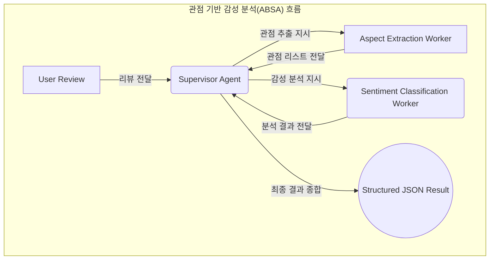

## 1. 감성 분석의 기본 개념

- **정의**: 텍스트에 나타난 주관적인 의견, 감정, 태도 등을 식별하고 추출하여 긍정, 부정, 중립 등과 같이 분류하는 자연어 처리 기술.
- **목표**: 비정형 텍스트 데이터를 정량적이고 실행 가능한 비즈니스 인사이트로 전환.

### 감성 분석의 척도 (Scales)

| 척도 | 설명 | 예시 |
| --- | --- | --- |
| **3점 척도 (Polarity)** | 가장 기본적인 분류 | `긍정`, `부정`, `중립` |
| **5점 척도 (Graded)** | 감성의 강도를 세분화 | `매우 긍정`, `긍정`, `중립`, `부정`, `매우 부정` |
| **다중 레이블 (Multi-label)** | 여러 감정을 동시에 식별 | `기쁨`, `분노`, `감사`, `실망` |
| **수치형 (Numeric)** | 특정 범위 내의 점수로 표현 | `1점에서 10점 사이의 점수` |

---

## 2. 기본 프롬프트 기법

### 2.1. [[[프롬프트] 01 Zero-shot & Few-shot 프롬프팅|Zero-shot 프롬프팅]]

별도의 예시 없이, 역할과 작업 지시만으로 감성을 분석하게 하는 가장 간단한 방법입니다.

```markdown
# 역할: 고객 리뷰 분석 전문가

다음 리뷰 텍스트의 감성을 '긍정', '부정', '중립' 중 하나로 분류하세요.

리뷰: "배송은 빨랐지만 포장이 허술해서 아쉬웠어요."

감성:
```

### 2.2. [[[프롬프트] 01 Zero-shot & Few-shot 프롬프팅|Few-shot 프롬프팅]]

고품질의 예시를 2-3개 제공하여 모델이 원하는 출력 형식과 분류 기준을 명확하게 학습하도록 유도합니다.

```markdown
# 역할: 고객 문의 분류 전문가

다음 예시와 같이 고객 문의의 감성을 분류하세요.

예시 1:
문의: "제품이 너무 마음에 들어요! 최고예요!"
감성: 긍정

예시 2:
문의: "환불 절차가 어떻게 되나요?"
감성: 중립

예시 3:
문의: "몇 번을 전화했는데 연결이 안 되네요. 실망입니다."
감성: 부정

---

이제 다음 문의의 감성을 분류하세요.

문의: "디자인은 예쁜데, 마감이 좀 부실하네요."
감성:
```

---

## 3. 고급 프롬프트 기법

### 3.1. 관점 기반 감성 분석 (ABSA - Aspect-Based Sentiment Analysis)

리뷰에 언급된 특정 대상(관점)에 대한 감성을 개별적으로 추출하여 정밀한 분석을 수행합니다. 멀티 에이전트 아키텍처를 사용하면 이 복잡한 과정을 체계적으로 처리할 수 있습니다.

#### 멀티 에이전트를 활용한 ABSA 처리 순서도



**순서도 흐름 설명:**
1.  **Supervisor Agent**는 "카메라는 좋지만, 배터리는 최악!"과 같은 사용자 리뷰를 받습니다.
2.  **Aspect Extraction Worker**에게 리뷰에 언급된 관점(aspect)들을 추출하도록 지시합니다.
3.  Worker는 `["카메라", "배터리"]` 와 같은 관점 리스트를 Supervisor에게 전달합니다.
4.  Supervisor는 각 관점("카메라", "배터리")에 대한 감성 분석을 **Sentiment Classification Worker**에게 병렬로 지시합니다.
5.  각 Worker는 `{"카메라": "긍정"}`, `{"배터리": "부정"}` 과 같은 분석 결과를 Supervisor에게 전달합니다.
6.  Supervisor는 모든 결과를 종합하여 아래 프롬프트 예시와 같은 최종 구조화된 JSON 결과물을 생성합니다.

#### 프롬프트 예시

```markdown
# 역할: 제품 피드백 정밀 분석가

다음 리뷰를 분석하여, 언급된 각 제품의 속성(aspect)과 그에 대한 감성(sentiment)을 JSON 형식으로 추출하세요. 감성은 '긍정', '부정', '중립'으로 분류합니다.

리뷰: "새로 나온 스마트폰의 카메라는 정말 환상적이지만, 배터리가 너무 빨리 닳아서 불편해요. 가격은 적당한 것 같습니다."

출력:
```json
{
  "analysis": [
    {
      "aspect": "카메라",
      "sentiment": "긍정"
    },
    {
      "aspect": "배터리",
      "sentiment": "부정"
    },
    {
      "aspect": "가격",
      "sentiment": "중립"
    }
  ]
}
```

### 3.2. [[[프롬프트] 02 Chain-of-Thought (CoT) 프롬프팅|생각의 사슬 (Chain-of-Thought)]] 활용

복합적이거나 미묘한 감정을 분석할 때, 모델에게 단계별 추론 과정을 거치도록 하여 정확도를 높입니다.

```markdown
# 역할: 문맥 추론 기반 감성 분석가

다음 리뷰의 최종 감성을 판단하기 전에, 단계별로 생각을 거쳐 결론을 내리세요.

리뷰: "기대했던 기능이 빠져 있어서 처음엔 실망했지만, 막상 써보니 다른 기능들이 기대 이상으로 훌륭해서 매우 만족스럽습니다."

단계별 분석:
1.  **초기 감정 식별**: '기대했던 기능이 빠져 실망' -> 부정적 감정 존재.
2.  **전환점 파악**: '하지만'을 통해 감정의 전환이 일어남.
3.  **후반 감정 식별**: '다른 기능들이 기대 이상으로 훌륭해서 만족' -> 긍정적 감정 존재.
4.  **최종 감성 종합**: 초기 실망감보다 후반부의 만족감이 더 강조되고 있으므로, 전체적인 감성은 긍정으로 판단됨.

최종 감성: 긍정
```

---

## 4. 주요 도전 과제 및 해결 프롬프트

| 도전 과제 | 설명 | 해결 프롬프트 전략 |
| --- | --- | --- |
| **비꼬는 문장 (Sarcasm)** | 긍정적인 단어를 사용하여 부정적인 의미를 전달하는 경우. | `"이 문장에 비꼬는 의도가 있는지 먼저 판단하고, 그 의도를 고려하여 최종 감성을 분석해 줘."` |
| **복합 감정 (Mixed Sentiments)** | 하나의 문장에 긍정과 부정이 함께 나타나는 경우. | `"문장 내에 상반된 감정이 있는지 확인하고, 각 감정이 어떤 대상을 향하는지 분리해서 알려줘." (ABSA와 유사)` |
| **중립의 모호성 (Neutral Ambiguity)** | 사실 전달과 의견 부재를 구분해야 하는 경우. | `"이 문장이 단순 사실 전달인지, 아니면 의견이지만 중립적인 태도인지 구분하여 분류해 줘."` |
| **도메인 특화 용어** | 특정 업계에서만 사용되는 긍정/부정 용어. | `"이 리뷰는 [IT 전문가] 커뮤니티의 글이야. 해당 도메인의 맥락을 고려하여 감성을 분석해 줘."` |

---

## 5. 평가 지표

| 지표명                          | 설명                                             |
| ---------------------------- | ---------------------------------------------- |
| **정확도 (Accuracy)**           | 전체 예측 중 올바르게 예측한 비율. (데이터 불균형 시 왜곡 가능)         |
| **정밀도 (Precision)**          | '긍정'으로 예측한 것 중 실제 '긍정'인 비율. (FP 줄이는 것이 중요할 때)  |
| **재현율 (Recall)**             | 실제 '긍정' 중 모델이 '긍정'으로 예측한 비율. (FN 줄이는 것이 중요할 때) |
| **F1-점수 (F1-Score)**         | 정밀도와 재현율의 조화 평균. (클래스가 불균형할 때 가장 중요한 지표)       |
| **혼동 행렬 (Confusion Matrix)** | 모델이 어떤 클래스를 혼동하는지 시각적으로 보여주는 표.                |