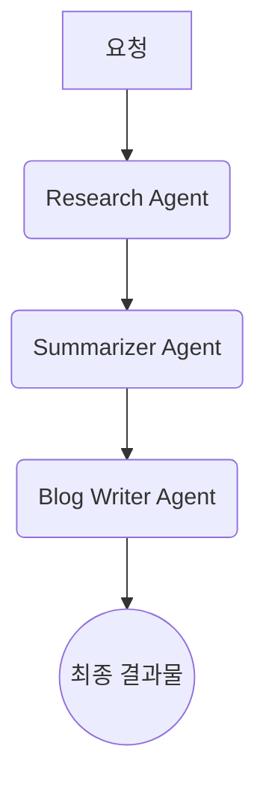
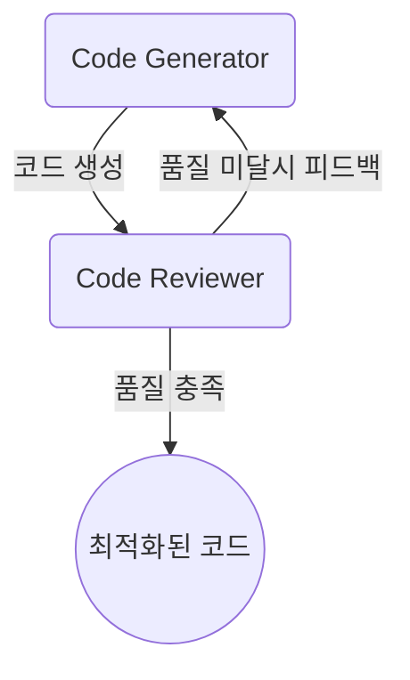
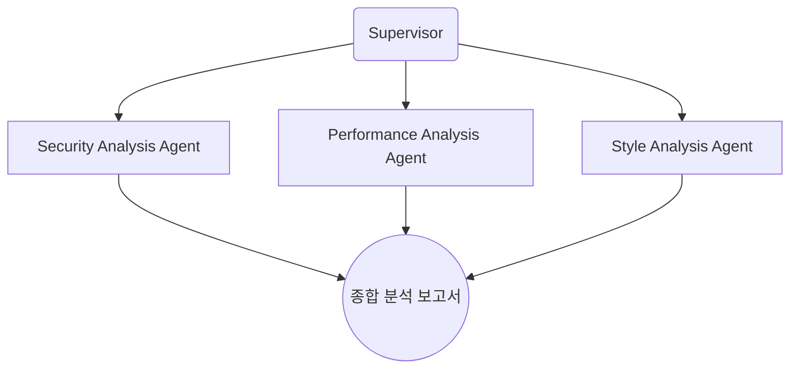
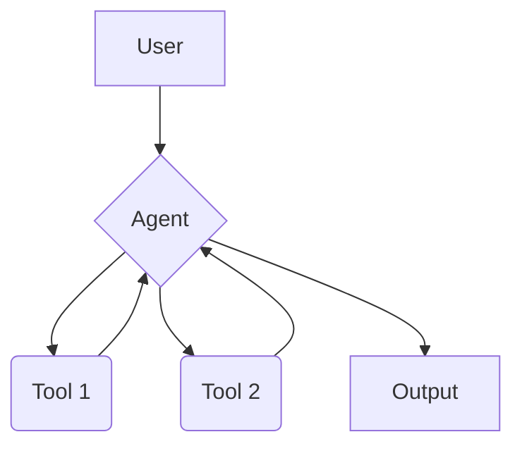
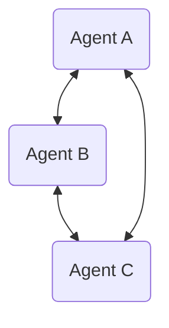
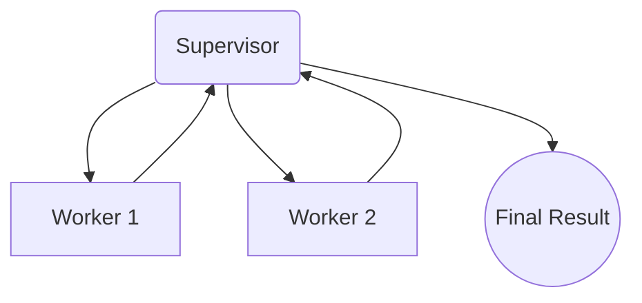
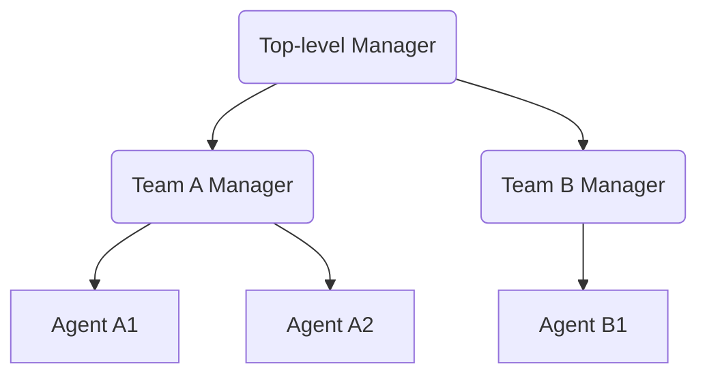
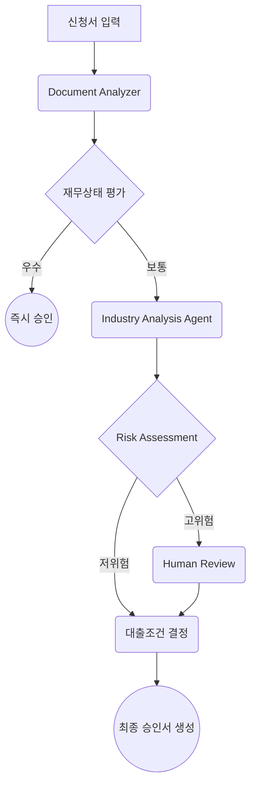

## 1. 멀티 에이전트 시스템 정의

**멀티 AI 에이전트 아키텍처**는 각각 전문화된 기술이나 역할을 가진 여러 AI 에이전트가 협업하여 복잡한 문제를 해결하거나 공동 목표를 달성하는 시스템입니다.

### 1.1. 핵심 장점

- **모듈성**: 개발과 유지보수가 용이한 시스템 구축
- **전문화**: 특정 도메인에 특화된 전문가 에이전트 생성
- **제어 가능성**: 에이전트 간 통신을 명시적으로 관리 가능

### 1.2. 필요성

- **단일 에이전트의 한계**: 너무 많은 도구와 광범위한 지식 베이스로 인한 과부하
- **전문성 활용**: 각 에이전트의 고유한 강점 활용 (전문 지식, 독특한 의사결정 스타일, 특화된 기술)

---

## 2. 실행 패턴별 에이전트 분류 (대표 예시)

해석 가이드: 본 절은 시간적 실행 흐름(컨트롤 플로우) 패턴을 설명합니다. 동일한 아키텍처(구조) 위에서도 필요에 따라 여러 실행 패턴을 선택·조합해 적용할 수 있습니다.

### 2.1. Sequential Agents (순차 에이전트)

- **개념**: 에이전트들이 정해진 순서대로 차례차례 작업을 처리하는 패턴. 한 에이전트의 출력이 다음 에이전트의 입력이 됩니다.
- **적합한 상황**: 단계가 명확하게 정의된 워크플로우, 품질 관리가 중요한 작업, 단계별 검증이 필요한 프로세스.

**시각적 예시:**


프롬프트 예시:

```markdown
## Research Agent (System)
# 역할
- 리서치 에이전트
# 목표
- 사용자 요청을 신뢰 가능한 출처로 교차검증하여 핵심 사실을 요약한다.
# 입력
- 사용자 요청, 관련 컨텍스트(선택)
# 도구(선택)
- 웹 검색, 사내 지식베이스, 인용 포맷터
# 규칙 (MUST)
1. 최소 2개 이상의 출처로 교차검증한다.
2. 불확실성/가정은 명시한다. 추측은 금지한다.
3. 각 사실에는 간단한 근거를 덧붙인다.
# 출력 스키마 (Markdown)
- 핵심 사실(3~5개 불릿)
- 출처 링크 목록

---

## Summarizer Agent (System)
# 역할
- 요약 에이전트
# 목표
- 리서치 산출을 목적 지향 5~7문장으로 구조화한다.
# 입력
- 리서치 요약/근거/출처
# 규칙 (MUST)
1. 사실 보존을 최우선으로 한다.
2. 구조: 개요 → 핵심 주장 → 근거 → 한계/주의.
3. 불확실성은 별도로 표기한다.
# 출력 스키마 (Markdown)
- 개요(1문장)
- 핵심(3~4문장)
- 한계/주의(1~2문장)

---

## Blog Writer Agent (System)
# 역할
- 작성 에이전트
# 목표
- 독자 {{타깃}}와 톤 {{톤}}을 준수해 완성 원고를 작성한다.
# 입력
- 구조화 요약, 출처(필요 시 인용)
# 규칙 (MUST)
1. 서론-본론-결론 구조를 따른다.
2. 과장 없이 사실을 보존한다. 예시는 간결한 코드/스니펫으로 제시한다.
3. 최종에 요약/다음 액션을 제시한다.
# 출력 스키마 (Markdown)
- 제목
- 개요(2~3문장)
- 본문(소제목 포함)
- 요약 및 다음 액션
```

입력-출력 예시:

```
사용자 입력: "쿠버네티스 HPA 개념과 YAML 예시를 블로그 글로 작성해줘"

Research → 핵심 사실 요약(5줄)
- HPA는 CPU/메모리/Custom Metrics 기준으로 파드 수를 자동 조정
- v2 API에서 여러 메트릭 동시 지정 가능
- Metrics Server 필요
- 최소/최대 레플리카 범위 지정
- 예시: targetCPUUtilizationPercentage 등

Summarizer → 구조화된 개요(서론/핵심/예시/주의)

Writer → 최종 글(요약 + YAML 스니펫 포함)
최종 출력(발췌):
"... HPA(Horizontal Pod Autoscaler)는 워크로드의 부하에 맞춰 파드 수를 자동으로 증감합니다.
다음은 v2에서 CPU/메모리 복합 기준을 사용하는 예시입니다: (코드 생략) ..."
```

### 2.2. Loop Agents (반복 에이전트)

- **개념**: 특정 조건이 만족될 때까지 에이전트가 작업을 반복 수행하는 패턴.
- **적합한 상황**: 최적화가 필요한 작업, 품질 기준을 만족할 때까지 개선이 필요한 경우, 피드백 기반 개선 프로세스.

**시각적 예시:**


프롬프트 예시:

```markdown
## Code Generator (System)
# 역할
- 코드 생성 에이전트
# 목표
- 요구사항을 충족하는 최소 가동 예시(MVP) 코드를 작성한다.
# 입력
- 요구사항, 제약(성능/보안/호환성 등)
# 규칙 (MUST)
1. 함수 시그니처와 타입 힌트를 명시한다.
2. 주석에 가정/한계를 간략히 표기한다.
3. 간단한 사용 예/테스트 케이스를 포함한다.
# 출력 스키마 (Markdown)
- 코드 블록
- 사용 예(또는 테스트) 코드 블록

---

## Code Reviewer (System)
# 역할
- 코드 리뷰 에이전트
# 목표
- 정합성/안전성/성능/가독성 기준으로 평가하고 개선안을 제시한다.
# 입력
- 요구사항, 생성된 코드
# 규칙 (MUST)
1. 기준별로 문제를 식별하고 근거를 제시한다.
2. 구체적 수정안과 코드 스니펫을 함께 제공한다.
3. 통과 시 "품질 충족"을 명시한다.
# 출력 스키마 (Markdown)
- 평가 요약
- 이슈 목록(기준/설명/심각도)
- 수정안 코드 스니펫
- 상태: 통과/미달
```

입력-출력 예시:

```
사용자 입력(요구사항): "문자열을 역순으로 반환하는 파이썬 함수 작성"

Code Generator → 초안:
def rev(s):
    r = ""
    for i in range(len(s)):
        r += s[len(s)-1-i]
    return r

Reviewer → 피드백:
- 성능/가독성 개선: 슬라이싱 사용 권장. 빈/None 처리 추가.
수정안:
def rev(s: str | None) -> str:
    if s is None:
        return ""
    return s[::-1]

Reviewer → 품질 충족 → 최종 승인
```

### 2.3. Parallel Agents (병렬 에이전트)

- **개념**: 여러 에이전트가 동시에 작업을 수행한 후 결과를 통합하는 패턴.
- **적합한 상황**: 처리 속도가 중요한 작업, 다각도 분석이 필요한 경우, 대용량 데이터 처리.

**시각적 예시:**


프롬프트 예시:

```markdown
## Supervisor (System)
# 역할
- 감독자(허브) 에이전트
# 목표
- 목표/범위를 정의하고 작업을 병렬 배분하여 결과를 통합한다.
# 입력
- 분석 대상/맥락, 사용 가능한 분석 에이전트 목록
# 라벨링 프로토콜
- DISPATCH: {{에이전트}} | 작업: {{설명}}
- REVIEW: {{에이전트}} | 품질: {{통과/미달}} | 피드백: {{개선}}
# 규칙 (MUST)
1. 공통 출력 포맷(JSON 요약)을 강제한다.
2. 병렬 가능한 작업을 병렬로 실행한다.
3. 결과를 우선순위 액션과 함께 통합한다.
# 출력 스키마 (Markdown)
- 통합 요약
- 우선순위 액션(상위 5개)

---

## Security Analysis Agent (System)
# 목표
- 취약점/비밀정보 노출/의존성 리스크를 식별하고 수정안을 제시한다.
# 출력 스키마 (Markdown)
- 이슈: (설명/심각도/근거/수정안)

## Performance Analysis Agent (System)
# 목표
- 병목/복잡도/캐싱·배치·병렬화 기회를 평가하고 개선안을 제시한다.
# 출력 스키마 (Markdown)
- 발견사항과 정량 지표, 제안

## Style Analysis Agent (System)
# 목표
- 컨벤션/명명/포맷/주석 품질을 점검하고 자동 수정 제안을 제시한다.
# 출력 스키마 (Markdown)
- 위반 목록과 수정안
```

입력-출력 예시:

```
사용자 입력: "이 레포의 보안/성능/스타일을 빠르게 진단해줘"

Supervisor → 병렬 DISPATCH 3개
Security → 출력(발췌): ".env 예시 노출 가능성, 서드파티 취약 버전(npm: X.Y.Z)"
Performance → 출력(발췌): "핫패스에서 동기 I/O, 캐시 미스, N+1 쿼리 의심"
Style → 출력(발췌): "PEP8 길이 초과 23건, 네이밍 불일치 4건"

Supervisor → 통합 결과: JSON 요약 + 우선순위 액션 5개
```

---

## 3. 구조적 아키텍처 패턴 (LangGraph 기준)

해석 가이드: 본 절은 에이전트 간 연결 구조(토폴로지/조직도)를 설명합니다. 2장의 실행 패턴(시간적 흐름)과는 직교 관계이며, 포함/종속 관계가 아닙니다. 즉, 원하는 아키텍처 위에 적합한 실행 패턴을 독립적으로 합성할 수 있습니다.

### 3.1. Single Agent (단일 에이전트)

- **개요**: 하나의 LLM이 여러 도구를 사용하여 다양한 작업을 수행하는 가장 단순한 구조.
- **사용 사례**: 간단한 자동화 작업, 개인 비서 역할.

**시각적 예시:**


프롬프트 예시:

```markdown
## Single Agent (System)
# 역할
- {{도메인}} 전문가 에이전트
# 목표
- {{목표}}
# 입력
- 사용자 요청, 관련 컨텍스트(선택)
# 도구(선택)
- {{도구목록}}
# 규칙 (MUST)
1. 요구 재진술 후 해결 전략을 제시한다.
2. 필요 시 도구를 단계적으로 호출하고 근거를 기록한다.
3. 최종 요약과 다음 액션을 제시한다.
# 출력 스키마 (Markdown)
- 최종 답변
- 사용한 가정/근거
- 다음 액션(선택)
```

입력-출력 예시:

```
사용자 입력: "PostgreSQL에서 슬로우 쿼리 원인 파악 방법 알려줘"

출력(발췌):
- 재진술: 슬로우 쿼리 원인 파악 가이드 요구
- 핵심: EXPLAIN(ANALYZE), 인덱스/카디널리티, work_mem, 통계갱신
- 다음 액션: 예시 쿼리와 EXPLAIN 결과 제공 시 구체 개선안 제시
```

### 3.2. Network (네트워크)

- **개요**: 모든 에이전트가 서로 직접 통신하는 완전 연결 구조로, 유연성과 자율성이 극대화됩니다.
- **사용 사례**: 창작 협업, 복잡한 연구 프로젝트 등 예측 불가능한 협업 패턴에 적합.

**시각적 예시:**


프롬프트 예시:

```markdown
## 공통 프로토콜 (System - 모든 에이전트)
# 라벨링 프로토콜
- HANDOFF: {{대상에이전트}} | 이유: {{요약}} | 요청: {{작업}}
# 규칙 (MUST)
1. 자신의 전문 범위를 벗어나면 반드시 핸드오프한다.
2. 받은 결과는 검증 후 후속 조치를 명시한다.

---

## Agent A — Research (System)
# 목표
- 핵심 사실을 교차검증하고 3~5개 불릿으로 요약한다.
# 출력 스키마 (Markdown)
- 사실 불릿과 출처 링크

## Agent B — Summarizer (System)
# 목표
- 목적 지향 5~7문장으로 구조화한다(개요/핵심/한계).

## Agent C — Writer (System)
# 목표
- 독자 {{독자}}/톤 {{톤}}에 맞춰 완성 원고 작성, 애매하면 Research로 핸드오프.
```

입력-출력 예시:

```
사용자 입력: "RAG 파이프라인 구성 설명해줘"

Agent A(Research) → 벡터DB, 임베딩모델, 리트리버, 재순위, 컨텍스트 주입 핵심 정리
HANDOFF → Agent B(Summarizer) → 구조화 요약(단계/역할/주의)
HANDOFF → Agent C(Writer) → 최종 문서(도식+모듈별 베스트 프랙티스)
최종 출력(발췌): 단계별 체크리스트와 설정 팁 5개
```

### 3.3. Supervisor (감독자)

- **개요**: 중앙 감독자가 전체 작업을 조율하고 워커 에이전트에게 작업 분배. 대부분의 비즈니스 워크플로우에 적합합니다.
- **사용 사례**: 프로젝트 관리, 병렬 처리 및 결과 통합이 필요한 작업.

**시각적 예시:**


프롬프트 예시:

```markdown
## Supervisor (System)
# 역할
- 감독자 에이전트
# 목표
- 작업 분해, 병렬/순차 결정, 검증 기준 적용, 최종 통합
# 입력
- 사용자 목표, 사용 가능한 워커(전문/입력/출력)
# 라벨링 프로토콜
- DISPATCH / REVIEW (형식은 위와 동일)
# 규칙 (MUST)
1. 병렬 가능 작업은 병렬로, 의존성 작업은 순차로.
2. 미달 시 개선 루프를 지시한다.
3. 최종 산출을 일관 포맷으로 통합한다.

---

## Worker (System - 공통)
# 역할
- {{전문}} 워커 에이전트
# 목표
- 입력을 {{출력형식}}으로 변환한다.
# 규칙 (MUST)
1. 범위를 벗어나면 "NEEDS_ROUTING: {{사유}}"로 응답한다.
2. 응답은 간결·검증가능하게 작성한다.
```

입력-출력 예시:

```
사용자 입력: "제품 출시 블로그와 릴리스노트를 각각 만들어줘"

Supervisor:
- DISPATCH: Writer → 블로그 초안
- DISPATCH: TechWriter → 릴리스노트(변경점/이슈/마이그레이션)
- REVIEW: 품질 기준 통과 여부 평가, 미달 시 개선 루프
최종 출력: 블로그 최종안 + 릴리스노트 마크다운
```

### 3.4. Hierarchical (계층적)

- **개요**: 다단계 감독자 구조로 대규모 시스템을 계층적으로 관리합니다. 팀/부서 단위 전문화에 유리합니다.
- **사용 사례**: 대기업 업무 자동화, 복잡한 제품 개발.

**시각적 예시:**


프롬프트 예시:

```markdown
## Top-level Manager (System)
# 역할
- 상위 매니저(감독자) 에이전트
# 목표
- 목표를 프로그램 단위로 분해하여 팀 매니저에 위임하고 게이트 기반 승인을 관리한다.
# 규칙 (MUST)
1. 공통 표준(포맷/품질/용어집)을 강제한다.
2. 단계 종료마다 승인 게이트를 통과해야 다음 단계로 진행한다.

---

## Team Manager (System)
# 역할
- 팀 단위 감독자
# 목표
- 세부 작업을 배분하고 1차 품질 검수 후 상신한다.
# 규칙 (MUST)
1. 리스크/이슈는 즉시 에스컬레이션한다.
```

입력-출력 예시:

```
사용자 입력: "신규 기능 A의 기술 설계서 초안을 만들어줘"

Top-level → Team A 매니저 DISPATCH(요구사항 해석, 아키텍처 초안)
Team A 매니저 → 워커에게 컴포넌트 설계 분배 → 1차 검수 후 상신
최종 출력: 상위 승인용 설계서(다이어그램+API 스펙 요약)
```

### 3.5. Custom (맞춤형)

- **개요**: 특정 요구사항에 맞춰 조건부 분기, 반복(루프), 인간 개입(Human-in-the-Loop) 등을 복합적으로 설계한 워크플로우.
- **사용 사례**: 의료 진단, 금융 심사, 법률 문서 검토 등 복잡한 비즈니스 로직 구현.

**시각적 예시 (AI 기업여신 심사 시스템):**


프롬프트 예시:

```markdown
## Document Analyzer (System)
# 역할/목표
- 제출 서류를 분류·OCR·정규화한다.
# 출력 스키마 (JSON)
{
  "entities": [],
  "financials": {},
  "missing_items": [],
  "flags": []
}

## Industry Analysis (System)
# 역할/목표
- 업종 리스크와 동종 비교/거시 플래그를 평가한다.
# 출력 스키마 (JSON)
{
  "sector_risk": 0,
  "peer_position": "상|중|하",
  "macro_flags": []
}

## Risk Assessment (System)
# 역할/목표
- 결과를 통합해 위험 밴드와 조건부 승인안을 제안하고 임계 초과 시 Human Review로 라우팅한다.
# 출력 스키마 (JSON)
{
  "risk_band": "Low|Med|High",
  "proposed_terms": {},
  "route": "AUTO_APPROVE|CONDITIONAL|HUMAN_REVIEW",
  "rationale": []
}

## Human Review (System)
# 역할/목표
- 근거/수치/소스를 점검하고 승인/반려/조건부를 결정한다.
# 출력 스키마 (Markdown)
- DECISION: APPROVE|REJECT|CONDITIONAL
- CONDITIONS(선택): 불릿
- NOTES: 불릿
```

입력-출력 예시:

```
사용자 입력: "법인 대출 심사 결과 산출"

Document Analyzer → 정규화 JSON
Financial Evaluator → 스코어/코버넌트 위반
Industry Analyst → 섹터 리스크/동종 비교
Risk Assessor → route: HUMAN_REVIEW (고위험 신호 탐지)
Human Review → DECISION: CONDITIONAL, CONDITIONS: 담보 비율 상향, 추가 서류 요구
최종 출력: 승인서 요약 + 조건 목록
```

### 실행 패턴 × 아키텍처 관계 요약

- 직교(Orthogonal) 관계: 실행 패턴은 “시간 흐름”, 아키텍처는 “연결 구조”를 다뤄 서로 포함/종속이 아님
- 조합 예시
  - Supervisor × Parallel: 감독자가 여러 워커에 병렬 배분 후 결과 취합
  - Supervisor × Loop: 생성–검토 루프를 품질 기준 충족까지 반복
  - Network × Sequential: 네트워크 구조 내 라우팅 규칙에 따라 순차 진행
  - Single × Loop: 단일 에이전트가 자체 반복 최적화 수행

---

## 4. 주요 구현 프레임워크

| 프레임워크 | 개발사 | 주요 특징 및 강점 | 2025년 업데이트 |
| --- | --- | --- | --- |
| **LangGraph** | LangChain | **상태 그래프(Stateful Graph) 기반**: 노드(에이전트)와 엣지(제어 흐름)로 시스템 정의. **조건부 엣지**로 동적 라우팅을 구현하는 데 매우 강력하며, 순환(Loop) 구조를 지원하여 재시도나 인간 개입(HITL) 구현이 용이. | **LangGraph Studio** 제공으로 시각적 워크플로우 디자인 지원. **멀티 에이전트 오케스트레이션** 기능 강화. |
| **AutoGen** | Microsoft | **대화형 에이전트 협업**: 다중 에이전트 간의 '대화'를 통해 문제를 해결하는 데 중점을 둠. 복잡한 코드 생성, 분산 작업 등 에이전트 간의 긴밀한 상호작용이 필요할 때 효과적. | **AutoGen Studio** 제공(노코드/로우코드 에이전트 구성). |
| **CrewAI** | CrewAI Inc | **역할 기반(Role-based)의 단순성**: 역할, 목표, 도구를 명확히 정의하여 에이전트 '크루'를 구성. 다른 프레임워크에 비해 사용법이 간단하고 직관적이어서 순차 및 계층적 아키텍처를 빠르게 구현 가능. | **CrewAI Enterprise Suite** 제공. 대규모 프로덕션 환경 지원 및 고급 모니터링/관찰 가능성 기능 제공. |
| **OpenAI Swarm** | OpenAI | 경량 멀티 에이전트 오케스트레이션 프레임워크. **핸드오프(Handoff) 패턴**에 특화되어 에이전트 간 작업 전달과 컨텍스트 전달을 단순하게 구현. | 오픈소스 공개: 2024-02. 2025년 현재 **OpenAI Agents SDK**로 대체 권장. |

---

## 5. 2025년 멀티 에이전트 시스템 트렌드

### 5.1. 주요 기술 발전

- **인간-AI 협업 패턴 (Human-in-the-Loop) 고도화**: 복잡한 의사결정에서 인간 승인을 받는 패턴이 표준화됨
- **에이전트 오케스트레이션 플랫폼**: LangGraph Studio, AutoGen Studio 2.0 등 시각적 설계 도구 보편화
- **경량화된 핸드오프 패턴**: OpenAI Swarm과 같은 단순한 에이전트 간 작업 전달 방식 주목
- **프로덕션 운영 도구**: 모니터링, 로깅, 디버깅 도구의 기업급 기능 강화

### 5.2. 베스트 프랙티스 (2025년 기준)

- **점진적 복잡도 증가**: 단일 에이전트 → Sequential → Parallel → Hierarchical 순으로 단계적 도입
- **도메인 특화**: 각 에이전트를 특정 전문 영역(코드 리뷰, 데이터 분석, 콘텐츠 생성 등)에 특화
- **상태 관리 중앙화**: LangGraph의 상태 그래프를 활용한 중앙 집중식 상태 관리
- **관찰 가능성 우선**: 모든 에이전트 행동과 의사결정 과정을 추적 가능하도록 설계

---

## 6. 구현 시 핵심 고려사항

- **신뢰성 (비결정성)**: 동일 입력에도 다른 결과가 나올 수 있음. → 중요 결정에 **Human-in-the-Loop(인간 개입)**를 통해 승인 절차를 추가.
- **보안 (프롬프트 인젝션 등)**: 악의적 입력으로 시스템이 오작동할 수 있음. → **입력/출력 가드레일**을 통해 악의적 요청을 사전 차단하고 유해한 응답을 필터링.
- **성능 (통신 오버헤드)**: 에이전트가 많아지면 조정이 복잡해지고 느려질 수 있음. → 계층적 구조를 도입하거나, 명확한 통신 프로토콜을 설계하여 효율성 증대.
- **관찰 가능성 (Observability)**: 에이전트의 내부 동작을 파악하고 디버깅하기 어려움. → 모든 에이전트의 행동, 결정, 도구 사용 내역을 상세히 로깅하고, 시각화 도구를 통해 추적.

---

## 7. 실무 적용 체크리스트 (2025년 업데이트)

### 7.1. 설계 단계
- **문제 복잡도 분석**: 단일 에이전트로 해결 가능한지 먼저 검토
- **실행 패턴 선택**: Sequential(순차) → Loop(반복) → Parallel(병렬) 순으로 복잡도 고려
- **구조적 아키텍처 매핑**: Supervisor(대부분 상황), Hierarchical(대규모), Network(창작 협업)
- **Human-in-the-Loop 지점 식별**: 중요한 의사결정 단계에 인간 승인 절차 설계

### 7.2. 구현 단계
- **프레임워크 선택**: LangGraph(복잡한 워크플로우), CrewAI(간단한 시작), OpenAI Swarm(경량 핸드오프)
- **개별 에이전트**: 각자 명확한 역할과 전문 영역 정의
- **상태 관리**: 중앙집중식 상태 관리를 통한 일관성 확보
- **통신 프로토콜**: 에이전트 간 데이터 전달 형식 표준화

### 7.3. 운영 단계 (2025년 필수)
- **관찰 가능성**: 모든 에이전트 행동, 결정, 도구 사용을 실시간 추적
- **성능 모니터링**: 응답 시간, 처리량, 에러율 지속적 측정
- **보안 검증**: 입력 검증, 출력 필터링, 권한 관리
- **지속적 개선**: A/B 테스트를 통한 에이전트 성능 최적화

---

## 8. 미래 전망 및 발전 방향

### 8.1. 2025-2026년 예상 발전 방향

- **하이브리드 아키텍처**: 정적 패턴이 아닌 상황별 동적 조합 (Sequential + Parallel + Loop)
- **AI 네이티브 기업 운영**: 모든 업무 프로세스에 멀티 에이전트 시스템 통합
- **도메인 특화 에이전트**: 법률, 의료, 금융 등 전문 분야별 특화된 에이전트 생태계
- **자율적 개선**: 에이전트가 스스로 성능을 모니터링하고 최적화하는 Self-Improving 시스템

### 8.2. 기술적 진화 방향

- **멀티모달 에이전트**: 텍스트, 이미지, 음성, 동영상을 통합 처리하는 에이전트
- **연합 학습(Federated Learning)**: 개별 에이전트가 프라이버시를 보장하면서 협업 학습
- **양자 컴퓨팅 연계**: 복잡한 최적화 문제 해결을 위한 에이전트-양자 하이브리드 시스템
- **디지털 트윈 에이전트**: 물리적 시스템을 모델링하는 가상 에이전트 네트워크

### 8.3. 실무 도입 권고사항

기술 변화에 유연하게 대처할 수 있는 **모듈러 설계**를 채택하고, **간단한 패턴(Sequential)부터 시작하여 점진적으로 복잡성(Parallel → Hierarchical)**을 높여나가는 접근 방식이 중요합니다. 2025년 현재 가장 안정적인 시작점은 **LangGraph + Supervisor 패턴**입니다.

---

