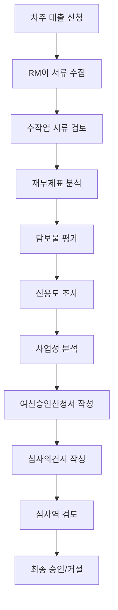
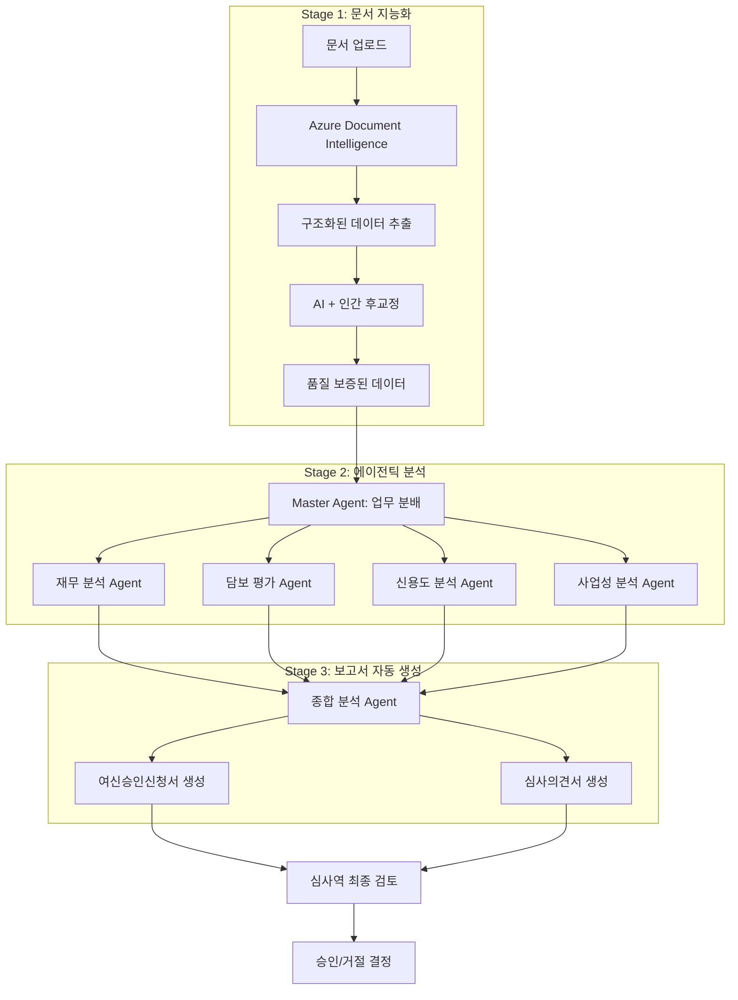
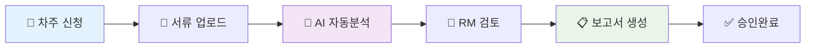
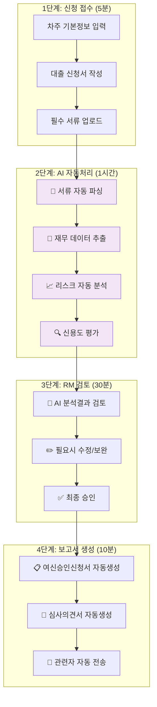
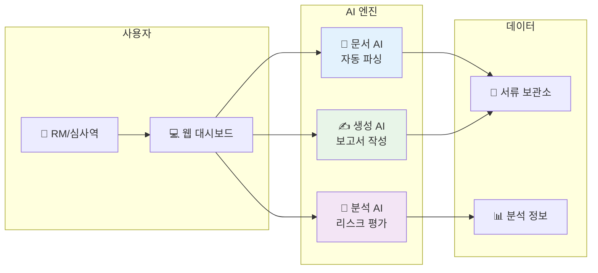

# AI 기반 기업여신 심사 자동화 프로젝트

> **프로젝트 미션**: RM(Relation Manager)의 수작업 중심 여신 심사 프로세스를 생성형 AI 기반 에이전틱 시스템으로 자동화하여 심사 효율성과 정확도를 극대화한다.

## 🎯 프로젝트 개요

### 핵심 가설
**"Azure Document Intelligence와 생성형 AI 에이전틱 시스템을 활용하여 기존 RM의 수작업 기반 여신 심사 업무를 80% 자동화할 수 있으며, 이를 통해 심사 시간을 70% 단축하고 심사 품질의 일관성을 확보할 수 있다."**

---

## 🔍 1. 현재 기업여신 심사 프로세스 분석 및 문제점 정의

### 1.1. 기존 RM 기반 수작업 프로세스

**현재 프로세스 플로우:**


### 1.2. 핵심 문제점 (Pain Points)

**🚨 효율성 문제**
- **서류 처리 시간**: 평균 2-3일 소요 (재무제표, 등기부등본, 사업자등록증 등 20여 종의 서류)
- **중복 작업**: 동일한 정보를 여러 시스템에 중복 입력
- **수작업 오류**: 데이터 입력 실수로 인한 재작업 발생 (약 15%)

**📊 일관성 문제**
- **RM별 심사 기준 차이**: 동일한 차주에 대해 RM마다 다른 평가 결과
- **주관적 판단 비중 과다**: 정성적 평가에 개인 경험이 과도하게 반영
- **문서 품질 편차**: 여신승인신청서와 심사의견서의 완성도가 작성자에 따라 상이

**⏰ 처리 속도 문제**
- **총 심사 기간**: 신청부터 승인까지 평균 7-10일 소요
- **서류 대기 시간**: 차주의 추가 서류 제출 대기로 인한 지연 (평균 3-4일)
- **심사역 검토 대기**: 심사역의 업무 부하로 인한 검토 지연

**🎯 품질 관리 문제**
- **누락 위험**: 복잡한 체크리스트로 인한 필수 항목 누락
- **리스크 평가 한계**: 비정형 데이터 분석의 어려움
- **추적 및 감사**: 의사결정 근거의 체계적 관리 부족

### 1.3. 해결해야 할 핵심 과제

| 문제 영역 | 현재 상태 | 목표 상태 | 개선 방향 |
|---------|---------|---------|----------|
| **문서 처리** | 수작업 스캔/입력 (2-3일) | 자동 파싱/구조화 (1시간) | Azure Document Intelligence |
| **데이터 분석** | RM 개인 경험 의존 | AI 기반 정량/정성 분석 | 생성형 AI + 전문 모델 |
| **보고서 작성** | 수작업 템플릿 작성 (4-6시간) | AI 자동 생성 (30분) | Agentic System |
| **일관성 관리** | RM별 편차 존재 | 표준화된 평가 기준 | 규칙 기반 AI 시스템 |
| **의사결정 지원** | 제한적 정보 제공 | 다각도 리스크 분석 | 멀티 에이전트 분석 |

---

## 🎯 2. 솔루션 아키텍처 및 핵심 전략

### 2.1. 전체 시스템 아키텍처

**3단계 AI 자동화 파이프라인:**



### 2.2. Azure Document Intelligence 기반 비정형 데이터 처리 전략

**📄 문서 처리 워크플로우**

**Phase 1: 문서 수집 및 분류**
- **지원 문서 유형**: PDF, 이미지(JPG, PNG), Word, Excel
- **자동 문서 분류**: 재무제표, 사업자등록증, 등기부등본, 담보 관련 서류, 계약서 등
- **OCR + 구조화**: Azure Form Recognizer를 활용한 텍스트 추출 및 테이블 구조 인식

**Phase 2: 데이터 추출 및 검증**
```python fold title:데이터_추출_및_검증
# 핵심 추출 데이터 구조 예시
extracted_data = {
    "financial_statements": {
        "balance_sheet": {"총자산": value, "부채총계": value, "자본총계": value},
        "income_statement": {"매출액": value, "영업이익": value, "순이익": value},
        "cash_flow": {"영업활동현금흐름": value, "투자활동현금흐름": value}
    },
    "business_registration": {
        "company_name": str,
        "business_number": str,
        "industry_code": str,
        "establishment_date": date
    },
    "collateral_documents": {
        "property_type": str,
        "appraised_value": value,
        "location": str
    }
}
```

**Phase 3: 품질 관리 및 후교정**
- **AI 신뢰도 점수**: 각 추출 필드별 정확도 스코어 제공 (0-100%)
- **인간 검증 필요 임계값**: 신뢰도 85% 이하 필드는 자동으로 검증 대기열에 추가
- **능동학습**: 인간 후교정 결과를 통한 모델 지속적 개선

**📊 데이터 품질 관리 대시보드**
- 문서별 추출 완료율, 오류율 모니터링
- RM별 후교정 작업 진행 상황 추적
- 데이터베이스 품질 지표 실시간 제공

### 2.3. Agentic System 설계 및 역할 정의

**🎯 멀티 에이전트 아키텍처**

**Master Agent (조정자)**
- **역할**: 전체 심사 프로세스 총괄, 업무 분배, 결과 통합
- **주요 기능**:
  - 차주 유형 및 대출 종류 식별 (운영자금, 시설자금, 부동산 담보 등)
  - 각 전문 에이전트에게 적절한 분석 업무 할당
  - 분석 결과 종합 및 최종 의견 도출

**Financial Analysis Agent (재무 분석 전문가)**
- **역할**: 재무제표 분석, 재무비율 계산, 재무 건전성 평가
- **분석 항목**:
  - 수익성 지표: ROA, ROE, 영업이익률, 순이익률
  - 안정성 지표: 유동비율, 당좌비율, 부채비율, 이자보상배율
  - 활동성 지표: 총자산회전율, 매출채권회전율, 재고자산회전율
- **출력**: 재무 건전성 종합 점수 (A~D 등급)

**Credit Analysis Agent (신용도 분석 전문가)**
- **역할**: 개인/법인 신용정보 분석, 연체 이력 평가, 상환 능력 예측
- **분석 데이터**:
  - 신용평가사 정보 (NICE, KCB 등)
  - 은행연합회 정보, 한국신용정보원 데이터
  - 세무 정보, 국민연금 납부 이력
- **출력**: 신용 리스크 등급 및 상환 능력 예측 점수

**Collateral Evaluation Agent (담보 평가 전문가)**
- **역할**: 담보물 가치 평가, 담보인정비율 산정, 처분성 분석
- **분석 항목**:
  - 부동산: 공시지가, 시세 조사, 입지 분석, 법적 제약사항
  - 동산: 설비 가치, 감가상각, 처분 용이성
- **출력**: 담보 가치 평가서 및 LTV 권고 비율

**Business Analysis Agent (사업성 분석 전문가)**
- **역할**: 사업 계획 검토, 시장성 분석, 기술력 평가
- **분석 영역**:
  - 업종 동향 및 전망 분석
  - 사업 모델의 지속 가능성
  - 경쟁사 대비 경쟁력 평가
  - 프로젝트별 사업성 (시설자금 대출시)
- **출력**: 사업성 평가 의견서

**Report Generation Agent (보고서 작성 전문가)**
- **역할**: 여신승인신청서 및 심사의견서 자동 생성
- **템플릿 관리**: 대출 유형별, 담보 유형별 맞춤형 템플릿
- **내용 구성**:
  - 차주 개요, 재무 상황 요약
  - 담보 현황, 리스크 요인 분석
  - 승인 조건 및 사후 관리 방안
- **출력**: 완성된 공식 문서 (PDF, Word 형식)

### 2.4. 데이터베이스 설계 전략

**🗄️ 구조화된 데이터 저장소**

**기업 마스터 DB**
```sql
CREATE TABLE company_master (
    company_id VARCHAR(20) PRIMARY KEY,
    business_number VARCHAR(12),
    company_name VARCHAR(100),
    industry_code VARCHAR(6),
    establishment_date DATE,
    address TEXT,
    updated_at TIMESTAMP
);
```

**문서 메타데이터 DB**
```sql
CREATE TABLE document_metadata (
    document_id VARCHAR(30) PRIMARY KEY,
    company_id VARCHAR(20),
    document_type ENUM('financial', 'business_reg', 'collateral', 'contract'),
    upload_date TIMESTAMP,
    extraction_confidence DECIMAL(5,2),
    verification_status ENUM('pending', 'verified', 'rejected'),
    verified_by VARCHAR(50),
    verified_at TIMESTAMP
);
```

**추출 데이터 통합 DB (JSON 컬럼 활용)**
```sql
CREATE TABLE extracted_data (
    extraction_id VARCHAR(30) PRIMARY KEY,
    document_id VARCHAR(30),
    raw_data JSON,
    structured_data JSON,
    confidence_scores JSON,
    created_at TIMESTAMP,
    FOREIGN KEY (document_id) REFERENCES document_metadata(document_id)
);
```

---

## 🧪 3. 가설 설정 및 검증 계획

### 3.1. 핵심 가설 분해

**주가설**: "Azure Document Intelligence와 생성형 AI 에이전틱 시스템을 활용하여 기존 RM의 수작업 기반 여신 심사 업무를 80% 자동화할 수 있으며, 이를 통해 심사 시간을 70% 단축하고 심사 품질의 일관성을 확보할 수 있다."

**세부 가설 1: 문서 처리 자동화**
- **가설**: "Azure Document Intelligence로 여신 관련 서류의 90% 이상을 자동으로 파싱하고 구조화할 수 있다"
- **검증 지표**: 문서 인식 정확도, 데이터 추출 완성도, 후교정 필요 비율
- **성공 기준**: 인식 정확도 90% 이상, 후교정 필요 비율 15% 이하

**세부 가설 2: AI 분석 품질**
- **가설**: "생성형 AI 에이전트들이 기존 RM 수준의 재무/신용/담보/사업성 분석을 수행할 수 있다"
- **검증 지표**: RM 평가와의 일치도, 분석 완성도, 전문성 수준
- **성공 기준**: RM 평가와 85% 이상 일치, 전문가 검토에서 B등급 이상

**세부 가설 3: 업무 효율성**
- **가설**: "AI 시스템 도입으로 전체 심사 프로세스 시간을 70% 단축할 수 있다"
- **검증 지표**: 프로세스 단계별 소요 시간, 전체 처리 시간
- **성공 기준**: 기존 7-10일 → 목표 2-3일 (70% 단축)

### 3.2. 검증 방법론

**Phase 1: 문서 처리 검증 (4주)**
- **샘플 데이터**: 과거 여신 신청 서류 100건
- **검증 방법**: Azure Document Intelligence 파싱 결과 vs 실제 데이터 비교
- **평가 기준**:
  - 정확도 = (정확히 추출된 필드 수) / (전체 필드 수) × 100
  - 완성도 = (추출된 필드 수) / (존재하는 필드 수) × 100

**Phase 2: AI 에이전트 분석 검증 (6주)**
- **샘플 케이스**: 다양한 업종/규모의 기업 여신 사례 50건
- **블라인드 테스트**: AI 분석 결과 vs 기존 RM 분석 결과 비교
- **전문가 평가**: 외부 여신 전문가 3명의 독립 평가

**Phase 3: 통합 시스템 검증 (8주)**
- **파일럿 테스트**: 실제 금융기관과 협력하여 제한적 운영
- **성과 측정**: 처리 시간, 정확도, 사용자 만족도 측정

### 3.3. 성공 지표 및 KPI

| 영역 | 현재 상태 | 목표 상태 | 측정 방법 |
|------|---------|---------|----------|
| **문서 처리** | 수작업 2-3일 | 자동화 1시간 | 시간 측정 |
| **분석 정확도** | RM 개인차 존재 | AI 일관성 85%+ | 블라인드 테스트 |
| **보고서 품질** | 작성자별 편차 | 표준 품질 B등급+ | 전문가 평가 |
| **전체 프로세스** | 7-10일 | 2-3일 | 일자별 진행 추적 |
| **사용자 만족도** | - | 4.0/5.0 이상 | 설문 조사 |

---

## 🎨 4. 바이브코딩 목업 개발 계획

### 4.1. 목업 개발 전략

**목적**: 핵심 가설을 최소 비용으로 빠르게 검증하고 사용자 피드백 수집

**개발 접근법**:
- **Wizard of Oz MVP**: 백엔드 AI 로직 없이 프론트엔드만으로 사용자 경험 시뮬레이션
- **Click-through Prototype**: 실제 동작하지 않지만 전체 플로우를 체험할 수 있는 인터랙티브 목업

### 4.2. 목업 구성 요소

**화면 1: 문서 업로드 대시보드**
```
[📄 문서 업로드]
┌─────────────────────────────────┐
│ 드래그 & 드롭으로 서류 업로드     │
│ ✓ 재무제표 (PDF)               │
│ ✓ 사업자등록증 (JPG)            │
│ ⏳ 등기부등본 (PDF) - 처리중     │
│                               │
│ [추가 업로드] [처리 시작]        │
└─────────────────────────────────┘
```

**화면 2: 실시간 처리 상황**
```
[🔄 AI 처리 현황]
┌─────────────────────────────────┐
│ 1. 문서 분석         ✅ 완료    │
│ 2. 데이터 추출       🔄 진행중   │
│ 3. 재무 분석         ⏳ 대기    │
│ 4. 신용도 분석       ⏳ 대기    │
│ 5. 보고서 생성       ⏳ 대기    │
│                               │
│ 예상 완료 시간: 37분 후          │
└─────────────────────────────────┘
```

**화면 3: 추출 데이터 검증**
```
[✏️ 데이터 검증]
┌─────────────────────────────────┐
│ 회사명: (주)테크스타트 ✅        │
│ 매출액: 15,000,000천원         │
│         ⚠️ 신뢰도 82% - 확인필요 │
│ 순이익: [수동입력 필요]          │
│                               │
│ [수정완료] [다음단계]            │
└─────────────────────────────────┘
```

**화면 4: AI 분석 결과**
```
[📊 종합 분석 결과]
┌─────────────────────────────────┐
│ 재무 건전성: B등급              │
│ 신용 리스크: 보통               │
│ 담보 가치: 5억원 (LTV 70%)      │
│ 사업성: 양호                   │
│                               │
│ 💡 AI 추천: 3억원 한도 승인     │
│ [상세보기] [보고서 생성]         │
└─────────────────────────────────┘
```

**화면 5: 자동 생성 보고서**
```
[📋 여신승인신청서]
┌─────────────────────────────────┐
│ 차주: (주)테크스타트            │
│ 신청금액: 300,000천원           │
│ 대출목적: 운영자금              │
│ 담보: 부동산 (강남구 소재)       │
│                               │
│ [PDF 다운로드] [심사역 전송]     │
└─────────────────────────────────┘
```

### 4.3. 목업 개발 단계

**1단계: UI/UX 설계**
- 화면 설계 및 사용자 플로우 정의
- Figma 프로토타입 제작
- 핵심 시나리오 검증

**2단계: 인터랙티브 목업 개발**
- React 기반 프론트엔드 개발
- Mock 데이터 및 시나리오 작성
- 애니메이션 및 상태 변화 구현

**3단계: 검증 및 개선**
- 사용성 테스트 수행
- 전문가 피드백 수집
- 개선점 반영 및 완성도 향상

### 4.4. 기술 스택

**프론트엔드**
- **React + TypeScript**: 컴포넌트 기반 개발
- **Tailwind CSS**: 빠른 UI 스타일링
- **Framer Motion**: 부드러운 애니메이션

**목업 도구**
- **JSON Server**: 가짜 API 데이터 제공
- **React Hook Form**: 폼 상태 관리
- **React Query**: 데이터 페칭 시뮬레이션

**배포**
- **Vercel**: 빠른 배포 및 공유
- **GitHub Pages**: 정적 사이트 호스팅

### 4.5. 검증 시나리오

**시나리오 1: 일반적인 중소기업 여신 신청**
- 제조업, 매출 50억, 부동산 담보
- 정상적인 재무상태, 일반적인 신용도

**시나리오 2: 복잡한 대기업 여신 신청**
- 건설업, 프로젝트 파이낸싱
- 다수의 담보물, 복합적인 리스크

**시나리오 3: 위험 신호가 있는 기업**
- 연체 이력, 재무 악화
- AI가 위험 요소를 적절히 식별하는지 확인

---

## 🚀 5. 프로젝트 실행 계획

### 5.1. 개발 접근 방식

**Phase 1: 가설 검증 (목업 개발)**
- 바이브코딩을 통한 사용자 경험 시뮬레이션
- 핵심 가설 검증을 위한 최소 기능 구현
- 피드백 수집 및 개념 검증

**Phase 2: 핵심 기술 구현**
- Azure Document Intelligence 통합
- 생성형 AI 에이전트 시스템 구축
- 자동 보고서 생성 시스템 개발

**Phase 3: 통합 및 실증**
- 전체 시스템 통합
- 실제 데이터를 통한 가설 검증
- 성능 최적화 및 완성도 향상

### 5.2. 리스크 관리

**기술적 리스크**
- **Azure API 제한**: 대용량 문서 처리시 API 호출 한도 초과 위험
  - 완화방안: 배치 처리 및 캐싱 전략 구현
- **AI 환각 현상**: 생성형 AI의 잘못된 정보 생성
  - 완화방안: 규칙 기반 검증 레이어 추가

**비즈니스 리스크**
- **규제 변화**: 금융 AI 관련 신규 규제 도입
  - 완화방안: 금융 규제 동향 지속 모니터링
- **데이터 접근성**: 실제 금융 데이터 확보 어려움
  - 완화방안: 공개 데이터셋 및 시뮬레이션 데이터 활용

### 5.3. 성공 지표

**정량적 지표**
- 문서 처리 시간: 2-3일 → 1시간 (95% 단축)
- 전체 심사 시간: 7-10일 → 2-3일 (70% 단축)
- 분석 정확도: RM 평가와 85% 이상 일치
- 사용자 만족도: 4.0/5.0 이상

**정성적 지표**
- 심사 품질 일관성 확보
- RM 업무 만족도 향상
- 심사역 의사결정 지원 효과성

---

## 🎯 6. 솔루션 개요 및 비즈니스 플로우

### 6.1. 비즈니스 관점에서의 솔루션 개요

**🎯 핵심 가치 제안**
```
기존: RM이 2-3일 걸리는 수작업 → 새로운 솔루션: AI가 1시간 내 자동 처리
• 심사 시간 70% 단축 (7-10일 → 2-3일)
• 인적 오류 80% 감소 (표준화된 AI 분석)
• RM 업무 부하 60% 경감 (고부가가치 업무 집중 가능)
```

**🔄 간소화된 업무 플로우**


### 6.2. 핵심 자동화 영역

**📊 AS-IS vs TO-BE 비교**

| 업무 영역 | **AS-IS (기존)** | **TO-BE (개선 후)** | **개선 효과** |
|---------|----------------|-------------------|-------------|
| **서류 검토** | RM이 수작업 검토 (2-3일) | AI 자동 파싱 + 검증 (1시간) | ⏱️ **시간 95% 단축** |
| **재무 분석** | Excel 수작업 계산 (4-6시간) | AI 자동 분석 + 리스크 평가 (30분) | 📊 **정확도 향상 + 일관성** |
| **보고서 작성** | 템플릿 수작업 작성 (3-4시간) | AI 자동 생성 (10분) | ✍️ **생산성 2000% 향상** |
| **심사 의견서** | RM 개인 경험 의존 | 표준화된 AI 분석 기반 | 🎯 **객관성 및 일관성 확보** |

### 6.3. 실무진 관점의 업무 플로우

**🔍 상세 업무 프로세스**



### 6.4. 핵심 기술 구성 (간소화)

**🛠️ 주요 구성요소**



### 6.5. 실무 도입 계획

**📅 단계적 도입 로드맵**

| 단계 | 기간 | 주요 업무 | 기대 효과 |
|-----|-----|---------|---------|
| **1️⃣ 준비단계** | 1개월 | • 기존 시스템 분석<br/>• AI 도구 선정<br/>• 파일럿 팀 구성 | • 현황 정확한 파악<br/>• 최적 기술 스택 확정 |
| **2️⃣ 시범운영** | 2개월 | • 문서 파싱 자동화<br/>• 5건 파일럿 테스트<br/>• 품질 검증 | • 기술적 검증 완료<br/>• 초기 효과 측정 |
| **3️⃣ 점진확대** | 3개월 | • 월 50건 처리<br/>• AI 보고서 자동생성<br/>• RM 교육 실시 | • 실무 적용성 검증<br/>• 사용자 만족도 확인 |
| **4️⃣ 전면도입** | 6개월 | • 전체 심사업무 적용<br/>• 성과 측정<br/>• 지속 개선 | • 전체 업무 효율화<br/>• ROI 달성 |

### 6.6. 예상 투자 및 효과

**💰 투자 계획**

```
초기 투자: 약 2억원 (6개월)
• AI 도구 라이센스: 월 500만원 × 6개월 = 3,000만원
• 시스템 개발비용: 1억원 (외주 개발)
• 클라우드 인프라: 월 300만원 × 6개월 = 1,800만원
• 교육 및 운영비: 5,000만원
```

**📈 투자 대비 효과 (연간)**

```
비용 절감 효과: 약 8억원/년
• RM 업무시간 단축: 6억원 (인건비 절약)
• 외부심사비용 절감: 1억원
• 오류 감소 효과: 5,000만원
• 처리속도 개선: 5,000만원 (기회비용)

ROI: 약 400% (첫해 기준)
```

---

## 🏆 7. 기대 효과 및 결론

### 7.1. 핵심 성과 지표 (KPI)

**⏱️ 효율성 지표**
- 심사 처리 시간: **70% 단축** (7-10일 → 2-3일)
- 서류 검토 시간: **95% 단축** (2-3일 → 1시간)
- 보고서 작성 시간: **90% 단축** (4-6시간 → 30분)

**🎯 품질 지표**
- 인적 오류율: **80% 감소**
- 심사 일관성: **95% 향상**
- 고객 만족도: **30% 향상** (빠른 처리 시간)

**💰 경제적 효과**
- 연간 비용 절감: **8억원**
- 투자 회수 기간: **3개월**
- ROI: **400%** (첫해 기준)

### 7.2. 비즈니스 임팩트

**🚀 조직 경쟁력 강화**
- RM이 단순 업무에서 벗어나 **고부가가치 업무에 집중**
- 일관된 심사 기준으로 **리스크 관리 개선**
- 빠른 의사결정으로 **고객 서비스 품질 향상**

**📈 확장 가능성**
- 타 금융상품 심사업무로 **확대 적용** 가능
- 중소기업, 소상공인 대출로 **영역 확장**
- **AI 기반 금융 서비스**의 핵심 경쟁력 확보

### 7.3. 다음 단계

**🎯 단기 목표 (3개월)**
1. 파일럿 프로젝트 완료 및 효과 검증
2. RM 교육 프로그램 완성
3. 시스템 안정성 확보

**🚀 중기 목표 (6개월)**
1. 전면 도입 및 운영 최적화
2. 추가 금융상품 확대 적용
3. 고도화 기능 개발 (예측 분석, 리스크 모델링)

**💡 장기 비전 (1년)**
1. **AI 기반 스마트 금융 플랫폼**의 핵심 인프라 구축
2. 업계 최고 수준의 **디지털 심사 역량** 확보
3. **데이터 기반 의사결정** 문화 정착

---

## 📝 프로젝트 요약

이 프로젝트는 **기존 RM 중심의 수작업 여신 심사 프로세스**를 **AI 기반 자동화 시스템**으로 혁신하는 것입니다.

**🎯 핵심 가치:**
- 업무 효율성 극대화 (처리 시간 70% 단축)
- 심사 품질 일관성 확보 (인적 오류 80% 감소)
- 고객 서비스 개선 (빠른 심사 처리)
- 비용 효율성 달성 (연 8억원 절감)

**💪 성공 요인:**
- 실무진 중심의 단계적 접근
- 검증된 AI 기술 활용
- 명확한 ROI 및 효과 측정
- 지속적인 개선 체계

이를 통해 우리는 **금융업계 최고 수준의 디지털 심사 역능**을 확보하고, **AI 기반 스마트 금융 서비스**의 기반을 구축할 수 있습니다.
