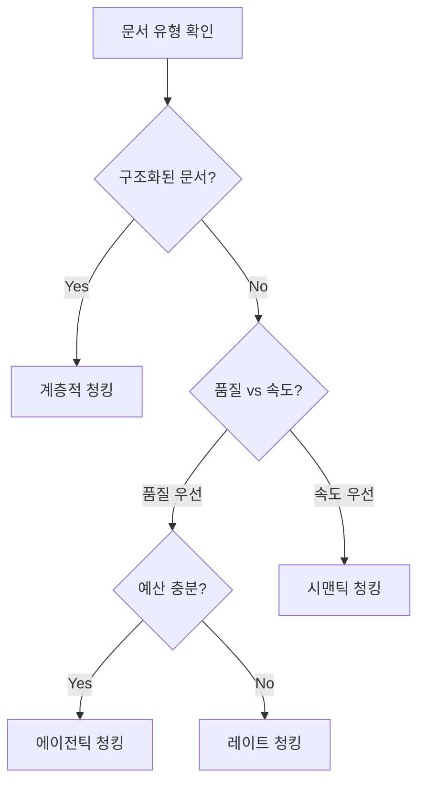

# 청킹(Chunking) 전략 가이드

문서를 "검색과 생성에 유리한 단위"로 자르는 과정이 청킹입니다. 좋은 청킹은 검색 품질(정밀·재현)과 생성 품질(충실도·관련성)을 동시에 끌어올립니다. 이 가이드는 목적에 따른 전략 선택, 신뢰할 수 있는 구현, 튜닝·평가 방법을 한 번에 제공합니다.

## 🔗 관련 가이드

### RAG 시스템 전체 가이드 시리즈
1. **[[[RAG] 01 문서 파싱(Document Parsing) 완전 가이드]]** - 문서 전처리 및 파싱 기법
2. **[RAG] 02 청킹(Chunking) 전략 가이드** ← **현재 가이드**
3. **[[[RAG] 03 임베딩(Embedding) 최적화 가이드]]** - 벡터 임베딩 모델 선택 및 튜닝
4. **[[[RAG] 04 리트리버(Retriever) 최적화 가이드]]** - 검색 시스템 성능 개선
5. **[[프롬프트] 11 Retrieval Augmented Generation (RAG) 프롬프팅]]** - RAG 프롬프팅 기법
6. **[[[RAG] 05 평가 및 모니터링 가이드]]** - RAG 성능 측정 및 운영 모니터링

### 추가 참고 가이드
- **[[프롬프트 엔지니어링 - 마스터 가이드]]** - 전체 프롬프팅 기법 개요
- **[[프레임워크] LangChain]]** - RAG 구현 프레임워크
- **[[프레임워크] LlamaIndex]]** - RAG 특화 프레임워크
- **[[프레임워크] Haystack]]** - 엔터프라이즈 RAG 솔루션
5. **📊 평가 및 모니터링**: [[[RAG] 05 평가 및 모니터링 가이드]]

**💡 추가 참고**: [[프롬프트] 11 Retrieval Augmented Generation (RAG) 프롬프팅]] | [[프레임워크] LlamaIndex]]

## 0. 환경 준비와 빠른 시작

### 필수 패키지 설치
```bash
pip install --upgrade sentence-transformers tiktoken numpy
# 한국어 문장 분할 보강(선택)
pip install kss
```

### 도구별 역할
| 도구 | 역할 | 사용 시점 |
|------|------|----------|
| sentence-transformers | 문장을 벡터로 변환 | 시맨틱 청킹 시 |
| tiktoken | 토큰 수 계산 | 청크 크기 조정 시 |
| numpy | 벡터 연산 | 유사도 계산 시 |
| kss | 한국어 문장 분할 | 한국어 문서 처리 시 |

### 5분 완성 가이드 (권장 시작 방법)
**상황**: 첫 RAG 구현 또는 기존 시스템의 청킹 품질 개선

```python
# Step 1: 기본 셋업
from sentence_transformers import SentenceTransformer
import numpy as np

model = SentenceTransformer('paraphrase-multilingual-MiniLM-L12-v2')  # 한국어 지원
document = "여러분의 긴 문서 텍스트..."

# Step 2: 문장 분할 → 시맨틱 청킹 → 오버랩 적용
sentences = split_sentences_ko(document)  # 한국어라면 kss 사용
chunks = chunk_by_similarity(sentences, model.encode, threshold=0.82)
final_chunks = apply_overlap(chunks, overlap_ratio=0.15)

# Step 3: 즉시 검증
print(f"청크 수: {len(final_chunks)}")
print(f"평균 길이: {sum(len(c) for c in final_chunks) // len(final_chunks)} 문자")
print(f"첫 번째 청크 미리보기: {final_chunks[0][:100]}...")
```

**예상 결과**: 200-400자 내외의 의미적으로 일관된 청크들이 생성됩니다.

## 1. 목표와 기본값
- 목표: “독립적으로 의미가 통하는 단위”로 분할해 검색이 잘 잡히고, 생성 시 문맥 누락을 줄인다.
- 권장 기본값(시작점)
  - 청크 길이: 200–400 토큰(기본 250)
  - 오버랩: 10–20%(문맥 가교)
  - 모델 한계: 임베딩/LLM 컨텍스트 상한(예: 8K 토큰) 고려

## 2. 전략 선택 의사결정 트리

### 상황별 최적 전략 선택



### 실무 선택 기준표

| 상황 | 권장 전략 | 이유 | 예상 성능 |
|------|----------|------|----------|
| **첫 RAG 구현** | 시맨틱 청킹 | 구현 간단, 안정적 성능 | 품질 7/10, 속도 9/10 |
| **기술문서/매뉴얼** | 계층적 → 시맨틱 보정 | 구조 보존 + 품질 확보 | 품질 8/10, 속도 7/10 |
| **학술논문/리포트** | 레이트 청킹 | 문맥 중요도 고려 필요 | 품질 8/10, 속도 6/10 |
| **최고 품질 필요** | 에이전틱 청킹 | LLM 보조로 최적 분할 | 품질 9/10, 속도 3/10 |

### 전략별 구체적 적용 시나리오

**시맨틱 청킹 적용 예시**
- 고객센터 FAQ, 블로그 포스트, 뉴스 기사
- 구조가 일정하지 않지만 의미적 일관성이 중요한 경우

**계층적 청킹 적용 예시**
- API 문서, 제품 매뉴얼, 정책 문서
- 제목/섹션 구조가 명확하고 이를 보존해야 하는 경우

**레이트 청킹 적용 예시**
- 연구보고서, 백서, 긴 분석 문서
- 문서 전체의 흐름과 핵심 개념 파악이 중요한 경우

**에이전틱 청킹 적용 예시**
- 법률 문서, 의료 가이드라인, 중요 계약서
- 분할 오류가 치명적이고 높은 품질이 필수인 경우

## 3. 핵심 전략과 구현

### 3.1 시맨틱 청킹(권장 기본)
연속 문장 임베딩 유사도(코사인)가 임계치 아래로 떨어질 때 경계 생성.

코드(간단/견고)
```python
import numpy as np

def chunk_by_similarity(sentences, embed, threshold=0.82):
    """
    sentences: list[str]
    embed: Callable[[list[str]], np.ndarray]  # (n, d) 임베딩 반환
    """
    if not sentences:
        return []
    E = embed(sentences)
    E = E / (np.linalg.norm(E, axis=1, keepdims=True) + 1e-12)
    chunks, cur = [], [sentences[0]]
    for i in range(1, len(sentences)):
        sim = float(E[i-1] @ E[i])
        if sim < threshold:
            chunks.append(' '.join(cur))
            cur = [sentences[i]]
        else:
            cur.append(sentences[i])
    if cur:
        chunks.append(' '.join(cur))
    return chunks
```

경계 재검토 프롬프트(선택)
```text
역할: 청크 경계 검토자
지침:
- 청크는 독립적으로 읽혀야 합니다.
- 미완 문장·리스트 시작/끝에서 자르지 마세요.
출력: 잘못된 경계만 “이전과 병합/다음과 분리” 제안 형태로 간결히 나열
```

튜닝 힌트
- threshold가 낮을수록 청크가 길고, 높을수록 잘게 나뉩니다.
- 시작값 0.80~0.84 범위에서 스윕 후 “청크 길이 분포 + 검색 Recall”로 결정하세요.

### 3.2 레이트 청킹(문맥 우선)
문서 전체 분포(중요도/클러스터)를 먼저 보고 나중에 분할. 보고서/정책 문서에 유리.

코드(스케치)
```python
def late_chunk(sentences, embed, target_len=1000):
    E = embed(sentences)  # (n, d)
    g = E.mean(0); g /= (np.linalg.norm(g) + 1e-12)
    En = E / (np.linalg.norm(E,axis=1,keepdims=True)+1e-12)
    scores = En @ g  # 중요도(글로벌 유사도)
    chunks, cur, cur_len = [], [], 0
    for s, sc in zip(sentences, scores):
        cur.append(s); cur_len += len(s)
        if cur_len > target_len or sc < np.quantile(scores, 0.3):
            chunks.append(' '.join(cur)); cur, cur_len = [], 0
    if cur: chunks.append(' '.join(cur))
    return chunks
```

### 3.3 계층적 청킹(구조 보존)
제목(H1~H3), 리스트, 표 등 구조 신호를 우선 경계로 사용. 매뉴얼/사양서/위키에 적합.

프롬프트(마크다운 입력)
```text
역할: 마크다운 청킹 어시스턴트
지침:
- 1차 경계: #, ##, ### 제목
- 표/리스트 블록은 한 청크로 유지
- 200–400 토큰 넘으면 하위 단락 기준으로 추가 분할
출력(JSON): [{"title":"...","text":"..."}]
```

### 3.4 에이전틱 청킹(LLM 보조)
LLM이 자연스러운 분할점과 개념 단위를 고려. 비용/시간 소요되나 최고 품질.

프롬프트(지시)
```text
역할: 의미 보존 청킹 에디터
입력: 긴 텍스트
지침:
1) 청크는 독립적으로 이해 가능해야 함
2) 개념 중간 단절 금지
3) 200–400 토큰 목표, 10–20% 오버랩 권장
출력(JSON): [{"text":"...","reason":"경계 근거"}]
```

## 4. 문장 분할·토큰 계산 유틸(한국어 고려)
```python
# 문장 분할(간단)
import re
def split_sentences_naive(text:str):
    s = re.split(r'(?<=[.!?。！？])\s+', text)
    return [x.strip() for x in s if x.strip()]

# 한국어 특화(kss)
def split_sentences_ko(text:str):
    from kss import split_sentences
    return [x.strip() for x in split_sentences(text) if x.strip()]

# 토큰 수 계산(tiktoken)
import tiktoken
def count_tokens(text:str, enc_name='cl100k_base'):
    enc = tiktoken.get_encoding(enc_name)
    return len(enc.encode(text))
```

참고
- 토큰은 LLM이 텍스트를 처리하는 최소 단위입니다. 청크 길이를 토큰 기준으로 맞추면 “한 번에 인코딩 가능한 범위”를 넘지 않게 설계할 수 있습니다.

## 5. 튜닝 절차(임계값·오버랩 스윕)
```python
def sweep_thresholds(sentences, embed, thresholds=(0.78,0.80,0.82,0.84)):
    results = {}
    for thr in thresholds:
        chunks = chunk_by_similarity(sentences, embed, threshold=thr)
        lengths = list(map(len, chunks))
        results[thr] = {
            'n_chunks': len(chunks),
            'avg_len': sum(lengths)/len(lengths),
            'p95_len': sorted(lengths)[int(0.95*len(lengths))-1]
        }
    return results

def apply_overlap(chunks, overlap_ratio=0.15):
    out = []
    for i, c in enumerate(chunks):
        if i==0: out.append(c); continue
        prev = out[-1].split()
        ov = prev[int(len(prev)*(1-overlap_ratio)):] if prev else []
        out.append(' '.join(ov + c.split()))
    return out
```

## 6. 문서 타입별 프리셋
- 매뉴얼/사양서: 계층적 → 시맨틱 보정, 오버랩 15–20%
- 블로그/기사: 시맨틱, 오버랩 10–15%
- 리서치 리포트: 레이트 → 에이전틱 보정, 오버랩 15%
- FAQ/단문: 시맨틱(임계치 높게), 오버랩 5–10%

## 7. 예시(입력→출력)
입력(요약)
```
개요: HPA는 CPU/메모리 또는 커스텀 메트릭으로 파드 수를 자동 조정한다. Metrics Server가 필요하다.
설정: 목표 CPU 70%, 최소/최대 레플리카. v2 API는 여러 메트릭 동시 지정.
```

시맨틱 청킹 결과(예)
```json
[
  {"chunk": "HPA는 … 자동 조정한다. Metrics Server가 필요하다."},
  {"chunk": "목표 CPU 70% … v2 API … 여러 메트릭 …"}
]
```

## 8. 품질 점검과 성능 튜닝 실무 가이드

### 단계적 품질 검증 프로세스

**1단계: 청크 분포 분석 (기본 품질 확인)**
```python
def analyze_chunk_distribution(chunks):
    lengths = [len(c.split()) for c in chunks]
    return {
        'count': len(chunks),
        'avg_words': np.mean(lengths),
        'std_words': np.std(lengths),
        'min_words': np.min(lengths),
        'max_words': np.max(lengths),
        'percentiles': np.percentile(lengths, [25, 50, 75, 95])
    }

# 목표 기준
# - 평균 50-200 단어 (한국어 기준)
# - 표준편차 < 평균의 50%
# - 95% 청크가 300 단어 이하
```

**2단계: 검색 품질 측정 (중간 검증)**
```python
def evaluate_retrieval_quality(queries, chunks, ground_truth):
    # Top-k 재현율 측정
    recall_at_k = {}
    for k in [1, 3, 5, 10]:
        retrieved = retriever.get_relevant_documents(query, k=k)
        relevant_found = len(set(retrieved) & set(ground_truth))
        recall_at_k[f'recall@{k}'] = relevant_found / len(ground_truth)
    return recall_at_k
```

**3단계: 최종 RAG 품질 검증**
- RAGAS 메트릭으로 충실도/관련성 측정
- 사용자 피드백 수집 (5점 척도)
- 응답 시간 모니터링

### 성능 문제별 해결책

| 문제 증상 | 원인 | 해결 방법 |
|---------|------|----------|
| 청크가 너무 길다 (>300 단어) | threshold 너무 낮음 | 0.80 → 0.82로 상향 조정 |
| 청크가 너무 짧다 (<50 단어) | threshold 너무 높음 | 0.84 → 0.82로 하향 조정 |
| 검색 재현율 낮음 | 오버랩 부족 | 10% → 15%로 증가 |
| 응답 충실도 낮음 | 문맥 단절 | 레이트 청킹 또는 에이전틱 청킹 검토 |
| 처리 속도 느림 | 복잡한 청킹 방식 | 시맨틱 청킹으로 단순화 |

## 9. 실전 배포 체크리스트

### 배포 전 필수 검토사항
- [ ] **청크 품질**: 평균 50-200 단어, 95% 청크가 300 단어 이하
- [ ] **문맥 연결**: 10-20% 오버랩으로 개념 단절 방지
- [ ] **구조 보존**: 제목/표/리스트 등 중요 구조 요소 보존
- [ ] **타입별 최적화**: 문서 유형에 맞는 청킹 전략 적용
- [ ] **성능 검증**: Top-5 재현율 80% 이상 달성

### 운영 중 모니터링 항목
- [ ] **응답 품질**: RAGAS 충실도 0.8 이상 유지
- [ ] **사용자 만족도**: 평점 4.0/5.0 이상 유지
- [ ] **시스템 성능**: 평균 응답시간 3초 이내 유지
- [ ] **오류 모니터링**: 청킹 실패율 1% 미만 유지

### 개선 사이클 (월 1회 권장)
1. 사용자 피드백 및 실패 케이스 분석
2. A/B 테스트로 청킹 파라미터 최적화
3. 새로운 문서 유형 대응 전략 수립
4. 성능 벤치마크 업데이트

## 10. 트러블슈팅 가이드

### 자주 발생하는 문제와 즉시 해결법

**문제 1: "검색 결과가 관련성이 떨어진다"**
```
증상: Top-5 재현율이 60% 미만
원인 분석:
1. 청크가 너무 크다 → 노이즈 포함
2. 청크가 너무 작다 → 문맥 부족
3. 오버랩 부족 → 개념 단절

해결 순서:
1. 청크 크기 분포 확인 (analyze_chunk_distribution 실행)
2. 평균이 200 단어 초과 시 → threshold 0.80 → 0.82
3. 평균이 50 단어 미만 시 → threshold 0.84 → 0.82
4. 오버랩 10% → 15%로 증가
```

**문제 2: "생성된 답변이 사실과 다르다"**
```
증상: RAGAS 충실도가 0.7 미만
원인: 청크 경계에서 문맥 누락

해결책:
1. 에이전틱 청킹으로 전환 (품질 우선 시)
2. 레이트 청킹 적용 (문맥 중요 문서)
3. 오버랩 20%까지 증가
```

**문제 3: "시스템이 너무 느리다"**
```
증상: 응답시간 5초 이상
원인: 복잡한 청킹 또는 과도한 청크 수

해결책:
1. 시맨틱 청킹으로 단순화
2. 청크 크기 증가 (threshold 0.84 → 0.80)
3. 배치 처리 도입
```

### 문제 예방을 위한 설계 원칙
1. **점진적 복잡도**: 시맨틱 청킹으로 시작 → 필요 시 고급 기법 적용
2. **측정 가능성**: 모든 변경사항에 대해 정량적 평가 수행
3. **롤백 준비**: 이전 설정으로 즉시 복구 가능한 체계 유지

---

## 부록 A. 용어 빠른 이해
- 청크(Chunk): 문서를 잘라 만든 작은 단위 텍스트(검색/생성의 기본 단위)
- 오버랩(Overlap): 인접 청크 간 일부 문장을 겹치게 넣어 문맥 단절을 줄이는 기법
- 시맨틱 청킹: 의미(임베딩) 유사도에 따라 경계를 정하는 분할
- 레이트 청킹: 임베딩을 만든 뒤 중요도/클러스터 분포를 보고 나중에 자르는 방식
- 계층적 청킹: 제목/목차 등 문서 구조를 경계로 삼는 분할
- 에이전틱 청킹: LLM이 경계를 제안/보정하는 분할(비용↑ 품질↑)
- 컨텍스트 윈도우: 모델이 한 번에 처리 가능한 토큰 범위(예: 8K)
- 정밀도/재현율: 검색 결과의 정확성/누락 없음의 지표(둘 사이엔 트레이드오프가 있습니다)
