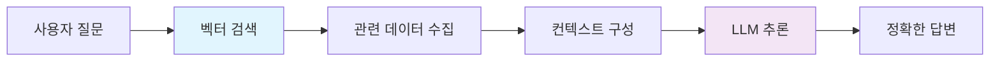
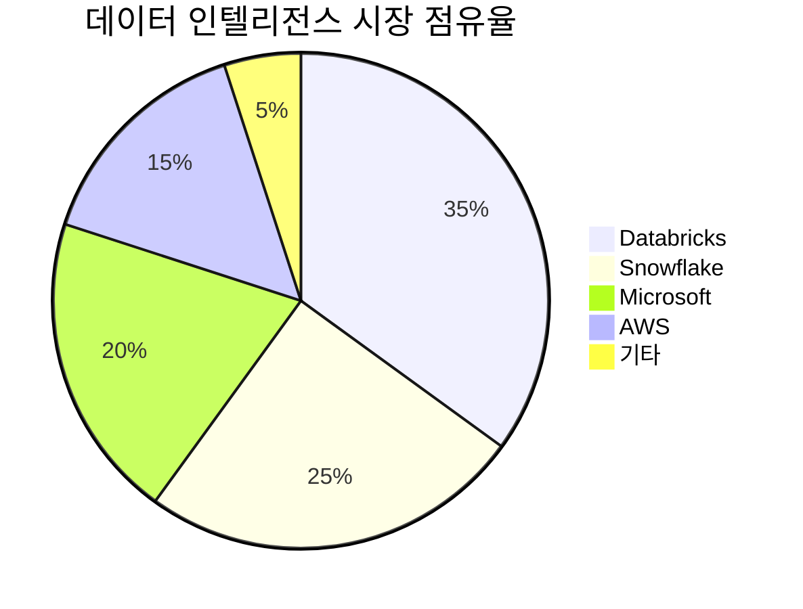
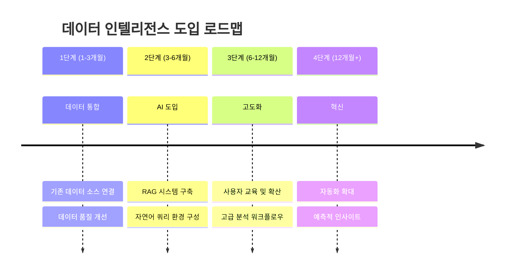
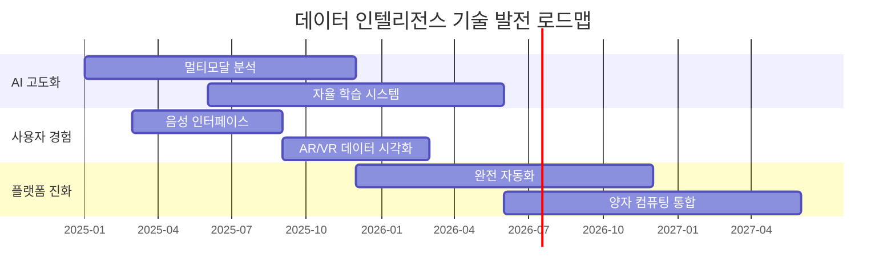

# 데이터 인텔리전스 (Data Intelligence)

> **비유로 이해하기**: 데이터 인텔리전스를 조직의 데이터를 관리하는 **'초지능 사서'**에 비유할 수 있습니다. 이 사서는 도서관(데이터 레이크하우스)의 모든 책(데이터)을 어디에 있는지 알 뿐만 아니라, 모든 책의 내용을 이해하고 있으며, 여러분이 어떤 질문을 하든 그 맥락을 파악하여 가장 정확한 정보를 찾아 자연스러운 말로 설명해 줍니다. 심지어 여러 책의 내용을 종합하여 새로운 리포트를 작성해주기까지 합니다.

## 🔍 핵심 개념

**데이터 인텔리전스(Data Intelligence)**는 단순한 데이터 분석을 넘어선 차세대 데이터 활용 패러다임입니다.

### ⚡ 핵심 특징
- **🧠 AI 네이티브**: 생성형 AI가 모든 데이터 작업의 중심
- **💬 자연어 인터페이스**: 코딩 없이 대화로 데이터 분석
- **🔗 맥락적 이해**: 데이터의 의미와 관계를 자동으로 파악
- **🚀 실시간 통찰**: 질문 즉시 답변과 실행 가능한 제안

### 📈 2025년 주목받는 이유
1. **생성형 AI의 성숙**: ChatGPT, Claude 등의 발전으로 자연어 데이터 분석이 현실화
2. **데이터 민주화 요구**: 비전문가도 데이터 인사이트에 접근해야 하는 시대적 요구
3. **실시간 의사결정**: 빠른 비즈니스 환경에서 즉석 데이터 분석의 필요성 증대
4. **통합 플랫폼**: 분산된 데이터를 하나의 지능형 플랫폼에서 통합 관리

---

## 1. 한눈에 보는 개념 비교: DI, BI, 그리고 데이터 분석

| 구분 | **Business Intelligence (BI)** | **Data Analysis (DA)** | **Data Intelligence (DI)** |
| :--- | :--- | :--- | :--- |
| **주요 질문** | "무슨 일이 있었나?" (What happened?) | "왜 일어났을까?" (Why?)<br>"무슨 일이 일어날까?" (What will happen?) | "**이 데이터는 무엇인가?**" (What is this data?)<br>"**왜 이 데이터가 중요한가?**" (Why is it important?) |
| **핵심 초점** | 과거~현재의 비즈니스 성과 모니터링 | 통계적 분석 및 미래 예측 | **데이터 자체의 맥락과 의미 이해** |
| **주요 기술** | 대시보드, 리포팅, 데이터 시각화 | 통계 모델, 예측 모델링 | **AI/ML, 자연어 처리(NLP), 통합 거버넌스** |
| **데이터 종류** | 주로 정형 데이터 | 정형/비정형 데이터 | 모든 종류의 데이터 (정형, 비정형, 시맨틱) |
| **결과물** | 시각화된 리포트, 성과 대시보드 | 분석 보고서, 예측 모델 | **대화형 AI 에이전트, 자동화된 데이터 관리, 시맨틱 검색** |

---

## 2. 데이터 인텔리전스 아키텍처 시각화

데이터 인텔리전스 플랫폼은 다양한 데이터 소스를 통합하고, 지능적으로 처리하여 사용자에게 전달하는 유기적인 구조를 가집니다.

```mermaid
graph TD
    subgraph "데이터 소스 (Data Sources)"
        A[<fa:fa-database> ERP/CRM]
        B[<fa:fa-file-alt> Logs/Files]
        C[<fa:fa-cloud> Cloud Apps]
        D[<fa:fa-broadcast-tower> IoT/Streaming]
    end

    subgraph "통합 데이터 플랫폼 (Unified Data Platform)"
        direction LR
        E[Data Lakehouse<br>(Delta Lake)]
        F[Unified Governance<br>(Unity Catalog)]
        E -- 관리/보안 --> F
    end

    subgraph "데이터 인텔리전스 엔진 (DI Engine)"
        G["<fa:fa-robot> <b>DatabricksIQ</b><br>(Generative AI + Semantics)"]
    end

    subgraph "사용자 및 애플리케이션 (Users & Applications)"
        H[<fa:fa-comments> 자연어 쿼리<br>(Natural Language Query)]
        I[<fa:fa-chart-line> BI 대시보드]
        J[<fa:fa-cogs> AI/ML 모델 개발]
        K[<fa:fa-tasks> 자동화된 워크플로우]
    end

    A & B & C & D -- 데이터 수집/통합 --> E
    E -- 학습/이해 --> G
    F -- 컨텍스트 제공 --> G
    G -- 지능형 답변/자동화 --> H & I & J & K
```

---

## 3. 실제 활용 시나리오: 상세 예시

**상황**: 한 패션 리테일 기업의 마케팅 매니저 '김민아' 님은 최근 Z세대를 타겟으로 한 여름 캠페인의 실적이 예상보다 저조하여 고민에 빠졌습니다.

**데이터 인텔리전스 플랫폼 활용 과정**:

1.  **자연어 질문 (Problem Identification)**:
    *   김민아 매니저는 BI 대시보드를 열어보는 대신, DI 플랫폼의 챗봇에게 직접 질문합니다.
    *   `"지난달 진행한 여름 캠페인에서 Z세대 고객 그룹의 매출이 저조한 원인이 뭐야? 특히 인스타그램 광고 채널의 효율성을 상세히 분석해 줘."`

2.  **엔진의 시맨틱 이해 및 데이터 검색 (Semantic Search & Retrieval)**:
    *   DI 엔진은 '여름 캠페인', 'Z세대 고객 그룹', '매출', '인스타그램 광고' 등의 용어가 내부적으로 어떤 테이블과 지표에 해당하는지 즉시 이해합니다.
    *   광고 집행 데이터, 고객 구매 데이터(CRM), 웹/앱 로그, 소셜 미디어 댓글 데이터(비정형) 등 여러 소스에서 관련 정보를 자동으로 수집하고 통합(Join)합니다.

3.  **AI 기반 분석 및 인사이트 도출 (AI-Powered Analysis)**:
    *   엔진은 데이터를 분석하여 다음과 같은 잠재적 원인들을 발견합니다.
        *   "인스타그램 광고 클릭률(CTR)은 높았으나, 실제 구매 전환율(CVR)은 다른 채널 대비 30% 낮습니다."
        *   "광고를 클릭한 Z세대 사용자들은 평균적으로 상품 상세 페이지에서 5초 이내에 이탈했습니다."
        *   "소셜 미디어 댓글 분석 결과, '가격이 비싸다', '디자인이 너무 평범하다'는 부정적인 키워드가 다수 발견되었습니다."

4.  **실행 가능한 제안 (Actionable Recommendations)**:
    *   단순한 분석 결과를 넘어, DI 플랫폼은 다음과 같은 구체적인 해결책을 제안합니다.
    *   `"**제안 1**: Z세대의 가격 민감도를 고려하여, '10대 전용 할인 쿠폰'을 발급하는 소규모 A/B 테스트를 진행해 보세요."`
    *   `"**제안 2**: 상품 상세 페이지의 이탈률이 높으니, 사용자 참여를 유도할 수 있는 숏폼 비디오나 인터랙티브 콘텐츠를 추가하는 것을 고려해 보세요. 관련 성공 사례 노트를 첨부합니다."`

**결과**: 김민아 매니저는 데이터 분석가에게 별도의 요청을 보내고 며칠을 기다릴 필요 없이, 단 몇 분 만에 문제의 핵심 원인을 파악하고 구체적인 실행 계획까지 얻을 수 있었습니다.

---

## 4. 핵심 기술 스택

### 🔄 RAG (Retrieval-Augmented Generation)
데이터 인텔리전스의 핵심 엔진입니다.

**작동 원리**:


1. **🔍 검색 (Retrieve)**: 질문과 관련된 최신 데이터를 벡터 유사도로 검색
2. **🔗 증강 (Augment)**: 검색된 데이터를 맥락으로 LLM에 제공
3. **💡 생성 (Generate)**: 실제 데이터 기반의 신뢰할 수 있는 답변 생성

### 🏗️ 기술 아키텍처 구성요소

| 레이어 | 기술 | 역할 |
|--------|------|------|
| **🤖 AI 레이어** | LLM (GPT-4, Claude, Llama) | 자연어 이해 및 생성 |
| **🔍 검색 레이어** | Vector DB (Chroma, Pinecone) | 의미론적 검색 |
| **🗄️ 데이터 레이어** | Data Lakehouse (Delta Lake) | 통합 데이터 저장 |
| **🛡️ 거버넌스** | Unity Catalog | 권한, 계보, 품질 관리 |

---

## 5. 시장 동향 및 주요 플레이어

### 📊 시장 규모 (2025년 기준)


### 🏢 주요 플레이어 비교

| 플랫폼 | 강점 | 약점 | 적합 기업 |
|---------|------|------|----------|
| **Databricks** | • 통합 AI/ML 파이프라인<br>• 오픈소스 기반<br>• 강력한 거버넌스 | • 학습 곡선<br>• 높은 비용 | 대기업, AI 고도화 |
| **Snowflake** | • 클라우드 네이티브<br>• 확장성<br>• SQL 친화적 | • AI 기능 제한<br>• 컴퓨팅 비용 | 전통적 데이터팀 |
| **Microsoft Fabric** | • Office 365 연동<br>• 통합 환경 | • 벤더 종속<br>• 유연성 제한 | MS 생태계 기업 |

---

## 6. 실무 구현 로드맵

### 🗺️ 단계별 도입 전략



### ⚡ Quick Start 체크리스트

**📋 사전 준비 (2주)**
- [ ] 현재 데이터 인프라 감사
- [ ] 주요 비즈니스 질문 50개 정리
- [ ] 데이터 거버넌스 정책 수립
- [ ] 파일럿 팀 구성 (3-5명)

**🚀 파일럿 프로젝트 (4주)**
- [ ] 핵심 데이터 소스 3개 연결
- [ ] 기본 RAG 시스템 구축
- [ ] 자연어 쿼리 20개 테스트
- [ ] 사용자 피드백 수집

**📈 확장 단계 (8주)**
- [ ] 전 부서 데이터 통합
- [ ] 고급 분석 기능 활성화
- [ ] 사용자 교육 프로그램 실시
- [ ] ROI 측정 및 보고

---

## 7. 비용 및 ROI 분석

### 💰 구축 비용 (중형 기업 기준)

| 항목 | 초기 비용 | 월 운영비 |
|------|----------|----------|
| **플랫폼 라이선스** | $50,000 | $15,000 |
| **전문 인력** | $200,000 | $30,000 |
| **데이터 통합** | $100,000 | $5,000 |
| **교육 및 지원** | $30,000 | $3,000 |
| **총계** | **$380,000** | **$53,000** |

### 📊 예상 ROI (12개월 기준)

**💡 비용 절감 효과**
- 데이터 분석 시간 70% 단축 → **$240,000 절약**
- 리포트 자동화 → **$120,000 절약**
- 의사결정 속도 향상 → **$180,000 가치**

**🎯 수익 증대 효과**
- 고객 인사이트 개선 → **매출 3% 증가**
- 운영 효율성 향상 → **비용 5% 절감**

**📈 총 ROI: 250-300%**

---

## 8. 성공 사례 및 교훈

### 🏆 국내외 성공 사례

**🇰🇷 SK텔레콤**
- **도입 배경**: 고객 데이터 분석 자동화
- **성과**: 고객 이탈률 15% 감소
- **핵심 성공 요인**: 단계적 도입, 충분한 사용자 교육

**🇺🇸 Netflix**
- **도입 배경**: 콘텐츠 추천 시스템 고도화
- **성과**: 시청 시간 20% 증가
- **핵심 성공 요인**: AI-first 문화, 지속적 실험

### 🚨 주요 실패 요인 및 대응책

| 실패 요인 | 발생 확률 | 대응책 |
|----------|----------|--------|
| **데이터 품질 문제** | 60% | • 사전 데이터 정제<br>• 지속적 품질 모니터링 |
| **사용자 저항** | 40% | • 점진적 도입<br>• 성공 사례 공유 |
| **과도한 기대** | 30% | • 현실적 목표 설정<br>• 단계별 성과 측정 |

---

## 9. 미래 전망 및 트렌드

### 🔮 2025-2027 주요 트렌드

**🎯 기술 트렌드**
- **멀티모달 AI**: 텍스트+이미지+음성 통합 분석
- **에지 AI**: 실시간 로컬 데이터 처리
- **자율형 데이터**: 스스로 학습하고 진화하는 데이터 시스템

**🏢 비즈니스 트렌드**
- **데이터 민주화**: 모든 직원이 데이터 분석가
- **실시간 의사결정**: 즉석 인사이트 기반 운영
- **예측적 비즈니스**: 미래 시나리오 자동 생성

### 🚀 차세대 기능 로드맵



---

## 10. 실무 적용 가이드

### 🎯 부서별 활용 시나리오

**📈 마케팅팀**
- "이번 달 캠페인 ROI가 낮은 이유와 개선 방안은?"
- "경쟁사 대비 우리 브랜드 언급량 변화는?"
- "다음 분기 타겟 고객 세그먼트 추천해줘"

**💰 재무팀**
- "현재 현금흐름 상태와 향후 3개월 전망은?"
- "비용 절감이 가능한 항목들을 우선순위별로 보여줘"
- "예산 대비 실제 지출 차이가 큰 부서는?"

**👥 HR팀**
- "이직 위험이 높은 직원들의 특성은?"
- "팀별 생산성과 만족도의 상관관계는?"
- "신입 채용 시 중요한 역량 지표는?"

### 🛠️ 구현 체크포인트

**✅ 기술적 준비사항**
- [ ] 클라우드 인프라 (AWS/Azure/GCP)
- [ ] 데이터 파이프라인 자동화
- [ ] 보안 및 컴플라이언스 체계
- [ ] 모니터링 및 알럿 시스템

**👥 조직적 준비사항**
- [ ] 데이터 거버넌스 팀 구성
- [ ] 사용자 교육 프로그램
- [ ] 변화 관리 계획
- [ ] 성과 측정 KPI 정의

---

## 11. 관련 자료 및 다음 단계

### 📚 추가 학습 자료
- **[[프레임워크] Databricks]]**: 데이터 인텔리전스 플랫폼 상세 가이드
- **[[RAG] 01 문서 파싱]]**: RAG 시스템 구축 기초
- **[[프롬프트] 11 Retrieval Augmented Generation (RAG) 프롬프팅]]**: RAG 프롬프팅 기법

### 🎯 실무 적용 다음 단계
1. **POC 계획 수립**: 파일럿 프로젝트 기획서 작성
2. **기술 검증**: 주요 플랫폼 비교 분석
3. **예산 확보**: ROI 기반 예산안 작성
4. **팀 빌딩**: 전담 조직 구성

### 🔗 외부 리소스
- [Databricks 공식 문서](https://docs.databricks.com/)
- [Gartner Data & Analytics 리포트](https://www.gartner.com/en/information-technology/insights/data-analytics)
- [데이터 인텔리전스 커뮤니티](https://community.databricks.com/)

---

**💡 핵심 메시지**: 데이터 인텔리전스는 단순한 기술 트렌드가 아닌, 조직의 데이터 활용 방식을 근본적으로 바꾸는 패러다임 전환입니다. 성공적인 도입을 위해서는 기술적 준비와 함께 조직 문화의 변화가 필수적입니다.
