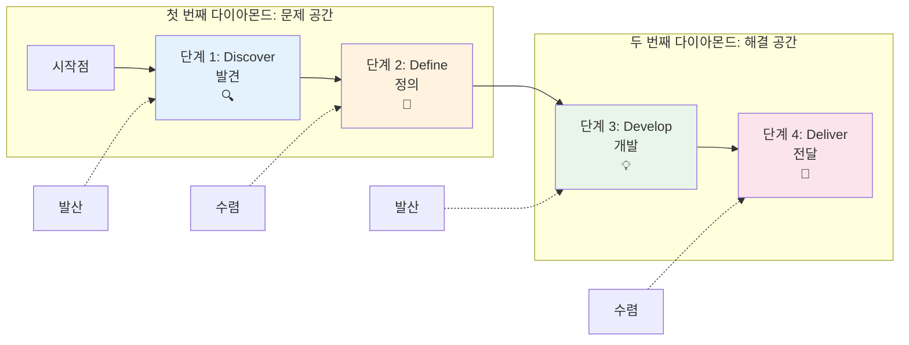
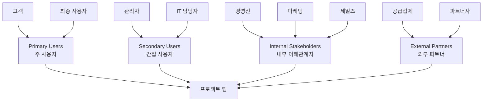
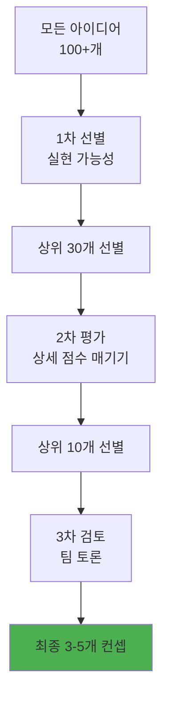
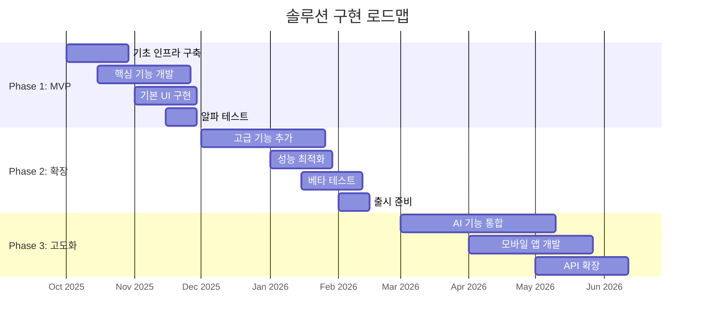

# 더블 다이아몬드 (Double Diamond)

> **핵심 철학**: "올바른 문제를 올바른 방법으로 해결한다." - British Design Council

## 💎 더블 다이아몬드란?

더블 다이아몬드는 영국 디자인 카운슬(British Design Council)에서 개발한 **체계적 문제 해결 프레임워크**입니다. 발산적 사고와 수렴적 사고를 두 번 반복하여 문제를 정확히 정의하고 최적의 솔루션을 개발하는 방법론입니다.


### ⚡ 핵심 원리

**🔄 Divergent & Convergent Thinking (발산과 수렴)**
- 넓게 탐색한 후 좁혀가는 사고 과정
- 가능성을 충분히 검토한 후 선택
- 성급한 결론 방지와 창의적 해결책 확보

**💎 Double Process (이중 프로세스)**
- 첫 번째 다이아몬드: 올바른 문제 찾기
- 두 번째 다이아몬드: 올바른 해결책 만들기
- 문제 정의와 해결책 개발의 명확한 분리

**🎯 Evidence-Based Decision (증거 기반 의사결정)**
- 가정이 아닌 실제 데이터와 관찰에 기반
- 사용자 중심적 접근
- 지속적인 검증과 개선

---

## 🗺️ 4단계 프로세스

### 📊 전체 프로세스 시각화



### 📈 각 단계별 활동 강도

```
활동 강도

높음 ┤     ╭─╮           ╭─╮
      │    ╱   ╲         ╱   ╲
      │   ╱     ╲       ╱     ╲
      │  ╱       ╲     ╱       ╲
낮음  └─╱─────────╲───╱─────────╲──
      Discover  Define  Develop  Deliver
        🔍       🎯      💡      🚀
```

---

## 1️⃣ Discover (발견) 단계

### 🎯 목적
문제 영역을 넓게 탐색하여 숨겨진 문제와 기회를 발견합니다.

### 🛠️ 주요 활동

**🔍 데스크 리서치**
```
시장 분석:
✅ 산업 동향 및 트렌드 분석
✅ 경쟁사 현황 및 전략 파악
✅ 규제 환경 및 기술 변화
✅ 사용자 행동 패턴 변화

내부 분석:
✅ 기존 데이터 및 연구 검토
✅ 과거 프로젝트 사례 분석
✅ 조직 역량 및 제약사항
✅ 이해관계자 맵핑
```

**👥 이해관계자 인터뷰**


**📊 현장 관찰 (Ethnographic Research)**
```
관찰 영역:
• 실제 사용 환경과 맥락
• 명시되지 않은 사용자 행동
• 기존 솔루션의 한계점
• 워크어라운드(임시 해결책) 패턴

기록 방법:
• 사진, 비디오를 통한 시각적 기록
• 행동 패턴의 정량적 측정
• 사용자 발언의 정확한 전사
• 감정 상태와 만족도 변화
```

**🗺️ 고객 여정 맵핑**
```
단계별 분석:
1. Awareness (인지) - 문제를 인식하는 시점
2. Consideration (고려) - 해결책을 탐색하는 과정
3. Purchase (구매) - 의사결정과 구매 과정
4. Onboarding (온보딩) - 첫 사용과 학습 과정
5. Usage (사용) - 일상적 사용 경험
6. Support (지원) - 문제 해결과 지원 요청
7. Advocacy (추천) - 만족도와 추천 의향

각 단계별 기록:
• 사용자 행동 (What they do)
• 사용자 생각 (What they think)
• 사용자 감정 (What they feel)
• 접촉점 (Touchpoints)
• 기회와 문제점 (Opportunities & Pain points)
```

### 📊 정보 수집 매트릭스

| 정보 유형 | 수집 방법 | 소요 시간 | 신뢰도 | 활용도 |
|----------|-----------|----------|--------|--------|
| **정량 데이터** | 웹 애널리틱스, 설문 | 1-2주 | 높음 | 높음 |
| **정성 인사이트** | 심층 인터뷰 | 2-3주 | 높음 | 매우 높음 |
| **행동 패턴** | 관찰 연구 | 3-4주 | 매우 높음 | 높음 |
| **시장 동향** | 데스크 리서치 | 1주 | 중간 | 중간 |

### 🎯 산출물
- 이해관계자 맵
- 사용자 여정 맵
- 현장 관찰 보고서
- 시장 분석 리포트
- 기회 영역 식별
- 초기 인사이트 목록

---

## 2️⃣ Define (정의) 단계

### 🎯 목적
수집된 정보를 종합하여 해결해야 할 핵심 문제를 명확히 정의합니다.

### 🛠️ 주요 활동

**🧩 인사이트 종합**
```
Affinity Mapping 과정:
1. 모든 발견사항을 개별 포스트잇에 기록
2. 유사한 내용끼리 그룹핑
3. 그룹별 주제 명명
4. 주제 간 연관관계 파악
5. 상위 테마 도출

예시 그룹핑:
📱 기술적 한계
• "앱이 자주 멈춘다"
• "로딩 시간이 너무 길다"
• "오프라인에서 사용할 수 없다"

😤 사용자 좌절감
• "복잡해서 포기하게 된다"
• "원하는 기능을 찾기 어렵다"
• "에러 메시지가 이해하기 어렵다"
```

**👤 페르소나 개발**
```
Primary Persona 예시:

이름: 김소영 (32세, 마케팅 팀장)

기본 정보:
• 직업: 중소기업 마케팅 팀장
• 경력: 8년
• 기술 수준: 중급
• 주요 도구: Excel, PowerPoint, Google Analytics

목표 및 동기:
• 마케팅 ROI를 정확히 측정하고 싶다
• 업무 효율성을 높이고 싶다
• 데이터 기반 의사결정을 하고 싶다

불만 및 고충:
• 여러 도구에서 데이터를 수동으로 취합해야 함
• 실시간 성과 파악이 어려움
• 상사에게 보고할 자료 준비에 너무 많은 시간 소요

사용 시나리오:
• 주로 오전에 성과 데이터 확인
• 주간 보고서는 금요일에 작성
• 캠페인 실행 중에는 실시간 모니터링 필요
```

**🎯 문제 정의서 (Problem Statement)**
```
템플릿:
[사용자 그룹]은 [상황/맥락]에서 [구체적 문제]를 겪고 있다.
이는 [근본 원인] 때문이며, [영향/결과]를 초래한다.
만약 이 문제를 해결한다면 [기대 효과]를 얻을 수 있다.

실제 예시:
중소기업 마케팅 담당자들은 다양한 채널에서 발생하는
마케팅 데이터를 통합 분석할 때 너무 많은 수동 작업을
겪고 있다. 이는 각 플랫폼별로 별도의 리포팅 시스템을
사용하기 때문이며, 분석 시간 지연과 인사이트 도출
기회 상실을 초래한다. 만약 이 문제를 해결한다면
마케팅 효율성을 40% 향상시키고 실시간 의사결정이
가능해질 것이다.
```

**📊 How Might We (HMW) 질문 생성**
```
문제 영역별 HMW 질문:

데이터 통합:
• 어떻게 하면 여러 소스의 데이터를 자동으로 통합할 수 있을까?
• 어떻게 하면 실시간으로 모든 채널 성과를 볼 수 있을까?

사용성:
• 어떻게 하면 복잡한 데이터를 직관적으로 표시할 수 있을까?
• 어떻게 하면 기술 지식이 없어도 쉽게 사용할 수 있을까?

효율성:
• 어떻게 하면 리포트 작성 시간을 90% 줄일 수 있을까?
• 어떻게 하면 인사이트 도출을 자동화할 수 있을까?
```

### 🎯 우선순위 매트릭스

**임팩트 vs 해결 가능성**
```
높은 임팩트 │ ⭐ 핵심 문제  │ 🎯 중요 문제
           │  우선 해결   │  계획적 접근
───────────┼─────────────┼─────────────
낮은 임팩트 │ 🔧 개선 사항  │ ❌ 제외
           │  여유시 검토  │  하지 않음
           │              │
         쉬움 ←──해결 가능성──→ 어려움
```

### 📈 문제 검증

**가설 설정 및 검증**
```
핵심 가설:
"중소기업 마케터들은 데이터 통합의 어려움 때문에
마케팅 의사결정을 늦추고 있을 것이다."

검증 방법:
✅ 추가 사용자 인터뷰 (10명)
✅ 현재 작업 프로세스 시간 측정
✅ 의사결정 지연 사례 수집
✅ 경쟁 솔루션 사용 현황 조사

성공 기준:
• 80% 이상이 데이터 통합 문제 언급
• 평균 리포트 작성 시간 4시간 이상
• 의사결정 지연 사례 주당 2회 이상
```

### 🎯 산출물
- 핵심 문제 정의서
- 타겟 페르소나 (Primary, Secondary)
- HMW 질문 목록
- 문제 우선순위 매트릭스
- 성공 지표 정의
- 프로젝트 범위 정의

---

## 3️⃣ Develop (개발) 단계

### 🎯 목적
정의된 문제에 대한 다양한 솔루션 아이디어를 발산적으로 생성합니다.

### 🛠️ 주요 활동

**💡 아이디어 생성 워크숍**
```
다양한 브레인스토밍 기법 활용:

🌟 Classic Brainstorming
• 15분간 개인 아이디어 작성
• 돌아가며 아이디어 발표
• 다른 아이디어에 편승하여 발전
• 비판 없이 모든 아이디어 환영

🎭 Role Storming
• 다양한 관점에서 아이디어 도출
• Apple, Google, Amazon이라면?
• 10살 아이, 90세 할머니라면?
• 무한 예산, 제로 예산이라면?

🔄 SCAMPER 기법
• Substitute: 다른 것으로 대체
• Combine: 서로 다른 요소 결합
• Adapt: 다른 분야에서 응용
• Modify: 크기, 색깔, 형태 변경
• Put to other uses: 다른 용도 활용
• Eliminate: 불필요한 요소 제거
• Reverse: 순서나 역할 바꾸기
```

**🔍 벤치마킹 및 영감 수집**
```
분석 대상:
✅ 직접 경쟁사 솔루션
✅ 간접 경쟁사 접근법
✅ 다른 산업의 유사 문제 해결책
✅ 최신 기술 트렌드 활용 사례

영감 소스:
• Behance, Dribbble (디자인 영감)
• Product Hunt (혁신 제품)
• Nielsen Norman Group (UX 베스트 프랙티스)
• Google Experiments (실험적 접근)

기록 방법:
• 스크린샷과 함께 핵심 아이디어 정리
• 우리 문제에 적용 가능한 부분 하이라이트
• 차별화 포인트 식별
```

**🏗️ 컨셉 개발**
```
아이디어를 컨셉으로 발전:

1. 아이디어 클러스터링
   • 유사한 아이디어들을 그룹핑
   • 각 그룹의 핵심 테마 도출
   • 하이브리드 아이디어 생성 가능성 탐색

2. 컨셉 스케치
   • 각 컨셉을 시각적으로 표현
   • 사용자 시나리오 포함
   • 핵심 기능과 특징 명시

3. 컨셉 설명서 작성
   • 목적과 가치 제안
   • 주요 기능과 특징
   • 차별화 포인트
   • 구현 방향성
```

### 🎯 아이디어 평가 및 선별

**평가 기준 매트릭스**
```
평가 기준:
1. 사용자 가치 (40%)
   • 문제 해결 효과성
   • 사용자 만족도 기대치
   • 사용 편의성

2. 기술적 실현가능성 (25%)
   • 기술적 복잡도
   • 개발 기간과 비용
   • 기존 시스템과의 호환성

3. 비즈니스 임팩트 (25%)
   • 시장 잠재력
   • 수익성 기대치
   • 브랜드 차별화 효과

4. 혁신성 (10%)
   • 시장 첫 도입 여부
   • 기술적 혁신도
   • 사용자 경험 혁신도
```

**선별 프로세스**


### 🏆 최종 컨셉 정리

**컨셉별 상세 정리**
```
컨셉 A: 통합 대시보드 솔루션
• 핵심 가치: 원스톱 데이터 조회
• 주요 기능: 실시간 통합 대시보드
• 차별화: AI 기반 인사이트 제공
• 구현 복잡도: 중간
• 시장 임팩트: 높음

컨셉 B: 자동화 리포트 생성기
• 핵심 가치: 리포트 작업 자동화
• 주요 기능: 템플릿 기반 자동 생성
• 차별화: 자연어 분석 및 요약
• 구현 복잡도: 높음
• 시장 임팩트: 매우 높음

컨셉 C: 모바일 퍼스트 분석 도구
• 핵심 가치: 언제 어디서나 접근
• 주요 기능: 모바일 최적화 인터페이스
• 차별화: 푸시 알림 기반 즉시 대응
• 구현 복잡도: 낮음
• 시장 임팩트: 중간
```

### 🎯 산출물
- 아이디어 목록 (100+개)
- 벤치마킹 리포트
- 최종 컨셉 3-5개
- 컨셉별 상세 설명서
- 평가 매트릭스 결과
- 컨셉 시각화 자료

---

## 4️⃣ Deliver (전달) 단계

### 🎯 목적
선택된 컨셉을 구체적인 솔루션으로 발전시켜 실제 구현 가능한 형태로 만듭니다.

### 🛠️ 주요 활동

**🎨 프로토타이핑**
```
프로토타입 단계별 발전:

1. Paper Prototype (1-2일)
   • 핵심 화면과 플로우 스케치
   • 사용자 시나리오 검증
   • 내부 팀 피드백 수집

2. Digital Wireframe (3-5일)
   • 상세한 화면 설계
   • 기능 명세서 작성
   • 기술팀과의 실현가능성 검토

3. Interactive Prototype (1-2주)
   • 실제 상호작용 구현
   • 사용자 테스트 가능 수준
   • 비즈니스 로직 반영

4. High-Fidelity Prototype (2-3주)
   • 최종 디자인 적용
   • 실제 데이터 연동
   • 성능 최적화 반영
```

**👥 사용자 테스트**
```
테스트 계획:

참가자: 15-20명
• Primary Persona: 10명
• Secondary Persona: 5명
• Edge Case Users: 3-5명

테스트 방법:
• 모더레이티드 테스트 (1시간씩)
• 태스크 기반 시나리오 수행
• Think-aloud 프로토콜
• 인터뷰 및 설문조사

측정 지표:
✅ 태스크 완료율 (목표: 80% 이상)
✅ 태스크 완료 시간 (기준선 대비)
✅ 에러 발생 횟수 (화면당 1회 미만)
✅ 만족도 점수 (5점 만점에 4점 이상)
✅ NPS (Net Promoter Score)
```

**📊 테스트 결과 분석**
```
정량적 분석:
• 성공률, 완료 시간, 에러율 등 수치화
• 목표 지표 달성 여부 확인
• 통계적 유의성 검증

정성적 분석:
• 사용자 발언 내용 분석
• 감정적 반응 패턴 파악
• 예상치 못한 사용 행동 발견

개선 우선순위:
높은 임팩트 & 쉬운 해결 → 즉시 수정
높은 임팩트 & 어려운 해결 → 다음 버전
낮은 임팩트 → 백로그 등록
```

**🔄 반복 개선**
```
개선 사이클:
1. 테스트 결과 분석
2. 우선순위별 개선 사항 도출
3. 프로토타입 수정
4. 내부 검토
5. 재테스트 (필요시)

일반적인 개선 영역:
• 내비게이션 구조 단순화
• 핵심 기능 접근성 향상
• 에러 처리 및 피드백 개선
• 온보딩 프로세스 최적화
• 성능 및 로딩 속도 개선
```

### 🚀 구현 계획 수립

**📋 개발 로드맵**


**👥 팀 구성 및 역할**
```
개발팀 구성:
• 프로젝트 매니저 (1명)
• 프론트엔드 개발자 (2-3명)
• 백엔드 개발자 (2-3명)
• UI/UX 디자이너 (1-2명)
• QA 엔지니어 (1명)
• 데이터 엔지니어 (1명)

외부 협력:
• 사용자 리서처 (월 20시간)
• 보안 컨설턴트 (프로젝트 기간)
• 마케팅 에이전시 (런칭 시)
```

### 📈 성과 측정 계획

**KPI 설정**
```
사용자 중심 지표:
• 월간 활성 사용자 (MAU)
• 사용자 만족도 (CSAT)
• 고객 추천 지수 (NPS)
• 기능별 사용률

비즈니스 지표:
• 매출 증대 효과
• 고객 획득 비용 (CAC)
• 고객 생애 가치 (LTV)
• 시장 점유율

기술적 지표:
• 시스템 가용성 (Uptime)
• 응답 속도 (Response Time)
• 에러 발생률
• 보안 사고 횟수
```

**📊 지속적 모니터링**
```
모니터링 도구:
• Google Analytics (사용자 행동)
• Mixpanel (이벤트 추적)
• Hotjar (사용자 세션 분석)
• New Relic (시스템 성능)

리뷰 사이클:
• 주간: 핵심 지표 트래킹
• 월간: 사용자 피드백 분석
• 분기: 전략적 방향 검토
• 연간: 전체 성과 평가
```

### 🎯 산출물
- 최종 프로토타입 (High-Fidelity)
- 사용자 테스트 보고서
- 기술 명세서
- 개발 로드맵
- 팀 구성 계획
- KPI 측정 계획
- 런칭 전략

---

## 🛠️ 실무 적용 가이드

### 📅 프로젝트 타임라인 (12-16주 기준)

| 주차 | 단계 | 주요 활동 | 투입 인력 | 주요 산출물 |
|------|------|-----------|----------|------------|
| **1-3주** | Discover | 리서치, 인터뷰, 관찰 | 3-4명 | 인사이트 리포트 |
| **4-5주** | Define | 분석, 문제정의 | 4-5명 | 문제 정의서 |
| **6-9주** | Develop | 아이디어 생성, 컨셉 개발 | 5-6명 | 핵심 컨셉 3-5개 |
| **10-16주** | Deliver | 프로토타입, 테스트, 개선 | 6-8명 | 최종 솔루션 |

### 🏢 조직 준비사항

**문화적 준비**
```
✅ 실험과 학습 문화
• 완벽하지 않은 초기 아이디어 허용
• 사용자 피드백을 최우선 가치로 인정
• 빠른 실패와 빠른 학습 장려

✅ 협업 중심 문화
• 부서간 벽 없는 소통
• 다양한 관점의 적극적 수용
• 건설적 갈등과 토론 문화

✅ 데이터 기반 의사결정
• 가정보다 실제 데이터 우선
• 정량적/정성적 근거 제시 습관
• 지속적 검증과 개선 마인드
```

**물리적/디지털 인프라**
```
물리적 공간:
• 대형 화이트보드 벽면
• 유연한 가구 배치 가능 공간
• 조용한 개인 작업 공간
• 사용자 테스트용 별도 룸

디지털 도구:
• 협업 도구 (Miro, Figma, Slack)
• 프로젝트 관리 (Jira, Asana)
• 사용자 리서치 (Lookback, Zoom)
• 프로토타이핑 (Figma, Principle)
• 데이터 분석 (Google Analytics, Mixpanel)
```

### 👥 팀 구성 및 역할

**핵심 팀 구성 (6-8명)**
```
🎯 프로젝트 리드 (1명)
• 전체 프로세스 총괄
• 이해관계자 관리
• 의사결정 촉진

🔍 리서처 (1-2명)
• 사용자 조사 설계 및 진행
• 데이터 수집 및 분석
• 인사이트 도출

🎨 디자이너 (1-2명)
• 아이디어 시각화
• 프로토타입 제작
• 사용자 테스트 설계

💻 개발자 (1-2명)
• 기술적 실현가능성 검토
• 프로토타입 기술 구현
• 시스템 아키텍처 설계

📊 비즈니스 분석가 (1명)
• 시장성 및 수익성 분석
• 비즈니스 모델 검증
• ROI 측정 및 분석
```

**확장 팀 (필요시 참여)**
```
• 도메인 전문가
• 법무/컴플라이언스 담당자
• 마케팅 담당자
• 고객 서비스 담당자
• 외부 컨설턴트
```

---

## 📊 성과 측정 및 ROI

### 🎯 단계별 성공 지표

**Discover 단계**
- 이해관계자 인터뷰 완료율 (목표: 95%)
- 수집된 인사이트 개수 (목표: 50+개)
- 사용자 관찰 시간 (목표: 40시간+)
- 시장 분석 범위 (직접/간접 경쟁사 10+ 분석)

**Define 단계**
- 문제 정의 명확성 (팀 내 합의도 90%+)
- HMW 질문 개수 (목표: 20-30개)
- 페르소나 검증율 (실제 사용자 매칭 80%+)
- 프로젝트 범위 합의 (이해관계자 90% 동의)

**Develop 단계**
- 생성된 아이디어 개수 (목표: 100+개)
- 컨셉 개발 완성도 (상세도 및 실현가능성)
- 벤치마킹 범위 (경쟁사 및 유사 사례 20+개)
- 팀 만족도 (아이디어 품질에 대한 4/5점 이상)

**Deliver 단계**
- 프로토타입 완성도 (사용자 테스트 가능 수준)
- 사용자 테스트 성공률 (태스크 완료율 80%+)
- 사용자 만족도 (5점 만점에 4점 이상)
- 구현 계획 구체성 (개발팀 동의 90%+)

### 💰 ROI 분석 (실제 사례 기준)

**투입 비용 (16주 프로젝트)**
```
인건비:
• 핵심팀 6명 × 16주: $240,000
• 확장팀 지원: $60,000
• 외부 전문가: $40,000

운영비:
• 사용자 리서치: $20,000
• 도구 및 라이선스: $10,000
• 프로토타이핑 재료: $5,000
• 기타 운영비: $15,000

총 투입 비용: $390,000
```

**기대 효과 (12개월 기준)**
```
직접적 효과:
• 개발 시간 단축: 40% ($500,000 절약)
• 시장 실패 리스크 감소: 60% ($1,200,000 리스크 회피)
• 고객 만족도 향상: 25% (고객 유지율 증대)

간접적 효과:
• 팀 협업 효율성: 30% 향상
• 혁신 역량 구축: 조직 전체 확산
• 브랜드 가치 향상: 사용자 중심 이미지

정량적 ROI:
총 효과: $1,700,000+
ROI = (1,700,000 - 390,000) / 390,000 = 336%
```

---

## 🚨 주의사항 및 베스트 프랙티스

### ⚠️ 흔한 실수와 해결책

**1. 🏃‍♂️ 성급한 솔루션 도출**
```
문제: Discover 단계를 충분히 거치지 않고 바로 솔루션 생각
영향: 잘못된 문제 정의, 사용자 니즈 불일치

해결책:
• Discover에 전체 시간의 25-30% 투자
• "5 Whys" 기법으로 근본 원인 탐구
• 다양한 이해관계자 관점 수집
• 정량적 데이터와 정성적 인사이트 균형
```

**2. 🎯 모호한 문제 정의**
```
문제: "사용자 경험 개선" 같은 추상적 문제 정의
영향: 측정 불가능한 목표, 팀 혼란

해결책:
• 구체적이고 측정 가능한 문제 진술
• SMART 기준 적용 (구체적, 측정가능, 달성가능, 관련성, 시간제한)
• 문제 해결 시 기대 효과 명시
• 성공/실패 기준 사전 정의
```

**3. 💡 아이디어 조기 수렴**
```
문제: 좋아 보이는 첫 아이디어에 성급히 몰입
영향: 혁신적 기회 놓침, 최적이 아닌 솔루션

해결책:
• "Yes, and..." 문화 조성
• 판단 보류하고 충분한 발산 시간 확보
• 다양한 브레인스토밍 기법 활용
• 극단적 아이디어도 환영하는 분위기
```

**4. 🔄 무한 반복의 함정**
```
문제: 완벽한 솔루션을 위해 계속 반복만 함
영향: 프로젝트 지연, 팀 피로도 증가

해결책:
• "Good enough" 기준점 설정
• 단계별 명확한 완료 조건 정의
• 시간 박스(Time-boxing) 엄격 적용
• 완벽함보다 학습에 집중
```

### 🏆 성공하는 프로젝트의 패턴

**🎯 명확한 문제 의식**
- 해결하고자 하는 문제가 구체적이고 명확
- 문제의 중요성에 대한 조직 내 공감대 형성
- 문제 해결 시 기대 효과가 측정 가능

**👥 다양성 있는 팀**
- 서로 다른 전문성과 관점을 가진 팀원
- 사용자를 직접 만나본 경험이 있는 팀원 포함
- 건설적 갈등을 두려워하지 않는 문화

**🔄 철저한 프로세스 준수**
- 각 단계의 목적과 활동을 정확히 이해
- 발산과 수렴의 타이밍을 적절히 조절
- 단계별 산출물의 품질 기준 준수

**📊 데이터 기반 의사결정**
- 가정이 아닌 실제 사용자 데이터 기반
- 정량적 지표와 정성적 인사이트의 균형
- 지속적 검증과 개선 의지

---

## 🔗 관련 자료 및 응용

### 📚 관련 방법론
- **[[방법론] 디자인 방법론 가이드]]**: 전체 방법론 비교 가이드
- **[[방법론] 디자인 씽킹]]**: 사용자 공감 중심 접근
- **[[방법론] 서비스 디자인]]**: 서비스 경험 전체 설계
- **[[방법론] 린 UX]]**: 애자일 환경에서의 적용

### 🛠️ 추천 도구 및 템플릿

**리서치 단계**
- User Interview Template
- Observation Sheet
- Journey Mapping Template
- Stakeholder Mapping Canvas

**분석 단계**
- Affinity Mapping Board
- Persona Template
- Problem Statement Canvas
- HMW Question Framework

**아이디어 단계**
- Brainstorming Facilitation Guide
- Concept Development Template
- Evaluation Matrix
- Storyboard Template

**구현 단계**
- Prototype Planning Canvas
- User Testing Script
- Test Results Analysis Sheet
- Implementation Roadmap Template

### 🎯 응용 사례

**정부/공공기관**
- 정책 수립 과정에 시민 관점 반영
- 공공 서비스 개선 프로젝트
- 규제 개혁 및 행정 효율화

**기업/조직 혁신**
- 신제품/서비스 개발
- 비즈니스 모델 혁신
- 조직 문화 및 프로세스 개선

**사회적 문제 해결**
- 교육, 의료, 환경 문제 해결
- 소외 계층 지원 솔루션
- 지역 사회 발전 프로젝트

---

**💡 마무리 메시지**: 더블 다이아몬드는 단순한 프로세스 이상의 의미를 가집니다. '올바른 문제를 올바른 방법으로 해결한다'는 철학 하에서 체계적이고 사용자 중심적인 사고를 기를 수 있는 강력한 도구입니다. 각 단계의 목적을 명확히 이해하고, 발산과 수렴의 균형을 잘 맞춘다면 혁신적인 솔루션을 개발할 수 있습니다.

### 📈 각 단계별 활동 강도

```
활동 강도

높음 ┤     ╭─╮           ╭─╮
      │    ╱   ╲         ╱   ╲
      │   ╱     ╲       ╱     ╲
      │  ╱       ╲     ╱       ╲
낮음  └─╱─────────╲───╱─────────╲──
      Discover  Define  Develop  Deliver
        🔍       🎯      💡      🚀
```

---

## 1️⃣ Discover (발견) 단계

### 🎯 목적
문제 영역을 넓게 탐색하여 숨겨진 문제와 기회를 발견합니다.

### 🛠️ 주요 활동

**🔍 데스크 리서치**
```
시장 분석:
✅ 산업 동향 및 트렌드 분석
✅ 경쟁사 현황 및 전략 파악
✅ 규제 환경 및 기술 변화
✅ 사용자 행동 패턴 변화

내부 분석:
✅ 기존 데이터 및 연구 검토
✅ 과거 프로젝트 사례 분석
✅ 조직 역량 및 제약사항
✅ 이해관계자 맵핑
```

**👥 이해관계자 인터뷰**


**📊 현장 관찰 (Ethnographic Research)**
```
관찰 영역:
• 실제 사용 환경과 맥락
• 명시되지 않은 사용자 행동
• 기존 솔루션의 한계점
• 워크어라운드(임시 해결책) 패턴

기록 방법:
• 사진, 비디오를 통한 시각적 기록
• 행동 패턴의 정량적 측정
• 사용자 발언의 정확한 전사
• 감정 상태와 만족도 변화
```

**🗺️ 고객 여정 맵핑**
```
단계별 분석:
1. Awareness (인지) - 문제를 인식하는 시점
2. Consideration (고려) - 해결책을 탐색하는 과정
3. Purchase (구매) - 의사결정과 구매 과정
4. Onboarding (온보딩) - 첫 사용과 학습 과정
5. Usage (사용) - 일상적 사용 경험
6. Support (지원) - 문제 해결과 지원 요청
7. Advocacy (추천) - 만족도와 추천 의향

각 단계별 기록:
• 사용자 행동 (What they do)
• 사용자 생각 (What they think)
• 사용자 감정 (What they feel)
• 접촉점 (Touchpoints)
• 기회와 문제점 (Opportunities & Pain points)
```

### 📊 정보 수집 매트릭스

| 정보 유형 | 수집 방법 | 소요 시간 | 신뢰도 | 활용도 |
|----------|-----------|----------|--------|--------|
| **정량 데이터** | 웹 애널리틱스, 설문 | 1-2주 | 높음 | 높음 |
| **정성 인사이트** | 심층 인터뷰 | 2-3주 | 높음 | 매우 높음 |
| **행동 패턴** | 관찰 연구 | 3-4주 | 매우 높음 | 높음 |
| **시장 동향** | 데스크 리서치 | 1주 | 중간 | 중간 |

### 🎯 산출물
- 이해관계자 맵
- 사용자 여정 맵
- 현장 관찰 보고서
- 시장 분석 리포트
- 기회 영역 식별
- 초기 인사이트 목록

---

## 2️⃣ Define (정의) 단계

### 🎯 목적
수집된 정보를 종합하여 해결해야 할 핵심 문제를 명확히 정의합니다.

### 🛠️ 주요 활동

**🧩 인사이트 종합**
```
Affinity Mapping 과정:
1. 모든 발견사항을 개별 포스트잇에 기록
2. 유사한 내용끼리 그룹핑
3. 그룹별 주제 명명
4. 주제 간 연관관계 파악
5. 상위 테마 도출

예시 그룹핑:
📱 기술적 한계
• "앱이 자주 멈춘다"
• "로딩 시간이 너무 길다"
• "오프라인에서 사용할 수 없다"

😤 사용자 좌절감
• "복잡해서 포기하게 된다"
• "원하는 기능을 찾기 어렵다"
• "에러 메시지가 이해하기 어렵다"
```

**👤 페르소나 개발**
```
Primary Persona 예시:

이름: 김소영 (32세, 마케팅 팀장)

기본 정보:
• 직업: 중소기업 마케팅 팀장
• 경력: 8년
• 기술 수준: 중급
• 주요 도구: Excel, PowerPoint, Google Analytics

목표 및 동기:
• 마케팅 ROI를 정확히 측정하고 싶다
• 업무 효율성을 높이고 싶다
• 데이터 기반 의사결정을 하고 싶다

불만 및 고충:
• 여러 도구에서 데이터를 수동으로 취합해야 함
• 실시간 성과 파악이 어려움
• 상사에게 보고할 자료 준비에 너무 많은 시간 소요

사용 시나리오:
• 주로 오전에 성과 데이터 확인
• 주간 보고서는 금요일에 작성
• 캠페인 실행 중에는 실시간 모니터링 필요
```

**🎯 문제 정의서 (Problem Statement)**
```
템플릿:
[사용자 그룹]은 [상황/맥락]에서 [구체적 문제]를 겪고 있다.
이는 [근본 원인] 때문이며, [영향/결과]를 초래한다.
만약 이 문제를 해결한다면 [기대 효과]를 얻을 수 있다.

실제 예시:
중소기업 마케팅 담당자들은 다양한 채널에서 발생하는
마케팅 데이터를 통합 분석할 때 너무 많은 수동 작업을
겪고 있다. 이는 각 플랫폼별로 별도의 리포팅 시스템을
사용하기 때문이며, 분석 시간 지연과 인사이트 도출
기회 상실을 초래한다. 만약 이 문제를 해결한다면
마케팅 효율성을 40% 향상시키고 실시간 의사결정이
가능해질 것이다.
```

**📊 How Might We (HMW) 질문 생성**
```
문제 영역별 HMW 질문:

데이터 통합:
• 어떻게 하면 여러 소스의 데이터를 자동으로 통합할 수 있을까?
• 어떻게 하면 실시간으로 모든 채널 성과를 볼 수 있을까?

사용성:
• 어떻게 하면 복잡한 데이터를 직관적으로 표시할 수 있을까?
• 어떻게 하면 기술 지식이 없어도 쉽게 사용할 수 있을까?

효율성:
• 어떻게 하면 리포트 작성 시간을 90% 줄일 수 있을까?
• 어떻게 하면 인사이트 도출을 자동화할 수 있을까?
```

### 🎯 우선순위 매트릭스

**임팩트 vs 해결 가능성**
```
높은 임팩트 │ ⭐ 핵심 문제  │ 🎯 중요 문제
           │  우선 해결   │  계획적 접근
───────────┼─────────────┼─────────────
낮은 임팩트 │ 🔧 개선 사항  │ ❌ 제외
           │  여유시 검토  │  하지 않음
           │              │
         쉬움 ←──해결 가능성──→ 어려움
```

### 📈 문제 검증

**가설 설정 및 검증**
```
핵심 가설:
"중소기업 마케터들은 데이터 통합의 어려움 때문에
마케팅 의사결정을 늦추고 있을 것이다."

검증 방법:
✅ 추가 사용자 인터뷰 (10명)
✅ 현재 작업 프로세스 시간 측정
✅ 의사결정 지연 사례 수집
✅ 경쟁 솔루션 사용 현황 조사

성공 기준:
• 80% 이상이 데이터 통합 문제 언급
• 평균 리포트 작성 시간 4시간 이상
• 의사결정 지연 사례 주당 2회 이상
```

### 🎯 산출물
- 핵심 문제 정의서
- 타겟 페르소나 (Primary, Secondary)
- HMW 질문 목록
- 문제 우선순위 매트릭스
- 성공 지표 정의
- 프로젝트 범위 정의

---

## 3️⃣ Develop (개발) 단계

### 🎯 목적
정의된 문제에 대한 다양한 솔루션 아이디어를 발산적으로 생성합니다.

### 🛠️ 주요 활동

**💡 아이디어 생성 워크숍**
```
다양한 브레인스토밍 기법 활용:

🌟 Classic Brainstorming
• 15분간 개인 아이디어 작성
• 돌아가며 아이디어 발표
• 다른 아이디어에 편승하여 발전
• 비판 없이 모든 아이디어 환영

🎭 Role Storming
• 다양한 관점에서 아이디어 도출
• Apple, Google, Amazon이라면?
• 10살 아이, 90세 할머니라면?
• 무한 예산, 제로 예산이라면?

🔄 SCAMPER 기법
• Substitute: 다른 것으로 대체
• Combine: 서로 다른 요소 결합
• Adapt: 다른 분야에서 응용
• Modify: 크기, 색깔, 형태 변경
• Put to other uses: 다른 용도 활용
• Eliminate: 불필요한 요소 제거
• Reverse: 순서나 역할 바꾸기
```

**🔍 벤치마킹 및 영감 수집**
```
분석 대상:
✅ 직접 경쟁사 솔루션
✅ 간접 경쟁사 접근법
✅ 다른 산업의 유사 문제 해결책
✅ 최신 기술 트렌드 활용 사례

영감 소스:
• Behance, Dribbble (디자인 영감)
• Product Hunt (혁신 제품)
• Nielsen Norman Group (UX 베스트 프랙티스)
• Google Experiments (실험적 접근)

기록 방법:
• 스크린샷과 함께 핵심 아이디어 정리
• 우리 문제에 적용 가능한 부분 하이라이트
• 차별화 포인트 식별
```

**🏗️ 컨셉 개발**
```
아이디어를 컨셉으로 발전:

1. 아이디어 클러스터링
   • 유사한 아이디어들을 그룹핑
   • 각 그룹의 핵심 테마 도출
   • 하이브리드 아이디어 생성 가능성 탐색

2. 컨셉 스케치
   • 각 컨셉을 시각적으로 표현
   • 사용자 시나리오 포함
   • 핵심 기능과 특징 명시

3. 컨셉 설명서 작성
   • 목적과 가치 제안
   • 주요 기능과 특징
   • 차별화 포인트
   • 구현 방향성
```

### 🎯 아이디어 평가 및 선별

**평가 기준 매트릭스**
```
평가 기준:
1. 사용자 가치 (40%)
   • 문제 해결 효과성
   • 사용자 만족도 기대치
   • 사용 편의성

2. 기술적 실현가능성 (25%)
   • 기술적 복잡도
   • 개발 기간과 비용
   • 기존 시스템과의 호환성

3. 비즈니스 임팩트 (25%)
   • 시장 잠재력
   • 수익성 기대치
   • 브랜드 차별화 효과

4. 혁신성 (10%)
   • 시장 첫 도입 여부
   • 기술적 혁신도
   • 사용자 경험 혁신도
```

**선별 프로세스**


### 🏆 최종 컨셉 정리

**컨셉별 상세 정리**
```
컨셉 A: 통합 대시보드 솔루션
• 핵심 가치: 원스톱 데이터 조회
• 주요 기능: 실시간 통합 대시보드
• 차별화: AI 기반 인사이트 제공
• 구현 복잡도: 중간
• 시장 임팩트: 높음

컨셉 B: 자동화 리포트 생성기
• 핵심 가치: 리포트 작업 자동화
• 주요 기능: 템플릿 기반 자동 생성
• 차별화: 자연어 분석 및 요약
• 구현 복잡도: 높음
• 시장 임팩트: 매우 높음

컨셉 C: 모바일 퍼스트 분석 도구
• 핵심 가치: 언제 어디서나 접근
• 주요 기능: 모바일 최적화 인터페이스
• 차별화: 푸시 알림 기반 즉시 대응
• 구현 복잡도: 낮음
• 시장 임팩트: 중간
```

### 🎯 산출물
- 아이디어 목록 (100+개)
- 벤치마킹 리포트
- 최종 컨셉 3-5개
- 컨셉별 상세 설명서
- 평가 매트릭스 결과
- 컨셉 시각화 자료

---

## 4️⃣ Deliver (전달) 단계

### 🎯 목적
선택된 컨셉을 구체적인 솔루션으로 발전시켜 실제 구현 가능한 형태로 만듭니다.

### 🛠️ 주요 활동

**🎨 프로토타이핑**
```
프로토타입 단계별 발전:

1. Paper Prototype (1-2일)
   • 핵심 화면과 플로우 스케치
   • 사용자 시나리오 검증
   • 내부 팀 피드백 수집

2. Digital Wireframe (3-5일)
   • 상세한 화면 설계
   • 기능 명세서 작성
   • 기술팀과의 실현가능성 검토

3. Interactive Prototype (1-2주)
   • 실제 상호작용 구현
   • 사용자 테스트 가능 수준
   • 비즈니스 로직 반영

4. High-Fidelity Prototype (2-3주)
   • 최종 디자인 적용
   • 실제 데이터 연동
   • 성능 최적화 반영
```

**👥 사용자 테스트**
```
테스트 계획:

참가자: 15-20명
• Primary Persona: 10명
• Secondary Persona: 5명
• Edge Case Users: 3-5명

테스트 방법:
• 모더레이티드 테스트 (1시간씩)
• 태스크 기반 시나리오 수행
• Think-aloud 프로토콜
• 인터뷰 및 설문조사

측정 지표:
✅ 태스크 완료율 (목표: 80% 이상)
✅ 태스크 완료 시간 (기준선 대비)
✅ 에러 발생 횟수 (화면당 1회 미만)
✅ 만족도 점수 (5점 만점에 4점 이상)
✅ NPS (Net Promoter Score)
```

**📊 테스트 결과 분석**
```
정량적 분석:
• 성공률, 완료 시간, 에러율 등 수치화
• 목표 지표 달성 여부 확인
• 통계적 유의성 검증

정성적 분석:
• 사용자 발언 내용 분석
• 감정적 반응 패턴 파악
• 예상치 못한 사용 행동 발견

개선 우선순위:
높은 임팩트 & 쉬운 해결 → 즉시 수정
높은 임팩트 & 어려운 해결 → 다음 버전
낮은 임팩트 → 백로그 등록
```

**🔄 반복 개선**
```
개선 사이클:
1. 테스트 결과 분석
2. 우선순위별 개선 사항 도출
3. 프로토타입 수정
4. 내부 검토
5. 재테스트 (필요시)

일반적인 개선 영역:
• 내비게이션 구조 단순화
• 핵심 기능 접근성 향상
• 에러 처리 및 피드백 개선
• 온보딩 프로세스 최적화
• 성능 및 로딩 속도 개선
```

### 🚀 구현 계획 수립

**📋 개발 로드맵**


**👥 팀 구성 및 역할**
```
개발팀 구성:
• 프로젝트 매니저 (1명)
• 프론트엔드 개발자 (2-3명)
• 백엔드 개발자 (2-3명)
• UI/UX 디자이너 (1-2명)
• QA 엔지니어 (1명)
• 데이터 엔지니어 (1명)

외부 협력:
• 사용자 리서처 (월 20시간)
• 보안 컨설턴트 (프로젝트 기간)
• 마케팅 에이전시 (런칭 시)
```

### 📈 성과 측정 계획

**KPI 설정**
```
사용자 중심 지표:
• 월간 활성 사용자 (MAU)
• 사용자 만족도 (CSAT)
• 고객 추천 지수 (NPS)
• 기능별 사용률

비즈니스 지표:
• 매출 증대 효과
• 고객 획득 비용 (CAC)
• 고객 생애 가치 (LTV)
• 시장 점유율

기술적 지표:
• 시스템 가용성 (Uptime)
• 응답 속도 (Response Time)
• 에러 발생률
• 보안 사고 횟수
```

**📊 지속적 모니터링**
```
모니터링 도구:
• Google Analytics (사용자 행동)
• Mixpanel (이벤트 추적)
• Hotjar (사용자 세션 분석)
• New Relic (시스템 성능)

리뷰 사이클:
• 주간: 핵심 지표 트래킹
• 월간: 사용자 피드백 분석
• 분기: 전략적 방향 검토
• 연간: 전체 성과 평가
```

### 🎯 산출물
- 최종 프로토타입 (High-Fidelity)
- 사용자 테스트 보고서
- 기술 명세서
- 개발 로드맵
- 팀 구성 계획
- KPI 측정 계획
- 런칭 전략

---

## 🛠️ 실무 적용 가이드

### 📅 프로젝트 타임라인 (12-16주 기준)

| 주차 | 단계 | 주요 활동 | 투입 인력 | 주요 산출물 |
|------|------|-----------|----------|------------|
| **1-3주** | Discover | 리서치, 인터뷰, 관찰 | 3-4명 | 인사이트 리포트 |
| **4-5주** | Define | 분석, 문제정의 | 4-5명 | 문제 정의서 |
| **6-9주** | Develop | 아이디어 생성, 컨셉 개발 | 5-6명 | 핵심 컨셉 3-5개 |
| **10-16주** | Deliver | 프로토타입, 테스트, 개선 | 6-8명 | 최종 솔루션 |

### 🏢 조직 준비사항

**문화적 준비**
```
✅ 실험과 학습 문화
• 완벽하지 않은 초기 아이디어 허용
• 사용자 피드백을 최우선 가치로 인정
• 빠른 실패와 빠른 학습 장려

✅ 협업 중심 문화
• 부서간 벽 없는 소통
• 다양한 관점의 적극적 수용
• 건설적 갈등과 토론 문화

✅ 데이터 기반 의사결정
• 가정보다 실제 데이터 우선
• 정량적/정성적 근거 제시 습관
• 지속적 검증과 개선 마인드
```

**물리적/디지털 인프라**
```
물리적 공간:
• 대형 화이트보드 벽면
• 유연한 가구 배치 가능 공간
• 조용한 개인 작업 공간
• 사용자 테스트용 별도 룸

디지털 도구:
• 협업 도구 (Miro, Figma, Slack)
• 프로젝트 관리 (Jira, Asana)
• 사용자 리서치 (Lookback, Zoom)
• 프로토타이핑 (Figma, Principle)
• 데이터 분석 (Google Analytics, Mixpanel)
```

### 👥 팀 구성 및 역할

**핵심 팀 구성 (6-8명)**
```
🎯 프로젝트 리드 (1명)
• 전체 프로세스 총괄
• 이해관계자 관리
• 의사결정 촉진

🔍 리서처 (1-2명)
• 사용자 조사 설계 및 진행
• 데이터 수집 및 분석
• 인사이트 도출

🎨 디자이너 (1-2명)
• 아이디어 시각화
• 프로토타입 제작
• 사용자 테스트 설계

💻 개발자 (1-2명)
• 기술적 실현가능성 검토
• 프로토타입 기술 구현
• 시스템 아키텍처 설계

📊 비즈니스 분석가 (1명)
• 시장성 및 수익성 분석
• 비즈니스 모델 검증
• ROI 측정 및 분석
```

**확장 팀 (필요시 참여)**
```
• 도메인 전문가
• 법무/컴플라이언스 담당자
• 마케팅 담당자
• 고객 서비스 담당자
• 외부 컨설턴트
```

---

## 📊 성과 측정 및 ROI

### 🎯 단계별 성공 지표

**Discover 단계**
- 이해관계자 인터뷰 완료율 (목표: 95%)
- 수집된 인사이트 개수 (목표: 50+개)
- 사용자 관찰 시간 (목표: 40시간+)
- 시장 분석 범위 (직접/간접 경쟁사 10+ 분석)

**Define 단계**
- 문제 정의 명확성 (팀 내 합의도 90%+)
- HMW 질문 개수 (목표: 20-30개)
- 페르소나 검증율 (실제 사용자 매칭 80%+)
- 프로젝트 범위 합의 (이해관계자 90% 동의)

**Develop 단계**
- 생성된 아이디어 개수 (목표: 100+개)
- 컨셉 개발 완성도 (상세도 및 실현가능성)
- 벤치마킹 범위 (경쟁사 및 유사 사례 20+개)
- 팀 만족도 (아이디어 품질에 대한 4/5점 이상)

**Deliver 단계**
- 프로토타입 완성도 (사용자 테스트 가능 수준)
- 사용자 테스트 성공률 (태스크 완료율 80%+)
- 사용자 만족도 (5점 만점에 4점 이상)
- 구현 계획 구체성 (개발팀 동의 90%+)

### 💰 ROI 분석 (실제 사례 기준)

**투입 비용 (16주 프로젝트)**
```
인건비:
• 핵심팀 6명 × 16주: $240,000
• 확장팀 지원: $60,000
• 외부 전문가: $40,000

운영비:
• 사용자 리서치: $20,000
• 도구 및 라이선스: $10,000
• 프로토타이핑 재료: $5,000
• 기타 운영비: $15,000

총 투입 비용: $390,000
```

**기대 효과 (12개월 기준)**
```
직접적 효과:
• 개발 시간 단축: 40% ($500,000 절약)
• 시장 실패 리스크 감소: 60% ($1,200,000 리스크 회피)
• 고객 만족도 향상: 25% (고객 유지율 증대)

간접적 효과:
• 팀 협업 효율성: 30% 향상
• 혁신 역량 구축: 조직 전체 확산
• 브랜드 가치 향상: 사용자 중심 이미지

정량적 ROI:
총 효과: $1,700,000+
ROI = (1,700,000 - 390,000) / 390,000 = 336%
```

---

## 🚨 주의사항 및 베스트 프랙티스

### ⚠️ 흔한 실수와 해결책

**1. 🏃‍♂️ 성급한 솔루션 도출**
```
문제: Discover 단계를 충분히 거치지 않고 바로 솔루션 생각
영향: 잘못된 문제 정의, 사용자 니즈 불일치

해결책:
• Discover에 전체 시간의 25-30% 투자
• "5 Whys" 기법으로 근본 원인 탐구
• 다양한 이해관계자 관점 수집
• 정량적 데이터와 정성적 인사이트 균형
```

**2. 🎯 모호한 문제 정의**
```
문제: "사용자 경험 개선" 같은 추상적 문제 정의
영향: 측정 불가능한 목표, 팀 혼란

해결책:
• 구체적이고 측정 가능한 문제 진술
• SMART 기준 적용 (구체적, 측정가능, 달성가능, 관련성, 시간제한)
• 문제 해결 시 기대 효과 명시
• 성공/실패 기준 사전 정의
```

**3. 💡 아이디어 조기 수렴**
```
문제: 좋아 보이는 첫 아이디어에 성급히 몰입
영향: 혁신적 기회 놓침, 최적이 아닌 솔루션

해결책:
• "Yes, and..." 문화 조성
• 판단 보류하고 충분한 발산 시간 확보
• 다양한 브레인스토밍 기법 활용
• 극단적 아이디어도 환영하는 분위기
```

**4. 🔄 무한 반복의 함정**
```
문제: 완벽한 솔루션을 위해 계속 반복만 함
영향: 프로젝트 지연, 팀 피로도 증가

해결책:
• "Good enough" 기준점 설정
• 단계별 명확한 완료 조건 정의
• 시간 박스(Time-boxing) 엄격 적용
• 완벽함보다 학습에 집중
```

### 🏆 성공하는 프로젝트의 패턴

**🎯 명확한 문제 의식**
- 해결하고자 하는 문제가 구체적이고 명확
- 문제의 중요성에 대한 조직 내 공감대 형성
- 문제 해결 시 기대 효과가 측정 가능

**👥 다양성 있는 팀**
- 서로 다른 전문성과 관점을 가진 팀원
- 사용자를 직접 만나본 경험이 있는 팀원 포함
- 건설적 갈등을 두려워하지 않는 문화

**🔄 철저한 프로세스 준수**
- 각 단계의 목적과 활동을 정확히 이해
- 발산과 수렴의 타이밍을 적절히 조절
- 단계별 산출물의 품질 기준 준수

**📊 데이터 기반 의사결정**
- 가정이 아닌 실제 사용자 데이터 기반
- 정량적 지표와 정성적 인사이트의 균형
- 지속적 검증과 개선 의지

---

## 🔗 관련 자료 및 응용

### 📚 관련 방법론
- **[[방법론] 디자인 방법론 가이드]]**: 전체 방법론 비교 가이드
- **[[방법론] 디자인 씽킹]]**: 사용자 공감 중심 접근
- **[[방법론] 서비스 디자인]]**: 서비스 경험 전체 설계
- **[[방법론] 린 UX]]**: 애자일 환경에서의 적용

### 🛠️ 추천 도구 및 템플릿

**리서치 단계**
- User Interview Template
- Observation Sheet
- Journey Mapping Template
- Stakeholder Mapping Canvas

**분석 단계**
- Affinity Mapping Board
- Persona Template
- Problem Statement Canvas
- HMW Question Framework

**아이디어 단계**
- Brainstorming Facilitation Guide
- Concept Development Template
- Evaluation Matrix
- Storyboard Template

**구현 단계**
- Prototype Planning Canvas
- User Testing Script
- Test Results Analysis Sheet
- Implementation Roadmap Template

### 🎯 응용 사례

**정부/공공기관**
- 정책 수립 과정에 시민 관점 반영
- 공공 서비스 개선 프로젝트
- 규제 개혁 및 행정 효율화

**기업/조직 혁신**
- 신제품/서비스 개발
- 비즈니스 모델 혁신
- 조직 문화 및 프로세스 개선

**사회적 문제 해결**
- 교육, 의료, 환경 문제 해결
- 소외 계층 지원 솔루션
- 지역 사회 발전 프로젝트

---

**💡 마무리 메시지**: 더블 다이아몬드는 단순한 프로세스 이상의 의미를 가집니다. '올바른 문제를 올바른 방법으로 해결한다'는 철학 하에서 체계적이고 사용자 중심적인 사고를 기를 수 있는 강력한 도구입니다. 각 단계의 목적을 명확히 이해하고, 발산과 수렴의 균형을 잘 맞춘다면 혁신적인 솔루션을 개발할 수 있습니다.