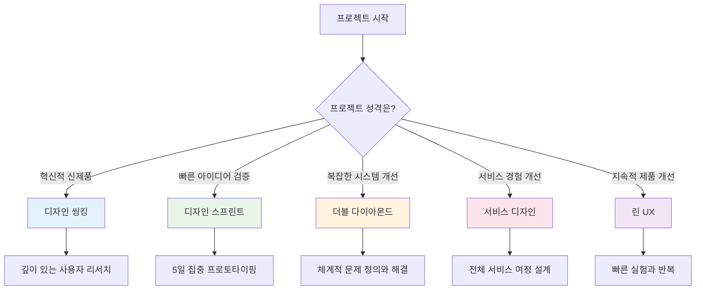

# 디자인 방법론 완전 가이드

> **핵심 개념**: 디자인 방법론은 문제 해결과 혁신을 위한 체계적 접근 방식입니다. 사용자 중심적 사고와 반복적 개선을 통해 복잡한 문제를 창의적으로 해결하는 프레임워크를 제공합니다.

## 🔍 개요

### ⚡ 왜 디자인 방법론이 중요한가?

**전통적 접근법의 한계:**
- 🎯 **가정 기반 개발**: 사용자 검증 없는 솔루션 설계
- ⏳ **선형적 프로세스**: 변경 비용이 높은 워터폴 방식
- 🏢 **내부 관점**: 조직 중심의 사고방식
- 📊 **데이터 의존**: 정량적 지표만 중시

**디자인 방법론의 해결책:**
- 👥 **사용자 중심**: 실제 니즈 기반 솔루션 개발
- 🔄 **반복적 개선**: 빠른 실험과 학습
- 🤝 **협업 중심**: 다학제적 팀워크
- 💡 **창의적 문제해결**: 혁신적 아이디어 발굴

---

## 📋 주요 디자인 방법론 비교

### 🏆 방법론별 특징 비교표

| 방법론 | 기간 | 팀 규모 | 복잡도 | 적합 프로젝트 | 핵심 강점 |
|--------|------|---------|--------|---------------|-----------|
| **[[방법론] 디자인 씽킹\|디자인 씽킹]]** | 2-12주 | 5-8명 | 중간 | 혁신 프로젝트, 신제품 개발 | 깊은 사용자 이해 |
| **[[방법론] 디자인 스프린트\|디자인 스프린트]]** | 5일 | 5-7명 | 낮음 | 빠른 검증, 아이디어 테스트 | 신속한 프로토타이핑 |
| **[[방법론] 더블 다이아몬드\|더블 다이아몬드]]** | 8-16주 | 4-10명 | 높음 | 전략적 프로젝트, 시스템 혁신 | 체계적 문제 정의 |
| **[[방법론] 서비스 디자인\|서비스 디자인]]** | 4-24주 | 6-12명 | 높음 | 서비스 개선, 고객 여정 최적화 | 전체적 서비스 시각 |
| **[[방법론] 린 UX\|린 UX]]** | 지속적 | 3-6명 | 낮음 | 애자일 개발, 지속적 개선 | 빠른 반복과 학습 |

### 🎯 선택 가이드

**프로젝트 유형별 추천:**

---

## 🚀 방법론별 상세 가이드

### 1. **[[방법론] 디자인 씽킹]]** 🎯
**핵심**: 사용자 공감을 통한 혁신적 솔루션 개발

**적용 시나리오:**
- 신제품/서비스 개발
- 기존 제품의 근본적 혁신
- 복합적 문제 해결
- 조직 문화 변화

**5단계 프로세스:**
1. **Empathize** (공감): 사용자 깊이 이해
2. **Define** (정의): 문제 명확히 정의
3. **Ideate** (아이디어): 창의적 솔루션 도출
4. **Prototype** (프로토타입): 빠른 시제품 제작
5. **Test** (테스트): 사용자 피드백 수집

---

### 2. **[[방법론] 디자인 스프린트]]** ⚡
**핵심**: 5일간 집중 프로토타이핑과 검증

**적용 시나리오:**
- 아이디어 빠른 검증
- 의사결정 가속화
- 팀 정렬과 집중
- 리스크 최소화

**5일 일정:**
- **월요일**: 문제 정의와 목표 설정
- **화요일**: 아이디어 스케치
- **수요일**: 최적 아이디어 선택
- **목요일**: 프로토타입 제작
- **금요일**: 사용자 테스트

---

### 3. **[[방법론] 더블 다이아몬드]]** 💎
**핵심**: 발산과 수렴을 통한 체계적 문제 해결

**적용 시나리오:**
- 복잡한 시스템 문제
- 전략적 프로젝트
- 정책 수립
- 조직 혁신

**4단계 프로세스:**
1. **Discover** (발견): 문제 영역 탐색
2. **Define** (정의): 핵심 문제 수렴
3. **Develop** (개발): 솔루션 발산
4. **Deliver** (전달): 최적 솔루션 구현

---

### 4. **[[방법론] 서비스 디자인]]** 🛡️
**핵심**: 전체 서비스 경험의 통합적 설계

**적용 시나리오:**
- 서비스 개선 프로젝트
- 고객 여정 최적화
- 옴니채널 경험 설계
- 조직간 협업 개선

**주요 도구:**
- 서비스 블루프린트
- 고객 여정 맵
- 스테이크홀더 맵
- 터치포인트 분석

---

### 5. **[[방법론] 린 UX]]** 🔄
**핵심**: 지속적 학습과 빠른 반복 개선

**적용 시나리오:**
- 애자일 개발 환경
- 스타트업 제품 개발
- 지속적 개선 프로젝트
- MVP 개발

**핵심 원칙:**
- Build-Measure-Learn 사이클
- 가설 기반 설계
- 최소 기능 제품 (MVP)
- 지속적 사용자 피드백

---

## 🛠️ 실무 적용 가이드

### 📋 프로젝트 시작 전 체크리스트

**✅ 프로젝트 준비:**
- [ ] 명확한 문제 정의 또는 기회 영역 식별
- [ ] 다학제적 팀 구성 (디자이너, 개발자, 비즈니스, 사용자)
- [ ] 충분한 시간과 예산 확보
- [ ] 경영진 지지와 권한 위임
- [ ] 사용자 접근 가능성 확인

**✅ 방법론 선택:**
- [ ] 프로젝트 목표와 제약사항 분석
- [ ] 팀 역량과 경험 수준 고려
- [ ] 조직 문화와의 적합성 평가
- [ ] 예상 결과물과 임팩트 설정

### 🎯 성공 요인

**🔥 Critical Success Factors:**

1. **리더십 지원**
   - 경영진의 명확한 비전 제시
   - 실험 실패를 허용하는 문화
   - 필요 자원의 지속적 지원

2. **사용자 중심 마인드셋**
   - 가정이 아닌 실제 데이터 기반 의사결정
   - 정기적 사용자 접촉과 피드백 수집
   - 사용자 니즈 우선순위화

3. **협업 문화**
   - 부서간 벽 허물기
   - 다양한 관점의 적극적 수용
   - 건설적 갈등과 토론 장려

4. **실행 역량**
   - 빠른 프로토타이핑 스킬
   - 데이터 수집과 분석 능력
   - 변화 관리와 커뮤니케이션

### 🚨 주요 함정과 대응책

| 함정 | 발생 확률 | 대응책 |
|------|----------|--------|
| **완벽주의 함정** | 70% | 80% 완성도에서 빠른 테스트, "Good enough" 기준 설정 |
| **내부 관점 고착** | 60% | 외부 사용자 의무적 참여, 정기적 현장 방문 |
| **방법론 혼합 오류** | 45% | 하나의 방법론 일관적 적용, 단계별 명확한 산출물 정의 |
| **이해관계자 저항** | 40% | 초기 단계 적극적 참여 유도, 단계별 성과 공유 |

---

## 📊 ROI 및 성과 측정

### 💰 투자 대비 효과 분석

**디자인 방법론 도입 비용 (중형 프로젝트 기준)**

| 항목 | 디자인 씽킹 | 디자인 스프린트 | 더블 다이아몬드 |
|------|------------|----------------|----------------|
| **기간** | 8-12주 | 1주 | 12-16주 |
| **팀 비용** | $80,000 | $15,000 | $120,000 |
| **외부 전문가** | $20,000 | $5,000 | $30,000 |
| **도구/공간** | $5,000 | $2,000 | $8,000 |
| **총 비용** | **$105,000** | **$22,000** | **$158,000** |

### 📈 기대 효과

**정량적 효과:**
- 제품 출시 시간 20-40% 단축
- 개발 비용 15-30% 절감
- 사용자 만족도 25-50% 향상
- 시장 성공률 2-3배 증가

**정성적 효과:**
- 팀워크와 협업 문화 개선
- 혁신적 사고방식 확산
- 고객 중심 조직 문화 구축
- 의사결정 품질 향상

---

## 🎓 학습 로드맵

### 📚 단계별 학습 과정

**1단계: 기초 이해 (2주)**
- [ ] 디자인 방법론 기본 개념 학습
- [ ] 각 방법론의 특징과 차이점 파악
- [ ] 사용자 중심 설계 원칙 이해
- [ ] 기본 도구와 템플릿 익히기

**2단계: 방법론 선택 (1주)**
- [ ] 프로젝트 특성 분석
- [ ] 조직 환경과 제약사항 고려
- [ ] 최적 방법론 선택
- [ ] 실행 계획 수립

**3단계: 파일럿 실행 (4-8주)**
- [ ] 소규모 프로젝트로 시작
- [ ] 방법론 단계별 실행
- [ ] 지속적 학습과 개선
- [ ] 성과 측정과 분석

**4단계: 확산 및 고도화 (지속적)**
- [ ] 성공 사례 공유
- [ ] 조직 전체 역량 구축
- [ ] 커스터마이징 및 최적화
- [ ] 지속적 혁신 문화 구축

---

## 🔗 관련 자료

### 📖 세부 방법론 가이드
- **[[방법론] 디자인 씽킹]]**: 5단계 프로세스 상세 가이드
- **[[방법론] 디자인 스프린트]]**: 5일 집중 워크숍 실행법
- **[[방법론] 더블 다이아몬드]]**: 체계적 문제 해결 프레임워크
- **[[방법론] 서비스 디자인]]**: 전체 서비스 경험 설계법
- **[[방법론] 린 UX]]**: 애자일 환경 UX 방법론

### 🛠️ 실무 도구
- **[[템플릿] 디자인 방법론 도구]]**: 각종 템플릿과 워크시트
- **[[체크리스트] 프로젝트 실행]]**: 단계별 실행 체크리스트

### 🎯 다음 단계
1. **방법론 선택**: 프로젝트에 적합한 방법론 결정
2. **팀 구성**: 다학제적 프로젝트 팀 빌딩
3. **파일럿 실행**: 작은 프로젝트로 실습
4. **성과 측정**: 결과 분석 및 개선

---

## 💡 실무 팁

### 🏆 성공하는 프로젝트의 공통점

**시작 단계:**
- 명확한 문제 정의와 성공 기준 설정
- 이해관계자들의 기대치 정렬
- 충분한 사용자 리서치 시간 확보

**진행 단계:**
- 정기적인 체크포인트와 피드백 루프
- 문서화보다 실행과 학습 우선
- 실패를 학습 기회로 활용

**마무리 단계:**
- 학습 내용의 체계적 정리
- 조직 차원의 지식 축적
- 다음 프로젝트로의 연결고리 마련

---

**💡 핵심 메시지**: 디자인 방법론은 단순한 프로세스가 아닌 사고방식의 전환입니다. 사용자 중심적 사고와 반복적 학습을 통해 더 나은 솔루션을 만들어내는 강력한 도구입니다. 중요한 것은 완벽한 실행이 아닌 지속적인 학습과 개선입니다.