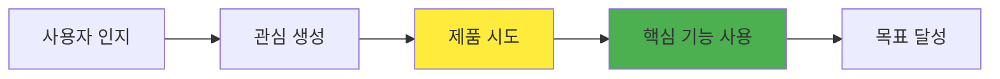
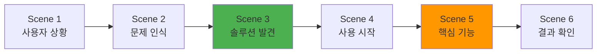
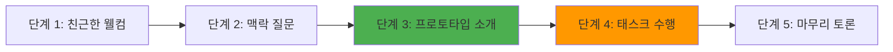

# 디자인 스프린트 (Design Sprint)

> **핵심 철학**: "아이디어에서 검증까지, 5일이면 충분하다." - Google Ventures

## 🚀 디자인 스프린트란?

디자인 스프린트는 **5일간의 집중적인 워크숍**을 통해 아이디어를 빠르게 프로토타입으로 만들고 실제 사용자와 검증하는 방법론입니다. Google이 개발하여 전 세계 수많은 스타트업과 기업에서 활용되고 있습니다.

### ⚡ 핵심 가치

**🎯 Speed (속도)**
- 몇 주-몇 달이 걸릴 과정을 5일로 압축
- 빠른 의사결정으로 논쟁 종료
- 즉시 시작 가능한 명확한 다음 단계 제시

**💰 Risk Reduction (위험 감소)**
- 대규모 개발 전 아이디어 검증
- 실패 비용을 최소화
- 시장 반응을 미리 확인

**🧠 Focus (집중)**
- 5일간 다른 업무 완전 차단
- 한 가지 문제에 팀 전체 집중
- 분산된 관심사 통합

---

## 📅 5일 프로세스 개요

### 🗓️ 전체 일정 시각화

```mermaid
gantt
    title 디자인 스프린트 5일 일정
    dateFormat X
    axisFormat %s

    section Monday
    문제 이해          :milestone, m1, 0, 0
    목표 설정          :1, 2h
    전문가 인터뷰       :3, 4h
    HMW 정리          :7, 2h

    section Tuesday
    기존 솔루션 검토    :milestone, m2, 8, 0
    아이디어 스케치     :9, 6h
    개인 작업 시간      :15, 2h

    section Wednesday
    해결책 결정        :milestone, m3, 16, 0
    투표 및 토론       :17, 4h
    스토리보드 작성     :21, 4h

    section Thursday
    프로토타입 제작     :milestone, m4, 24, 0
    역할 분담         :25, 1h
    제작 작업         :26, 7h

    section Friday
    사용자 테스트      :milestone, m5, 32, 0
    테스트 진행       :33, 6h
    결과 분석         :39, 2h
```



---

## 1️⃣ Monday - Understand (이해)

### 🎯 목표
문제를 명확히 이해하고 스프린트의 목표를 설정합니다.

### 📋 상세 일정

**09:00 - 10:00 | 스프린트 소개**
```
활동 내용:
✅ 스프린트 목표와 규칙 설명
✅ 팀원 소개 및 역할 정의
✅ 주요 일정 공유
✅ 성공 기준 합의

필요 준비물:
• 화이트보드 또는 대형 종이
• 포스트잇 (다양한 색상)
• 마커펜 세트
• 타이머
```

**10:00 - 12:00 | 전문가 인터뷰**
```
참여자: 각 분야 전문가 (20분씩)
• 마케팅 담당자
• 개발 담당자
• 고객 서비스 담당자
• 외부 전문가

질문 예시:
• 현재 가장 큰 문제는?
• 사용자들의 주요 불만은?
• 기술적 제약사항은?
• 시장에서의 기회는?
```

**13:00 - 15:00 | How Might We**
```
HMW 질문 생성 과정:
1. 전문가 인터뷰에서 나온 인사이트 정리
2. 각자 HMW 질문을 포스트잇에 작성
3. 벽에 붙이고 주제별로 그룹핑
4. 투표를 통해 중요한 질문 선별

예시 HMW:
• 어떻게 하면 첫 사용자도 쉽게 사용할 수 있을까?
• 어떻게 하면 기존 워크플로우를 방해하지 않을까?
```

**15:00 - 17:00 | 목표 설정 & 지도 작성**


### 📊 산출물
- HMW 질문 목록
- 스프린트 목표 정의
- 사용자 여정 지도
- 핵심 가정 목록

---

## 2️⃣ Tuesday - Sketch (스케치)

### 🎯 목표
개인별로 다양한 솔루션 아이디어를 스케치합니다.

### 📋 상세 일정

**09:00 - 11:00 | Lightning Demos**
```
기존 솔루션 검토:
• 경쟁사 제품 분석 (15분씩)
• 다른 산업의 참고 사례
• 각자 3분씩 발표
• 좋은 아이디어는 화이트보드에 기록

검토 영역:
✅ 직접 경쟁사
✅ 간접 경쟁사
✅ 전혀 다른 산업의 영감
✅ 기존 사내 솔루션
```

**11:00 - 12:00 | Four-Step Sketch**
```
4단계 스케치 과정:

1. Notes (20분)
   • 영감 아이디어들 정리
   • 키워드와 간단한 그림

2. Ideas (20분)
   • 거친 아이디어 스케치
   • 평가나 판단 없이 자유롭게

3. Crazy 8s (8분)
   • 8분간 8개 아이디어 스케치
   • 1분에 1개씩 빠르게

4. Solution Sketch (30분)
   • 최고의 아이디어를 3-panel 스토리로
   • 자세한 설명과 제목 추가
```

**13:00 - 17:00 | 개인 작업 시간**
```
각자 조용한 공간에서:
✅ Solution Sketch 완성
✅ 스티키 메모로 핵심 기능 설명
✅ 대안 아이디어까지 고려
✅ 명확한 제목과 설명 추가

주의사항:
• 다른 팀원과 토론 금지
• 개인의 깊은 사고에 집중
• 완벽함보다는 명확한 전달
```

### 🎨 스케치 가이드라인

**✅ 좋은 스케치:**
- 핵심 아이디어가 명확히 전달됨
- 사용자 흐름이 논리적임
- 실현 가능한 수준
- 제목과 설명이 구체적임

**❌ 피해야 할 것:**
- 너무 복잡한 디테일
- 추상적이거나 모호한 표현
- 여러 아이디어의 혼재
- 기술적 구현에 치중

### 📊 산출물
- 개인별 Solution Sketch (5-8개)
- 참고 아이디어 목록
- 스케치별 제목과 설명

---

## 3️⃣ Wednesday - Decide (결정)

### 🎯 목표
가장 유망한 솔루션을 선택하고 프로토타입 계획을 세웁니다.

### 📋 상세 일정

**09:00 - 10:30 | Art Museum**
```
갤러리 워크 방식:
1. 모든 스케치를 벽에 게시
2. 각자 조용히 관람하며 메모
3. 좋은 아이디어에 도트 스티커 부착
4. 질문이나 우려사항 포스트잇으로 기록

관찰 포인트:
• 사용자 가치가 높은 아이디어
• 실현 가능성이 높은 솔루션
• 차별화 요소가 있는 접근법
• 기술적 혁신이 있는 아이디어
```

**10:30 - 12:00 | Speed Critique**
```
3분 토론 방식:
• 각 스케치당 3분간 집중 토론
• 작성자는 마지막 30초만 설명
• 장점, 우려사항, 새로운 질문 정리
• 큰 아이디어들을 화이트보드에 기록

평가 기준:
✅ 사용자 문제 해결 정도
✅ 비즈니스 목표 달성도
✅ 기술적 실현 가능성
✅ 차별화 및 혁신성
```

**13:00 - 15:00 | Rumble (대결)**
```
후보 솔루션 비교:
1. 상위 2-3개 솔루션 선별
2. 각각의 장단점 심층 분석
3. 팀별 지지 솔루션 선택
4. 최종 투표로 승자 결정

의사결정 매트릭스:
          높은 임팩트
    쉬움 │ 👑 Winner │ 💪 Challenger
    ─────┼──────────┼─────────────
  어려움 │ 🤔 Maybe  │ ❌ Pass

결정자(Decider)의 최종 선택권 행사
```

**15:00 - 17:00 | Storyboard**


**스토리보드 작성 원칙:**
- 15-20개 프레임으로 구성
- 실제 사용자 시나리오 기반
- 핵심 기능에 집중
- 테스트 가능한 수준의 디테일

### 📊 산출물
- 선택된 솔루션 스케치
- 스토리보드 (15-20 프레임)
- 의사결정 과정 기록
- 프로토타입 요구사항 정의

---

## 4️⃣ Thursday - Prototype (프로토타입)

### 🎯 목표
내일 테스트할 수 있는 현실적인 프로토타입을 제작합니다.

### 📋 상세 일정

**09:00 - 10:00 | 프로토타입 전략 수립**
```
핵심 결정사항:
• 어떤 도구를 사용할 것인가?
• 어떤 부분까지 구현할 것인가?
• 어떻게 역할을 나눌 것인가?
• 어떤 리소스가 필요한가?

도구 선택 가이드:
📱 모바일 앱: Figma + InVision
💻 웹 서비스: HTML/CSS + Figma
🖥️ 소프트웨어: Keynote + POP
🏪 서비스: 비디오 + 롤플레이
```

**10:00 - 12:00 | 역할 분담 및 에셋 준비**
```
전형적인 역할 분담:
👑 Maker: 프로토타입 총괄 제작
✍️ Writer: 텍스트 콘텐츠 작성
👨‍🎨 Asset Collector: 이미지, 아이콘 수집
🎬 Interviewer: 내일 인터뷰 준비
📝 Note-taker: 테스트 관찰 및 기록

필요 에셋:
• 로고 및 브랜딩 요소
• 실제 콘텐츠 (더미 아님)
• 아이콘 및 이미지
• 사용자 데이터 예시
```

**13:00 - 17:00 | 집중 제작 시간**
```
프로토타입 제작 원칙:

🎭 Facade First
• 겉모양부터 완성
• 내부 로직은 최소한만
• 사용자가 볼 부분에 집중

🚀 Just Enough
• 테스트에 필요한 만큼만
• 완벽함보다는 완성도
• 시간 내 완료가 최우선

🔄 Iterate Fast
• 2시간마다 중간 점검
• 빠른 피드백과 수정
• 막힐 때는 즉시 도움 요청
```

### 🛠️ 프로토타입 유형별 가이드

**📱 모바일 앱 프로토타입**
```
도구: Figma + Protopie/Principle

필수 화면:
✅ 온보딩 플로우 (2-3화면)
✅ 메인 화면
✅ 핵심 기능 화면 (3-4화면)
✅ 결과/완료 화면

상호작용:
• 탭, 스와이프 기본 동작
• 핵심 플로우의 연결
• 실제 데이터 시뮬레이션
```

**💻 웹 서비스 프로토타입**
```
도구: Figma + 간단한 HTML/CSS

필수 페이지:
✅ 랜딩 페이지
✅ 회원가입/로그인
✅ 메인 대시보드
✅ 핵심 기능 페이지
✅ 결과 페이지

기능:
• 클릭 가능한 버튼
• 폼 입력 (시뮬레이션)
• 페이지 간 이동
```

### 📊 산출물
- 테스트 가능한 프로토타입
- 사용자 시나리오 스크립트
- 테스트 준비물 목록
- 역할별 담당자 지정

---

## 5️⃣ Friday - Test (테스트)

### 🎯 목표
실제 사용자 5명과 프로토타입을 테스트하여 학습합니다.

### 📋 상세 일정

**08:00 - 09:00 | 최종 준비**
```
테스트 전 체크리스트:
✅ 프로토타입 최종 점검
✅ 테스트 스크립트 리허설
✅ 녹화 장비 테스트
✅ 관찰 공간 세팅
✅ 간식 및 답례품 준비

기술적 준비:
• 예비 디바이스 준비
• 인터넷 연결 확인
• 화면 녹화 설정
• 백업 계획 수립
```

**09:00 - 16:00 | 사용자 테스트 (5세션)**
```
세션당 시간: 60분
• 웜업 (10분)
• 프로토타입 테스트 (30분)
• 인터뷰 (15분)
• 정리 (5분)

테스트 참가자:
👥 대상 사용자 5명
📊 다양한 배경과 경험 수준
🎯 실제 니즈를 가진 사람들
💰 적절한 보상 제공
```

### 🎤 인터뷰 가이드

**📋 테스트 스크립트 예시**
```
오프닝:
"안녕하세요. 오늘은 새로운 서비스 아이디어를 테스트해보려고 합니다.
이것은 여러분을 테스트하는 것이 아니라 우리의 아이디어를 테스트하는 것입니다.
자연스럽게 사용하시고 생각하는 것을 소리 내어 말씀해 주세요."

핵심 질문:
• "이 화면에서 무엇을 할 수 있을 것 같나요?"
• "지금 무엇을 하고 계신지 설명해 주세요"
• "이것이 당신의 문제를 해결해 줄 것 같나요?"
• "이런 서비스가 있다면 사용하고 싶으신가요?"
```

**👀 관찰 포인트**
| 관찰 영역 | 구체적 내용 | 기록 방법 |
|----------|------------|-----------|
| **이해도** | 의도대로 이해하는가? | 🟢 🟡 🔴 |
| **사용성** | 쉽게 사용하는가? | 클릭/탭 횟수 |
| **감정** | 긍정적 반응인가? | 표정, 말투 기록 |
| **가치** | 실제 도움이 되는가? | 구매 의향 질문 |

### 📊 실시간 분석

**16:00 - 17:00 | Five-Act Interview**


**패턴 분석 매트릭스**
```
사용자  │ 이해도 │ 사용성 │ 감정 │ 가치 │ 총점
────────┼────────┼────────┼──────┼──────┼─────
사용자1 │   🟢   │   🟡   │  🟢  │  🟢  │ 3.5
사용자2 │   🟡   │   🟢   │  🟡  │  🟢  │ 3.0
사용자3 │   🔴   │   🔴   │  🔴  │  🟡  │ 1.5
사용자4 │   🟢   │   🟢   │  🟢  │  🟢  │ 4.0
사용자5 │   🟡   │   🟡   │  🟡  │  🟢  │ 2.5
────────┼────────┼────────┼──────┼──────┼─────
평균    │  2.8   │  2.8   │ 2.6  │ 3.6  │ 2.9
```

### 📈 학습 및 다음 단계

**핵심 학습 정리:**
```
✅ 검증된 가설:
• 사용자들이 핵심 가치를 이해함
• 기존 솔루션보다 편리함을 인정

❓ 새로운 발견:
• 예상과 다른 사용 패턴 발견
• 추가 기능에 대한 니즈 확인

🚨 해결 필요 이슈:
• 온보딩 과정의 복잡성
• 핵심 기능 접근성 문제
```

### 📊 산출물
- 사용자 테스트 리포트
- 핵심 학습 사항 정리
- 개선 우선순위 목록
- 다음 스프린트 또는 개발 계획

---

## 🛠️ 실무 적용 가이드

### 👥 팀 구성 및 역할

**💡 이상적인 팀 (5-7명)**
```
🎯 Decider (1명)
• 최종 의사결정권자
• CEO, 프로덕트 매니저, 팀 리더
• 모든 5일 참여 필수

🔬 Facilitator (1명)
• 스프린트 진행자
• 시간 관리, 활동 가이드
• 중립적 입장 유지

💻 Designer (1-2명)
• 프로토타입 제작 주도
• UI/UX 전문 지식 제공

👨‍💻 Developer (1명)
• 기술적 실현 가능성 검토
• 프로토타입 기술 지원

📊 Business Expert (1명)
• 비즈니스 관점 제공
• 시장성, 수익성 검토

👥 User Expert (1명)
• 사용자 관점 대변
• 고객 서비스, 세일즈 담당
```

### 🏢 공간 및 도구 준비

**📍 이상적인 공간**
```
메인 룸:
✅ 큰 테이블 (8-10명 둘러앉기)
✅ 벽 3면 (화이트보드 또는 대형 종이)
✅ 프로젝터 또는 대형 모니터
✅ 자연광이 잘 드는 환경

보조 공간:
✅ 조용한 개인 작업 공간
✅ 테스트용 별도 룸
✅ 관찰용 공간 (일방향 유리 선택)
✅ 휴식 공간
```

**🛠️ 필수 도구 리스트**
```
아날로그 도구:
• 포스트잇 (5가지 색상, 각 10팩)
• 마커 (굵은 것, 가는 것)
• 도트 스티커 (투표용)
• A3 용지 (50장)
• 타이머

디지털 도구:
• Figma 또는 Sketch (프로토타이핑)
• Zoom 또는 Teams (원격 인터뷰)
• Loom (화면 녹화)
• Miro (온라인 화이트보드)
• 스마트폰 (테스트 녹화)
```

### 📋 사전 준비 체크리스트

**2주 전:**
- [ ] 팀 구성 및 일정 조율
- [ ] 스프린트 목표 대략 설정
- [ ] 공간 및 도구 준비
- [ ] 전문가 인터뷰 대상자 섭외

**1주 전:**
- [ ] 배경 자료 공유 (시장 조사, 사용자 리서치)
- [ ] 사용자 테스트 참가자 모집
- [ ] 최종 팀 브리핑
- [ ] 비상 연락망 구축

**당일:**
- [ ] 공간 세팅 및 도구 점검
- [ ] 간식 및 음료 준비
- [ ] 녹화/녹음 장비 테스트
- [ ] 팀원 출석 확인

---

## 📊 성과 측정 및 ROI

### 🎯 성공 지표

**과정 지표**
- 참여도: 5일 내내 풀타임 참여율
- 아이디어 생성: 스케치 개수 (목표: 25-40개)
- 의사결정 효율성: 주요 결정 소요 시간
- 프로토타입 완성도: 테스트 가능 수준 달성

**결과 지표**
- 사용자 만족도: 평균 3.5/5.0 이상
- 개념 증명: 핵심 가설 검증률
- 다음 단계 명확성: 구체적 실행 계획 수립
- 팀 정렬도: 향후 방향에 대한 합의 수준

### 💰 ROI 분석

**투입 비용 (5-7명 팀 기준)**
```
인건비:
• 팀원 5일 비용: $25,000
• 퍼실리테이터: $5,000

운영비:
• 공간 임대: $2,000
• 도구 및 재료: $1,000
• 사용자 테스트 비용: $2,000
• 기타 비용: $1,000

총 투입 비용: $36,000
```

**기대 효과**
```
시간 절약:
• 기존 개발 프로세스 대비 60% 단축
• 6개월 개발 → 1주 검증
• 시간 가치: $200,000

위험 감소:
• 실패 프로젝트 리스크 제거
• 시장 검증 후 개발 시작
• 리스크 가치: $500,000

의사결정 개선:
• 팀 내 논쟁 시간 단축
• 명확한 방향성 설정
• 효율성 가치: $50,000

총 기대 효과: $750,000
ROI = (750,000 - 36,000) / 36,000 = 1,983%
```

---

## 🚨 주의사항 및 문제 해결

### ⚠️ 일반적인 문제들

**1. 🏃‍♂️ 시간 관리 실패**
```
문제: 일정이 지연되며 마지막 날 허둥댐
원인: 완벽주의, 너무 많은 토론

해결책:
• 타이머 엄격 적용
• Time-boxing 철저히 준수
• "Good enough" 마인드셋
• 퍼실리테이터 역할 강화
```

**2. 🎯 목표 불분명**
```
문제: 무엇을 테스트하는지 모호함
원인: 월요일 목표 설정 부족

해결책:
• 구체적 성공 기준 설정
• 하나의 명확한 질문에 집중
• 가설 명시적 기록
• 정기적 목표 상기
```

**3. 👥 팀 갈등**
```
문제: 솔루션 선택 시 갈등 발생
원인: 개인적 선호, 권력 관계

해결책:
• Decider 권한 명확히 설정
• 객관적 평가 기준 사용
• 데이터와 사용자 피드백 우선
• 퍼실리테이터 중재 역할
```

### 🏆 성공하는 스프린트의 특징

**🎯 명확한 문제 정의**
- 해결하려는 문제가 구체적
- 성공/실패 기준이 명확
- 모든 팀원이 목표 공유

**👑 강력한 리더십**
- Decider의 적극적 참여
- 빠른 의사결정
- 팀 전체의 집중력 유지

**🚀 실행력 있는 팀**
- 각자 역할에 대한 전문성
- 협업 경험과 의지
- 사용자 중심 마인드셋

**📊 적절한 범위 설정**
- 5일 내 완료 가능한 범위
- 핵심 가설에만 집중
- 과도한 기능 욕심 없음

---

## 🔗 관련 자료 및 응용

### 📚 추가 학습 자료
- **[[방법론] 디자인 방법론 가이드]]**: 다른 방법론과 비교
- **[[방법론] 디자인 씽킹]]**: 더 깊이 있는 사용자 이해 과정
- **[[방법론] 린 UX]]**: 지속적 개선을 위한 방법론

### 🔄 스프린트 변형

**🎯 3일 스프린트 (압축형)**
- 월: 이해 + 스케치
- 화: 결정 + 프로토타입
- 수: 테스트 + 분석

**📱 디지털 전용 스프린트**
- 온라인 도구로 100% 진행
- 비동기 작업 시간 포함
- 글로벌 팀 협업 가능

**🏢 기업 맞춤형 스프린트**
- 승인 과정 통합
- 브랜드 가이드라인 반영
- 규정 준수 요건 포함

### 🎯 다음 단계 가이드

**성공적인 스프린트 후:**
1. **빠른 실행**: 2주 내 다음 단계 시작
2. **팀 유지**: 같은 팀으로 후속 작업
3. **학습 공유**: 조직 내 사례 전파
4. **프로세스 개선**: 다음 스프린트를 위한 회고

**실패한 스프린트 후:**
1. **원인 분석**: 무엇이 잘못되었는지 파악
2. **가설 수정**: 새로운 관점에서 문제 재정의
3. **팀 재구성**: 필요시 역할 조정
4. **재도전**: 학습 내용 바탕으로 다시 시도

---

**💡 마무리 메시지**: 디자인 스프린트는 완벽한 솔루션을 만드는 도구가 아닙니다. 빠르게 학습하고 방향을 찾는 강력한 방법입니다. 5일이라는 제한된 시간 안에서 최대한의 학습을 얻는 것이 진정한 성공입니다. 완벽함보다는 속도와 학습에 집중하세요.