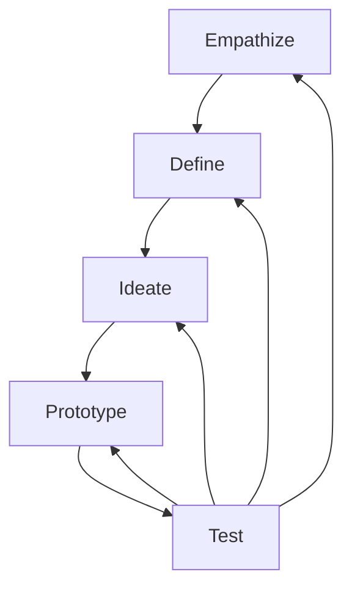
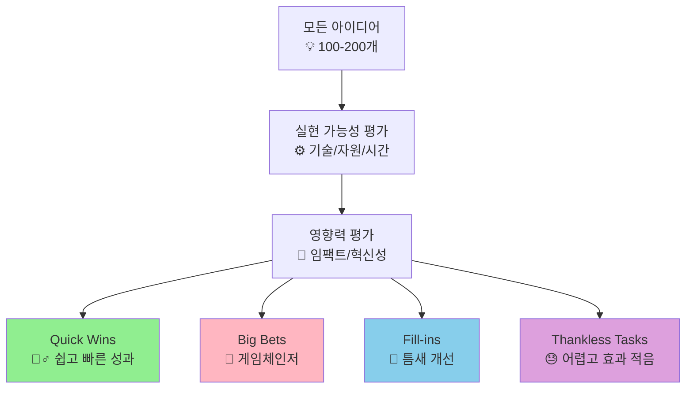
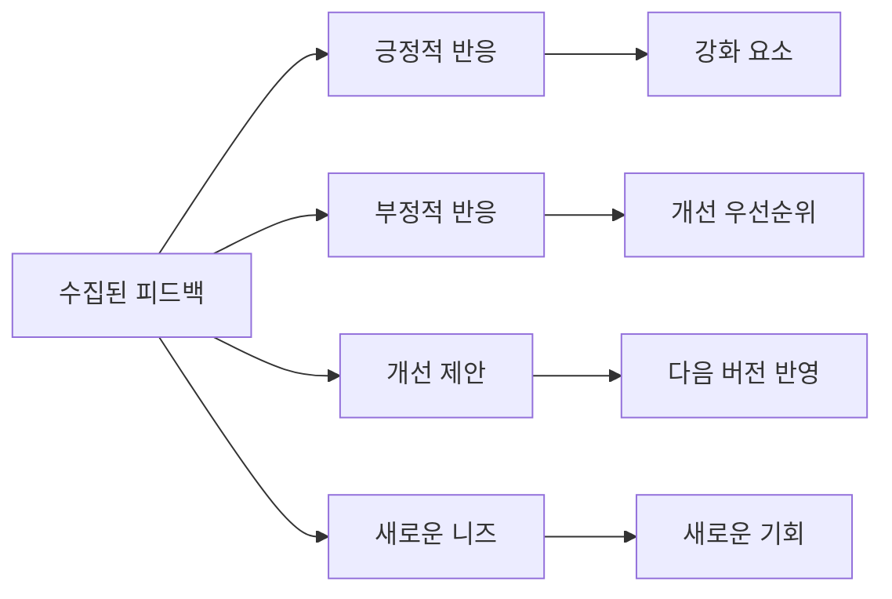
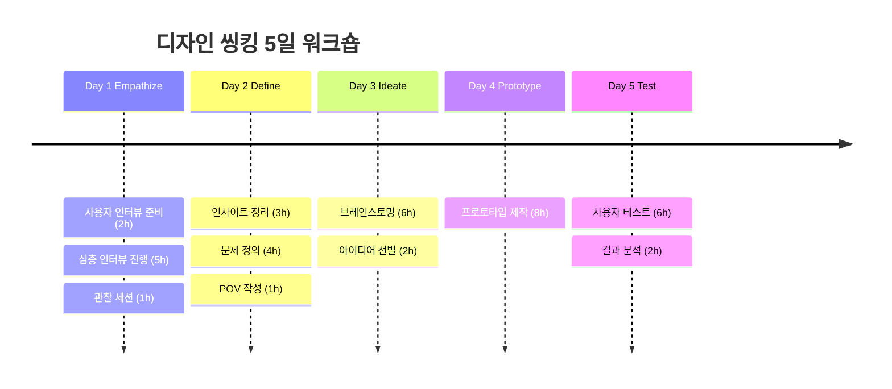

# 디자인 씽킹 (Design Thinking)

> **핵심 철학**: "사용자가 말하지 않은 니즈를 발견하고, 그들도 몰랐던 솔루션을 제공한다." - IDEO

## 🔍 디자인 씽킹이란?

디자인 씽킹은 **인간 중심적(Human-Centered)** 접근을 통해 혁신적 솔루션을 개발하는 방법론입니다. 사용자에 대한 깊은 공감과 이해를 바탕으로 창의적 문제 해결을 추구합니다.

## 💎 핵심 본질

디자인 씽킹의 진정한 핵심은 **3가지 통합적 요소**입니다:

### 🎯 사용자 중심적 사고 (Human-Centered Thinking)
- **관찰**: 가정이 아닌 실제 사용자 행동 관찰
- **공감**: 표면적 요구가 아닌 잠재적 니즈 발굴
- **맥락 이해**: 사용자의 환경과 감정까지 깊이 파악

### ⚡ 실험적 접근 (Experimental Approach)
- **빠른 프로토타이핑**: 완벽한 계획보다 신속한 실행
- **실패 학습**: 실패를 통한 개선과 발전
- **반복 개선**: "만들면서 배우기" 철학

### 🤝 협업적 창의성 (Collaborative Creativity)
- **다양한 관점**: 서로 다른 배경의 팀원 융합
- **판단 보류**: 비판 없이 아이디어 발산
- **집단지성**: 개인 한계를 뛰어넘는 팀 창의력

### 🔄 핵심 마인드셋: "How Might We?"
디자인 씽킹의 모든 단계를 관통하는 사고방식:
- 문제를 **기회**로 전환하는 질문법
- 제약을 **창의성의 동력**으로 활용
- 불가능해 보이는 것도 **가능성 탐색**

> 💡 **핵심 메시지**: 디자인 씽킹은 단순한 프로세스가 아닌 **혁신을 위한 사고방식의 전환**입니다. 사용자 공감을 통해 진짜 문제를 발견하고, 실험을 통해 예상치 못한 솔루션을 만들어냅니다.

### ⚡ 핵심 원칙

**1. 🫂 Human-Centered (인간 중심)**
- 모든 결정의 중심에 사용자를 둡니다
- 가정이 아닌 실제 관찰과 대화를 통한 이해
- 사용자의 감정과 경험까지 고려

**2. 🎭 Empathy First (공감 우선)**
- 사용자의 입장에서 문제를 바라봅니다
- 표면적 요구사항이 아닌 근본적 니즈 탐구
- 다양한 이해관계자의 관점 수용

**3. 🔄 Iterative Process (반복 프로세스)**
- 완벽한 해답을 찾기보다 지속적 개선
- 빠른 실험과 학습 사이클
- 실패를 통한 학습과 발전

---

## 🗺️ 5단계 프로세스

### 📊 전체 프로세스 시각화



---

## 1️⃣ Empathize (공감) 단계

### 🎯 목적
사용자를 깊이 이해하고 그들의 니즈, 감정, 동기를 파악합니다.

### 📅 기간 및 팀 구성
- **소요 시간**: 2-3주 (전체 프로젝트의 30-40%)
- **핵심 역할**: 사용자 리서처 2명, 관찰자 1-2명
- **참여 사용자**: 15-20명 (다양한 배경)

---

## 🛠️ 세부 실행 방법

### **Step 1: 사전 준비 (3-5일)**

#### **🎯 리서치 계획 수립**

**1단계: 사용자 그룹 정의**
```
Primary Users (주 사용자):
• 인구통계학적 특성
• 사용 빈도와 패턴
• 주요 니즈와 목표

Secondary Users (보조 사용자):
• 간접 영향을 받는 그룹
• 의사결정 영향자
• 극단적 사용자 (Edge Cases)

예시:
Primary: 30-40대 직장맘 (주 3회 이상 앱 사용)
Secondary: 배우자, 아이들, 직장 동료
Edge Cases: 싱글맘, 육아휴직맘, 워킹맘 대표
```

**2단계: 리크루팅 전략**
```
모집 채널:
✅ 기존 고객 DB 활용
✅ 온라인 커뮤니티 (맘카페, 직장인 모임)
✅ SNS 광고 (페이스북, 인스타그램)
✅ 지인 추천 (스노볼 샘플링)
✅ 전문 리크루팅 업체

인센티브 설계:
• 현금: 5-10만원 (1시간 인터뷰 기준)
• 상품권: 스타벅스, 문화상품권
• 제품 체험: 베타 버전 무료 이용권
• 기여감: "제품 개선에 참여" 어필
```

#### **🗣️ 인터뷰 가이드 작성**

**질문 구조 (AEIOU Framework)**
```
A - Activities (활동)
"평소 [상황]에서 어떤 일을 하시나요?"
"하루 중 언제 이런 필요를 느끼시나요?"

E - Environments (환경)
"주로 어디서 이 작업을 하시나요?"
"주변 환경이 어떤 영향을 주나요?"

I - Interactions (상호작용)
"다른 사람과 어떻게 소통하시나요?"
"어떤 도구나 서비스를 사용하시나요?"

O - Objects (객체)
"어떤 것들을 사용하거나 만지시나요?"
"가장 중요한 도구는 무엇인가요?"

U - Users (사용자)
"누구와 함께 이 일을 하시나요?"
"다른 사람의 도움이 필요한 때는 언제인가요?"
```

**실제 질문 스크립트 예시**
```
🔥 오프닝 질문 (아이스브레이킹):
"안녕하세요! 먼저 간단한 자기소개를 부탁드려도 될까요?"
"오늘 시간 내주셔서 정말 감사합니다."

💡 워밍업 질문:
"평소 하루 일과를 간단히 설명해 주세요."
"가장 바쁜 시간대는 언제인가요?"

🎯 핵심 질문:
"[문제 상황]에서 가장 어려운 점은 무엇인가요?"
"그럴 때 기분이 어떠세요?"
"현재는 어떤 방식으로 해결하고 계세요?"
"그 방법의 아쉬운 점이 있다면?"

🔍 심화 질문:
"구체적인 예시를 하나 들어주실 수 있나요?"
"그때 무슨 생각이 드셨나요?"
"다른 사람들도 비슷한 어려움을 겪을까요?"

💭 이상향 질문:
"마법지팡이가 있다면 어떻게 해결하고 싶으세요?"
"완벽한 해결책은 어떤 모습일까요?"
"그렇게 되면 기분이 어떠실 것 같아요?"

🙏 마무리:
"마지막으로 꼭 하고 싶은 말씀이 있으실까요?"
"혹시 제가 놓친 중요한 부분이 있을까요?"
```

### **Step 2: 사용자 인터뷰 실행 (1-2주)**

#### **🎬 인터뷰 진행 실무 가이드**

**사전 준비 체크리스트**
```
📝 필수 준비물:
✅ 인터뷰 가이드 (출력본)
✅ 동의서 (녹음/녹화 동의)
✅ 명함 또는 소개 자료
✅ 녹음기 또는 스마트폰
✅ 노트패드와 펜 (여분 포함)
✅ 간단한 선물 (커피, 간식)
✅ 타이머 (시간 관리용)

🏠 환경 세팅:
• 조용하고 편안한 공간
• 마주 앉기보다는 약간 비스듬히
• 녹음기는 가운데 위치
• 방해 요소 제거 (휴대폰 무음)
```

**실제 진행 스크립트**
```
🎯 오프닝 (5분):
"안녕하세요, [이름]님! 만나서 반갑습니다.
저희는 [회사/프로젝트명]에서 [목적]을 위해
사용자 분들의 경험을 듣고 있어요.

오늘 대화는 약 60분 정도 예상되고,
더 정확한 기록을 위해 녹음을 하고 싶은데
괜찮으실까요?

정답이 있는 건 아니고, 솔직한 경험과
느낌을 들려주시면 됩니다."

🔥 본격 시작:
"그럼 [주제]에 대해 이야기해볼까요?
혹시 [상황]을 경험해보신 적 있으신가요?"

💡 심화 탐색 기법:
- "조금 더 자세히 설명해 주실 수 있나요?"
- "그때 정확히 어떤 기분이셨나요?"
- "예를 들면 어떤 것들이 있을까요?"
- "다른 분들도 비슷하게 느낄까요?"
- "왜 그렇게 생각하시나요?"

🚨 어려운 상황 대처법:

침묵이 길 때:
"시간을 드릴게요, 천천히 생각해보세요."
"혹시 다른 각도로 질문해볼까요?"

대답을 피할 때:
"물론 답하기 어려운 질문일 수 있어요.
혹시 비슷한 경험이라도 있으실까요?"

감정적이 될 때:
"힘든 경험을 나눠주셔서 감사해요.
잠깐 쉬었다가 계속할까요?"
```

#### **👀 관찰 조사 (Shadowing)**

**준비 단계**
```
🎯 관찰 포인트 정의:
• 행동 패턴 (언제, 어디서, 어떻게)
• 감정 변화 (표정, 몸짓, 어조)
• 환경적 요인 (장소, 시간, 상황)
• 도구 사용법 (어떤 순서로, 얼마나 오래)
• 다른 사람과의 상호작용

📝 관찰 기록지 준비:
시간 | 행동 | 감정/반응 | 환경 | 메모
-----|------|----------|------|-----
09:00| 앱 실행 | 약간 짜증 | 지하철 | 느린 로딩
09:03| 검색 시도 | 집중 | 지하철 | 여러 번 터치
```

**실행 방법**
```
🔍 자연스러운 관찰:
"평소처럼 해보시면 됩니다.
저는 옆에서 조용히 지켜볼게요."

📱 사진/영상 촬영:
• 손 움직임과 화면 조작
• 표정 변화 (동의 하에)
• 작업 환경과 주변 상황
• 사용하는 도구들

🗣️ Think Aloud (생각 말하기):
"혹시 하시면서 드는 생각을
말씀해 주실 수 있나요?"
"지금 어떤 기분이세요?"
```

### **Step 3: 공감 맵 작성**

#### **🗺️ 공감 맵 워크숍 진행법**

**필요 준비물**
```
🛠️ 물리적 도구:
• 대형 종이 또는 화이트보드
• 컬러 포스트잇 (4가지 색상)
• 굵은 마커펜
• 타이머

💻 디지털 도구:
• Miro 또는 Mural 보드
• 줌 또는 팀즈 (원격 시)
```

**단계별 진행 방법**
```
1️⃣ 사용자 페르소나 설정 (15분)
"오늘은 [구체적 사용자명]의 입장에서 생각해봅시다."
• 이름, 나이, 직업, 상황 명시
• 전체 팀이 같은 사용자 이미지 공유

2️⃣ 개별 작업 (20분)
각자 포스트잇에 기록:
• 노란색: Says (말하는 것)
• 파란색: Thinks (생각하는 것)
• 초록색: Does (행동하는 것)
• 빨간색: Feels (느끼는 것)

💡 작성 팁:
- 인터뷰 녹음 내용 직접 인용
- 구체적 행동과 상황 명시
- 감정은 형용사로 표현

3️⃣ 공유 및 정리 (30분)
• 각자 작성한 포스트잇 발표
• 유사한 내용끼리 그룹핑
• 패턴과 인사이트 도출

4️⃣ 검증 및 보완 (15분)
• "이 사용자가 실제로 이럴까?" 점검
• 누락된 부분 추가
• 최종 공감 맵 완성
```

**공감 맵 템플릿**
```
┌─────────────────┬─────────────────┐
│  THINKS & FEELS │     SEES        │
│  (생각과 감정)     │   (보는 것)      │
│                 │                 │
│ • 걱정: "시간이   │ • 광고들        │
│   부족해"        │ • 다른 사람들의  │
│ • 스트레스       │   성공 사례      │
│ • 죄책감         │ • 복잡한 인터페이스│
└─────────────────┼─────────────────┤
│     SAYS        │     DOES        │
│   (말하는 것)     │   (행동하는 것)    │
│                 │                 │
│ • "시간이 없어"   │ • 미루기        │
│ • "너무 복잡해"   │ • 포기하기       │
│ • "다른 방법 없나?"│ • 대안 찾기      │
└─────────────────┴─────────────────┘

PAIN POINTS (고통점):
• 복잡한 과정
• 시간 부족
• 정보 부족

GAIN POINTS (이득점):
• 간단한 해결책
• 시간 절약
• 성취감
```

### **🎯 산출물 및 다음 단계 준비**

#### **필수 산출물**
```
📊 정리된 자료:
✅ 인터뷰 요약 보고서 (사용자별)
✅ 공감 맵 (주요 사용자 그룹별)
✅ 관찰 일지 및 사진/영상
✅ 핵심 인사이트 목록
✅ 페르소나 초안

📈 인사이트 정리 양식:
사용자 그룹: [30대 워킹맘]
핵심 니즈: [시간 효율성]
주요 고통점: [복잡한 과정, 정보 부족]
현재 해결책: [포기, 대안 찾기]
감정 상태: [스트레스, 죄책감]
기회 영역: [간소화, 자동화]
```

### **⚠️ 주의사항 및 문제해결**

#### **자주 발생하는 문제들**

```
🚨 문제: 사용자가 진실을 말하지 않는다
해결:
• 판단하지 않는 분위기 조성
• 구체적 행동 중심 질문
• "좋은 사용자"가 되려 하지 않아도 됨을 강조

🚨 문제: 너무 일반적인 답변만 나온다
해결:
• 구체적 사례 요청
• "마지막에 언제..." 식으로 특정 시점 물어보기
• 극단적 상황 가정하기

🚨 문제: 인터뷰이가 소극적이다
해결:
• 편안한 환경 조성 (커피, 간식)
• 개인적 경험담부터 시작
• 선택형 질문으로 부담 줄이기

🚨 문제: 시간이 부족하다
해결:
• 핵심 질문 3-5개만 선별
• 우선순위 높은 사용자 그룹 집중
• 짧은 15분 인터뷰 여러 번 진행
```

---

**💡 다음 단계 준비:** 수집된 인사이트를 바탕으로 Define 단계에서 해결할 문제를 명확히 정의할 준비가 되었습니다.

---

## 2️⃣ Define (정의) 단계

### 🎯 목적
수집된 인사이트를 종합하여 해결할 문제를 명확히 정의합니다.

### 📅 기간 및 팀 구성
- **소요 시간**: 1-2주 (전체 프로젝트의 20-25%)
- **핵심 역할**: 프로젝트 리드 1명, 전체 팀원 참여
- **필수 참석자**: Empathize 단계 참여했던 모든 팀원

---

## 🛠️ 세부 실행 방법

### **Step 1: 인사이트 종합 워크숍 (2-3일)**

#### **🧩 Affinity Mapping (친화도 매핑) 세션**

**사전 준비**
```
🛠️ 필요 도구:
• 대형 벽면 또는 화이트보드
• 포스트잇 (여러 색상)
• 굵은 마커펜 (검은색)
• 도트 스티커 (투표용)
• 타이머
• 카메라 (결과 기록용)

📊 준비 자료:
• 모든 인터뷰 전사록
• 관찰 노트
• 사진/영상 자료
• 기존 공감 맵
```

**단계별 진행법**
```
1️⃣ 개별 인사이트 추출 (45분)
진행자: "Empathize에서 발견한 모든 것을 포스트잇에 적어보겠습니다.
한 장에 하나씩, 명사가 아닌 문장으로 적어주세요."

규칙:
• 한 포스트잇당 하나의 발견사항
• 구체적이고 명확한 문장 작성
• 사용자의 말을 직접 인용도 가능
• 색깔별 분류: 노란색(행동), 파란색(감정), 초록색(니즈)

예시:
× "시간 부족" (너무 추상적)
○ "아침에 도시락 싸는 데 20분 이상 걸린다"
○ "아이가 편식할까봐 걱정된다"
○ "영양 정보를 찾아보는 것이 번거롭다"

2️⃣ 침묵 분류 작업 (30분)
진행자: "이제 말없이 비슷한 내용끼리 그룹을 만들어보겠습니다.
다른 사람이 움직인 포스트잇도 자유롭게 다시 움직여도 됩니다."

규칙:
• 완전한 침묵 유지
• 자유롭게 포스트잇 이동
• 크게 3-7개 그룹으로 자연스럽게 형성
• 애매한 것은 중간에 두기

3️⃣ 그룹 명명 및 토론 (45분)
진행자: "각 그룹에 어울리는 제목을 붙여보겠습니다."

토론 질문:
• "이 그룹의 공통점은 무엇인가요?"
• "한 단어로 표현한다면?"
• "사용자 입장에서 이 그룹은 어떤 의미인가요?"

나올 수 있는 주제들:
- 시간 압박 (Time Pressure)
- 정보 과부하 (Information Overload)
- 죄책감과 부담 (Guilt & Burden)
- 간편성 추구 (Seeking Convenience)
- 가족 관계 (Family Dynamics)
```

#### **🔍 인사이트 우선순위 결정**

**중요도 매트릭스 작성**
```
📊 평가 기준:
1. 빈도 (Frequency): 얼마나 자주 언급되었나?
2. 강도 (Intensity): 사용자의 감정적 반응이 얼마나 강했나?
3. 영향도 (Impact): 해결되면 사용자 삶에 얼마나 큰 변화가 있을까?

🎯 매트릭스 적용:
              높은 영향도    낮은 영향도
높은 빈도    [핵심 인사이트] [보편적 불편]
낮은 빈도    [숨은 기회]    [무시해도 됨]

투표 방식:
• 각자 도트 스티커 5개씩 배분
• 가장 중요하다고 생각하는 인사이트에 투표
• 한 인사이트에 여러 개 붙여도 됨
```

### **Step 2: 문제 정의 (POV) 작성 (1-2일)**

#### **📝 POV (Point of View) 워크숍**

**POV 공식과 작성법**
```
📋 기본 공식:
[사용자]는 [니즈]가 필요하다.
왜냐하면 [인사이트/이유]이기 때문이다.

🎯 고품질 POV 조건:
✅ 구체적인 사용자 (일반적이지 않은)
✅ 행동 가능한 니즈 (해결 가능한)
✅ 통찰력 있는 이유 (표면적이지 않은)

단계별 작성법:

1️⃣ 사용자 특정하기 (20분)
"누구를 위해 해결하려는가?"

잘못된 예: "사람들은..."
올바른 예: "맞벌이하는 30대 직장맘으로, 7살 아이를 키우며..."

워크시트:
나이: _______
직업: _______
가족상황: _______
특별한 상황: _______
가치관: _______

2️⃣ 니즈 도출하기 (30분)
"이 사용자의 진짜 니즈는 무엇인가?"

표면적 니즈 → 근본적 니즈 변환:
× "빠른 요리법을 원한다"
○ "아이와 보내는 시간을 확보하고 싶다"

× "쉬운 인터페이스를 원한다"
○ "스트레스 없이 목표를 달성하고 싶다"

3️⃣ 인사이트 연결하기 (25분)
"왜 이런 니즈가 생겼는가?"

인사이트 발견 질문:
• 사용자가 말하지 않았지만 우리가 관찰한 것은?
• 모순되는 행동과 말이 있었나?
• 감정적 반응이 특히 강했던 순간은?
• 다른 사용자와 확연히 다른 점은?
```

**실제 POV 작성 워크숍**
```
🎯 진행 스크립트:

진행자: "이제 팀별로 POV를 작성해보겠습니다.
A팀은 시간 압박 그룹, B팀은 정보 과부하 그룹을 담당해주세요."

15분 개별 작업:
• 각자 POV 초안 2-3개 작성
• 포스트잇에 하나씩 적기

15분 팀 토론:
• 각자 작성한 POV 공유
• 가장 강력한 POV 1개 선택
• 문장 다듬기

10분 전체 발표:
• 각 팀에서 최종 POV 발표
• 다른 팀 피드백
• 최종 POV 2-3개 선정

검증 질문들:
• "이 POV로 솔루션을 만든다면 흥미로울까?"
• "다른 회사도 같은 문제를 푸는 중일까?"
• "이 사용자에게 정말 중요한 문제일까?"
```

### **Step 3: HMW (How Might We) 질문 생성**

#### **❓ HMW 질문 브레인스토밍**

**HMW 질문 작성법**
```
🎯 좋은 HMW 질문 조건:
✅ 너무 좁지도 넓지도 않은 적절한 범위
✅ 여러 가지 솔루션이 가능한 개방성
✅ 긍정적이고 희망적인 어조
✅ 구체적이고 실행 가능한 방향성

📋 HMW 질문 변환 기법:

1️⃣ 문제를 기회로 전환:
문제: "시간이 부족하다"
HMW: "어떻게 하면 같은 시간에 더 많은 것을 할 수 있을까?"

2️⃣ 제약을 창의성으로 전환:
제약: "아이가 편식한다"
HMW: "어떻게 하면 편식하는 아이도 좋아할 영양식을 만들 수 있을까?"

3️⃣ 부정을 긍정으로 전환:
부정: "요리에 자신이 없다"
HMW: "어떻게 하면 요리 초보도 자신감을 가질 수 있을까?"
```

**HMW 워크숍 진행법**
```
🎯 단계별 진행:

1️⃣ 개별 HMW 생성 (20분)
규칙:
• POV 하나당 5-8개 HMW 질문 작성
• "How might we..."로 시작
• 판단하지 말고 양적으로 생성
• 포스트잇에 하나씩 작성

2️⃣ 팀별 공유 및 선별 (30분)
• 각자 작성한 HMW 발표
• 벽에 붙이고 유사한 것들 그룹핑
• 가장 흥미로운 HMW 5-7개 선택

3️⃣ HMW 다듬기 (20분)
선별된 HMW를 더 구체적이고 영감적으로 수정:

Before: "어떻게 하면 빠르게 요리할 수 있을까?"
After: "어떻게 하면 10분 만에 아이가 좋아하는 영양식을 만들 수 있을까?"

Before: "어떻게 하면 쉽게 만들 수 있을까?"
After: "어떻게 하면 요리 초보도 실패 없이 만들 수 있을까?"
```

### **Step 4: 사용자 여정 매핑**

#### **🗺️ User Journey Map 작성**

**여정 매핑 템플릿**
```
📊 여정 단계별 구성:

1️⃣ 단계 (Phases):
[인지] → [고려] → [시도] → [사용] → [평가]

2️⃣ 각 단계별 세부사항:

행동 (Actions):
• 구체적으로 무엇을 하는가?
• 어떤 도구를 사용하는가?

생각 (Thoughts):
• 무슨 생각을 하는가?
• 어떤 고민을 하는가?

감정 (Emotions):
• 어떤 기분인가? (5점 척도)
• 왜 그런 감정인가?

터치포인트 (Touchpoints):
• 어떤 채널을 거치는가?
• 누구와 접촉하는가?

기회점 (Opportunities):
• 개선할 포인트는?
• 새로운 가능성은?
```

**여정 매핑 워크숍**
```
🎯 준비물:
• 가로로 긴 종이 (A1 크기)
• 다양한 색깔 포스트잇
• 마커펜
• 감정 표현 스티커 😊😐😟

진행 순서:

1️⃣ 단계 설정 (15분):
"이 사용자의 전체 여정을 5-7단계로 나누면?"
• 팀 토론으로 주요 단계 합의
• 종이 상단에 단계별 구간 표시

2️⃣ 행동 매핑 (20분):
"각 단계에서 사용자가 구체적으로 하는 행동은?"
• 파란색 포스트잇 사용
• 관찰했던 실제 행동 기록

3️⃣ 감정 매핑 (20분):
"각 단계에서의 감정 상태는?"
• 빨간색 포스트잇 사용
• 1-5점 척도로 만족도 표시
• 감정 변화 라인 그래프로 표현

4️⃣ 기회점 도출 (25분):
"가장 아픈 지점(Pain Point)은 어디?"
• 감정이 가장 낮은 구간 집중 분석
• 노란색 포스트잇으로 개선 기회 표시
```

### **🎯 산출물 및 품질 검증**

#### **필수 산출물**
```
📊 Define 단계 최종 결과물:

1️⃣ 인사이트 맵
• 주요 발견사항 5-7개 그룹
• 각 그룹별 우선순위 점수
• 핵심 인사이트 3-5개 선별

2️⃣ POV 문서
• 최종 POV 2-3개
• 각 POV별 검증 결과
• 선택한 POV와 그 이유

3️⃣ HMW 질문 목록
• 선별된 HMW 질문 5-7개
• 각 질문별 솔루션 방향성
• 다음 단계 실행 계획

4️⃣ 사용자 여정 맵
• 단계별 상세 여정
• 감정 변화 곡선
• 주요 Pain Point 및 기회점
```

#### **🔍 품질 검증 체크리스트**

**POV 검증 질문**
```
✅ 사용자가 충분히 구체적인가?
"30대 직장맘" vs "바쁜 사람들"

✅ 니즈가 해결 가능한 수준인가?
"시간 절약" vs "불로소득 원함"

✅ 인사이트가 통찰력 있는가?
"편의성 원함" vs "완벽한 엄마가 되고 싶어함"

✅ 비즈니스 기회가 있는가?
"시장성이 충분한가?" "경쟁 우위 만들 수 있나?"
```

### **⚠️ 자주 발생하는 문제와 해결책**

```
🚨 문제: 너무 많은 인사이트로 혼란스럽다
해결:
• 중요도 매트릭스로 강제 순위 매기기
• "만약 하나만 해결한다면?" 질문하기
• 시간 제한 두고 빠르게 결정

🚨 문제: POV가 너무 일반적이다
해결:
• 실제 인터뷰 참가자 이름 넣어 구체화
• "왜 이 사람만의 특별한 상황인가?" 질문
• Edge case 사용자 중심으로 재작성

🚨 문제: HMW가 솔루션처럼 들린다
해결:
• "How might we..." 뒤에 동사가 오는지 확인
• 여러 가지 답이 가능한지 테스트
• 더 추상적 레벨로 한 단계 올려보기

🚨 문제: 팀원들이 서로 다른 문제에 집중한다
해결:
• 투표로 민주적 결정
• 가장 데이터가 많은 문제 우선
• 프로토타입으로 양쪽 다 테스트 계획
```

---

**💡 다음 단계 준비:** 명확하게 정의된 문제를 바탕으로 Ideate 단계에서 창의적인 솔루션을 발굴할 준비가 되었습니다.

---

## 3️⃣ Ideate (아이디어) 단계

### 🎯 목적
정의된 문제에 대한 창의적이고 다양한 해결책을 도출합니다.

### 📅 기간 및 팀 구성
- **소요 시간**: 1-2주 (전체 프로젝트의 15-25%)
- **핵심 역할**: 전체 팀원 참여, 외부 전문가 1-2명 초청
- **최적 인원**: 5-8명 (다양한 배경과 전문성)

---

## 🛠️ 세부 실행 방법

### **Step 1: 창의적 환경 조성 (1일)**

#### **🎨 아이데이션 공간 설계**

**물리적 환경 준비**
```
🏠 이상적 공간:
• 넓은 벽면 (아이디어 부착용)
• 원형 또는 U자형 좌석 배치
• 자연광이 들어오는 환경
• 방해받지 않는 독립된 공간
• 간단한 다과 준비 공간

🛠️ 필수 도구:
• 다양한 크기의 포스트잇
• 컬러 마커펜 (굵고 얇은 것)
• A3, A4 용지 (충분히)
• 타이머 (여러 개)
• 화이트보드 마커
• 도트 스티커 (투표용)
• 플립차트 용지
• 테이프, 풀

💡 창의성 촉진 도구:
• 다양한 잡지 (콜라주용)
• 레고 블록 또는 점토
• 색연필, 크레파스
• 다양한 텍스처의 재료
• 음악 재생 장비
```

#### **🧠 팀 워밍업 활동**

**아이스브레이킹 세션 (30분)**
```
🎯 진행 스크립트:
"오늘은 창의적 아이디어를 마음껏 펼쳐보는 시간입니다.
먼저 우리 뇌를 창의 모드로 바꿔보겠습니다!"

1️⃣ 30 Circles Challenge (10분):
• A4 용지에 30개 원이 그려진 시트 배부
• "각 원을 다른 사물로 변신시켜보세요"
• 시간 제한: 3분
• 목표: 양적 아이디어 생성 연습

2️⃣ Word Association (10분):
• 첫 번째 사람이 단어 하나 제시
• 다음 사람은 연상되는 단어 말하기
• 3라운드 진행, 속도 점점 빨리

3️⃣ Worst Possible Idea (10분):
• "우리 문제를 해결하는 최악의 방법은?"
• 일부러 나쁜 아이디어 생각해보기
• 판단 없이 웃으며 진행
• 창의적 사고의 장벽 허물기
```

### **Step 2: 집중 아이데이션 세션 (2-3일)**

#### **🌟 클래식 브레인스토밍**

**진행자 준비사항**
```
📋 브레인스토밍 4원칙 (벽에 붙여두기):
1. 비판 금지 - 모든 아이디어 환영
2. 자유 분방 - 기발할수록 좋음
3. 양적 추구 - 많을수록 좋음
4. 결합 확장 - 다른 아이디어에 편승

🎯 진행자 역할:
• 에너지 유지: 활발한 분위기 조성
• 규칙 준수: 비판 즉시 제지
• 참여 촉진: 소극적 멤버 격려
• 시간 관리: 적절한 속도 조절
```

**실제 브레인스토밍 진행법**
```
🎬 진행 스크립트:

오프닝 (5분):
"우리가 정의한 HMW 질문을 다시 확인해보겠습니다.
[HMW 질문 읽기]
지금부터 45분간 이 질문에 대한 아이디어를 쏟아내겠습니다."

Round 1: 개별 아이디어 생성 (15분)
"먼저 각자 조용히 아이디어를 적어보겠습니다.
• 포스트잇에 하나씩, 큰 글씨로
• 15분간 최대한 많이
• 말하지 말고 집중해서"

Round 2: 공유 및 빌딩 (20분)
"이제 돌아가며 아이디어를 발표하고 벽에 붙이겠습니다.
• 한 번에 하나씩
• 설명은 간단히
• 다른 사람 아이디어에서 영감받아 새로운 것 추가 가능"

Round 3: 연쇄 아이데이션 (10분)
"마지막으로 벽에 붙은 아이디어들을 보면서
떠오르는 새로운 아이디어들을 더 추가해보겠습니다."

마무리 확인:
"현재 총 몇 개의 아이디어가 나왔나요? 목표는 100개입니다!"
```

#### **🎭 관점 전환 기법들**

**역할극 아이데이션**
```
🎯 다양한 관점 시나리오:

1️⃣ 연령대별 관점 (25분):
• 7세 아이라면 어떻게 해결할까?
• 70세 할머니라면?
• 17세 청소년이라면?
• 각 관점에서 10분씩 아이디어 생성

2️⃣ 직업별 관점 (25분):
• 의사라면 어떻게 접근할까?
• 요리사라면?
• 게임 디자이너라면?
• 각 직업 특성을 살린 해결책

3️⃣ 극단적 상황 (25분):
• 예산이 무한대라면?
• 시간이 1분밖에 없다면?
• 법적 제약이 전혀 없다면?
• 기술 제약이 없다면?

진행 팁:
"지금부터 여러분은 7세 아이입니다.
아이의 마음으로, 아이의 시선으로
이 문제를 해결해보세요!"
```

**SCAMPER 기법 적용**
```
🔄 체계적 창의성 발휘:

S - Substitute (대체) - 15분:
"현재 솔루션의 핵심 요소를 다른 것으로 바꾸면?"
예시: 앱 → 음성, 화면 → 소리, 개별 → 공동체

C - Combine (결합) - 15분:
"두 가지 서로 다른 것을 합치면?"
예시: 요리 + 게임, 교육 + 엔터테인먼트

A - Adapt (적용) - 15분:
"다른 산업의 솔루션을 우리 문제에 적용하면?"
예시: 넷플릭스의 추천 → 식단 추천

M - Modify (수정) - 15분:
"크기, 색깔, 형태를 바꾸면?"
예시: 크게 → 작게, 빠르게 → 천천히

P - Put to other uses (전용) - 15분:
"원래 목적과 다르게 사용한다면?"

E - Eliminate (제거) - 15분:
"꼭 필요해 보이는 것을 제거하면?"

R - Reverse (역전) - 15분:
"순서나 역할을 반대로 하면?"

🎯 진행 스크립트:
"이제 SCAMPER 기법으로 체계적으로 아이디어를 확장해보겠습니다.
각 단계마다 15분씩, 최소 10개 아이디어가 목표입니다."
```

#### **🧩 하이브리드 아이데이션**

**아이디어 결합 워크숍**
```
🎯 목적: 기존 아이디어들을 조합해 새로운 솔루션 창조

1️⃣ 아이디어 분류 (20분):
• 기능별로 그룹핑
• 접근 방식별로 분류
• 타겟별로 구분
• 기술별로 정리

2️⃣ 강제 결합 (30분):
• 서로 다른 그룹에서 아이디어 2개씩 선택
• "이 둘을 어떻게 합칠 수 있을까?"
• 불가능해 보여도 강제로 결합
• 새로운 하이브리드 아이디어 생성

3️⃣ 아이디어 진화 (25분):
• 좋은 아이디어를 선택
• "이 아이디어를 10배 더 좋게 만들려면?"
• "이 아이디어의 정반대는 무엇일까?"
• "이 아이디어를 다른 맥락에 적용하면?"

예시:
아이디어 A: "요리 영상 튜토리얼"
아이디어 B: "지역 커뮤니티 연결"
결합: "이웃과 함께하는 실시간 요리 클래스"
```

### **Step 3: 아이디어 선별 및 발전**

#### **🎯 1차 선별: 도트 보팅**

**선별 워크숍 진행**
```
📊 선별 기준 설정:
1. 사용자 가치: 실제로 도움이 될까?
2. 실현 가능성: 우리가 만들 수 있을까?
3. 차별화: 다른 곳에서 하지 않는 독특함이 있을까?
4. 흥미도: 팀이 열정을 가질 수 있을까?

🗳️ 투표 진행법:
• 각자 도트 스티커 10개씩 배분
• 벽의 모든 아이디어 살펴보기 (무언 탐색 10분)
• 기준에 맞는 아이디어에 투표
• 한 아이디어에 여러 개 붙여도 됨
• 자신의 아이디어에도 투표 가능

📈 결과 분석:
• 5표 이상: 최우선 고려
• 3-4표: 2차 검토
• 1-2표: 보류
• 0표: 제외

🎯 진행자 멘트:
"여러분의 선택이 다음 단계로 갈 아이디어를 결정합니다.
신중하게, 하지만 직관도 믿고 투표해주세요."
```

#### **🔍 2차 선별: 매트릭스 평가**

**상세 평가 워크숍**
```
📋 평가표 작성:

아이디어명: ________________

평가 기준 (각 10점 만점):
1. 사용자 가치 (_/10): 사용자에게 얼마나 도움이 될까?
2. 실현 가능성 (_/10): 6개월 내 프로토타입 제작 가능할까?
3. 비즈니스 임팩트 (_/10): 수익 창출이나 목표 달성에 도움될까?
4. 차별화 (_/10): 경쟁사 대비 독특함이 있을까?
5. 열정도 (_/10): 팀이 이 아이디어에 열정을 가질 수 있을까?

총점: ___/50

💡 평가 진행법:
• 상위 15-20개 아이디어 대상
• 팀별로 3-4개씩 담당
• 각자 개별 점수 매기기
• 팀 토론으로 합의점 도출
• 최종 점수 기록

🏆 최종 선별:
• 40점 이상: 프로토타입 제작 대상 (3-5개)
• 30-39점: 추가 검토 및 발전 (5-7개)
• 29점 이하: 향후 고려 대상
```

### **🎯 산출물 및 다음 단계 준비**

#### **📊 필수 산출물**
```
📈 Ideate 단계 결과물:

1️⃣ 전체 아이디어 맵
• 생성된 모든 아이디어 (100-200개)
• 카테고리별 분류
• 투표 결과 표시

2️⃣ 선별된 아이디어 목록
• 최종 선택 아이디어 3-5개
• 각 아이디어별 상세 설명
• 선택 이유와 기대효과

3️⃣ 아이디어 발전 계획
• 프로토타입 제작 우선순위
• 각 아이디어별 검증 가설
• 필요한 자원과 일정

4️⃣ 다음 단계 실행 계획
• 프로토타입 유형 결정
• 역할 분담
• 일정 계획
```

### **⚠️ 자주 발생하는 문제와 해결책**

```
🚨 문제: 아이디어가 너무 현실적이다
해결:
• "만약 실패해도 괜찮다면?" 질문
• 더 기발하고 창의적 아이디어 요청
• 제약 조건 일시적 무시

🚨 문제: 팀원 중 일부가 소극적이다
해결:
• 개별 작업 시간 충분히 제공
• 소그룹(2-3명) 브레인스토밍
• 익명 아이디어 제출 방식 활용

🚨 문제: 비판적 의견이 계속 나온다
해결:
• 브레인스토밍 룰 재확인
• "나중에 평가하겠습니다" 즉시 제지
• 긍정적 에너지 의도적 주입

🚨 문제: 아이디어가 모두 비슷하다
해결:
• 관점 전환 기법 강제 적용
• 다른 산업 사례 참고
• 외부 전문가 초청

🚨 문제: 선별 과정에서 갈등이 생긴다
해결:
• 객관적 평가 기준 사용
• 투표로 민주적 결정
• 여러 아이디어 동시 프로토타이핑 고려
```

---

**💡 다음 단계 준비:** 선별된 아이디어를 바탕으로 Prototype 단계에서 실제 검증 가능한 형태로 구현할 준비가 되었습니다.

### 💡 아이디어 선별 과정

아이디어 선별은 **2×2 매트릭스**를 기반으로 한 체계적 분류와 평가로 진행됩니다.

#### **1단계: 2×2 매트릭스 분류**

**아이디어 분류 프로세스:**


**📊 아이디어 분류 2×2 매트릭스:**


**한국어 버전 :**
```
              │                │
    높은 가치  │                │ 높은 가치
              │                │
    ────────────────────────────────────────
              │                │
         🔧   │  Fill-ins      │ Quick Wins  🏃‍♂️
              │ (틈새 개선)      │ (빠른 성과)
              │                │
         낮은  │ • 기능 조정     │ • UI 개선     낮은
         노력  │ • 성능 최적화   │ • 프로세스    노력
              │ • 에러 개선     │   간소화
              │                │
    ────────────────────────────────────────
              │                │
         😓   │ Thankless      │ Big Bets    🚀
              │ Tasks          │ (게임체인저)
              │ (감사없는 일)     │
              │                │
         낮은  │ • 레거시 개선   │ • 플랫폼 전환  높은
         가치  │ • 규제 대응    │ • AI 자동화   노력
              │ • 완벽주의     │ • 신시장 창조
              │                │
```

**🎯 매트릭스 활용 가이드:**

| 사분면 | 우선순위 | 실행 타이밍 | 자원 배분 |
|--------|----------|-------------|-----------|
| **Quick Wins** | 🥇 1순위 | 즉시 시작 | 20% |
| **Big Bets** | 🥈 2순위 | 계획 후 실행 | 60% |
| **Fill-ins** | 🥉 3순위 | 여유 있을 때 | 15% |
| **Thankless Tasks** | ❌ 회피 | 가능한 피하기 | 5% |

#### **🏆 4가지 아이디어 카테고리 상세 분석**

**🏃‍♂️ Quick Wins (빠른 성과)**
```
특징: 낮은 노력 + 높은 임팩트
장점: 즉시 가시적 성과, 팀 모멘텀 구축
단점: 근본적 해결보다는 임시 방편
우선순위: ⭐⭐⭐⭐⭐ (1순위)

실행 전략:
• 즉시 구현 시작
• 초기 성공 사례로 활용
• 이해관계자 지지 확보

예시:
• UI 개선으로 사용성 향상
• 기존 프로세스 간소화
• 명확한 안내 문구 추가
```

**🚀 Big Bets (게임체인저)**
```
특징: 높은 노력 + 높은 임팩트
장점: 시장을 바꾸는 혁신적 솔루션
단점: 높은 리스크, 긴 개발 기간
우선순위: ⭐⭐⭐⭐ (2순위)

실행 전략:
• 단계적 개발 로드맵 수립
• 충분한 자원과 시간 확보
• 리스크 관리 계획 필수

예시:
• 플랫폼 비즈니스 모델 전환
• AI 기반 완전 자동화 시스템
• 새로운 시장 창조하는 제품
```

**🔧 Fill-ins (틈새 개선)**
```
특징: 낮은 노력 + 낮은 임팩트
장점: 리스크 없음, 안정적 개선
단점: 경쟁 우위 창출 어려움
우선순위: ⭐⭐⭐ (3순위)

실행 전략:
• 여유 자원으로 진행
• 다른 프로젝트와 병행
• 사소하지만 완성도 향상

예시:
• 기존 기능 미세 조정
• 에러 메시지 개선
• 성능 최적화 작업
```

**😓 Thankless Tasks (감사 없는 일)**
```
특징: 높은 노력 + 낮은 임팩트
장점: (거의 없음)
단점: 자원 낭비, 기회비용 높음
우선순위: ❌ (회피 대상)

대응 전략:
• 가능한 한 피하기
• 불가피하면 아웃소싱
• 다른 접근법으로 재검토

예시:
• 복잡한 레거시 시스템 개선
• 규제 대응만을 위한 기능
• 사용자 니즈 없는 완벽주의
```

#### **2단계: 정량적 평가 매트릭스**

**평가 기준과 가중치:**
| 기준 | 가중치 | 평가 척도 | 평가 방법 |
|------|--------|-----------|-----------|
| **사용자 가치** | 40% | 1-10점 | 사용자 니즈 해결 정도, Pain Point 완화 효과 |
| **실현 가능성** | 30% | 1-10점 | 기술적 난이도, 자원 요구량, 기간 적절성 |
| **비즈니스 임팩트** | 20% | 1-10점 | 수익성, 시장 크기, 경쟁 우위 창출 |
| **혁신성/차별화** | 10% | 1-10점 | 독창성, 경쟁자 대비 차별점 |

**계산 공식:**
```
총점 = (사용자 가치 × 0.4) + (실현 가능성 × 0.3) +
       (비즈니스 임팩트 × 0.2) + (혁신성 × 0.1)

예시: Quick Win 아이디어
• 사용자 가치: 8점 (32점)
• 실현 가능성: 9점 (27점)
• 비즈니스 임팩트: 7점 (14점)
• 혁신성: 6점 (6점)
→ 총점: 79점
```

#### **3단계: 최종 선별 프로세스**

**🎯 선별 워크숍 진행법:**
1. **개별 평가** (30분): 각자 상위 아이디어 개별 점수 매기기
2. **팀 토론** (45분): 점수 차이가 큰 아이디어 집중 논의
3. **도트 보팅** (15분): 최종 후보 8-10개 선별
4. **심층 검토** (60분): 구현 로드맵과 리스크 분석
5. **최종 결정** (30분): 3-5개 핵심 아이디어 확정

**🔍 검증 체크리스트:**
- [ ] 사용자 인터뷰에서 실제 언급된 문제를 해결하는가?
- [ ] 현재 팀 역량으로 6개월 내 프로토타입 제작 가능한가?
- [ ] 경쟁사가 쉽게 모방하기 어려운 차별점이 있는가?
- [ ] 비즈니스 모델과 일치하며 수익 창출 가능한가?
- [ ] 실패하더라도 학습할 가치가 있는 아이디어인가?

### 🎯 산출물
- 아이디어 목록 (100-200개)
- 아이디어 분류표
- 선별된 핵심 아이디어 (3-5개)
- 아이디어 상세 설명서

---

## 4️⃣ Prototype (프로토타입) 단계

### 🎯 목적
아이디어를 빠르게 구현 가능한 형태로 만들어 검증합니다.

### 🛠️ 프로토타입 유형

**📝 Paper Prototype**
```
적합한 경우: 초기 컨셉 검증
장점: 빠르고 저비용
단점: 제한적 상호작용

제작 시간: 2-4시간
필요 도구: 종이, 펜, 가위, 테이프
```

**📱 Digital Mockup**
```
적합한 경우: UI/UX 검증
장점: 실제와 유사한 경험
단점: 제작 시간 소요

제작 시간: 1-2일
필요 도구: Figma, Sketch, Adobe XD
```

**🎬 Video Prototype**
```
적합한 경우: 서비스 시나리오 검증
장점: 스토리텔링 가능
단점: 편집 기술 필요

제작 시간: 0.5-1일
필요 도구: 스마트폰, 편집앱
```

**🏗️ Physical Prototype**
```
적합한 경우: 물리적 제품
장점: 실제 사용감 체험
단점: 재료비, 제작 시간

제작 시간: 1-3일
필요 도구: 골판지, 3D프린터, 목공도구
```

### 🎯 프로토타입 원칙

**⚡ Fast & Cheap (빠르고 저렴하게)**
- 완벽함보다는 속도 우선
- 최소한의 기능만 구현
- 재활용 가능한 재료 활용

**🎭 Experiential (경험 중심)**
- 사용자가 실제로 체험할 수 있도록
- 핵심 상호작용에 집중
- 감정적 반응까지 고려

**🔄 Iterative (반복 가능)**
- 쉽게 수정할 수 있는 구조
- 버전별 변화 추적
- 빠른 개선 사이클

### 🎯 산출물
- 프로토타입 (물리적/디지털)
- 프로토타입 설명서
- 테스트 시나리오
- 개선 계획서

---

## 5️⃣ Test (테스트) 단계

### 🎯 목적
프로토타입을 실제 사용자와 함께 테스트하여 학습하고 개선합니다.

### 🛠️ 테스트 방법

**👥 사용자 테스트**
```
참가자: 5-8명 (대표 사용자)
시간: 30-60분/세션
장소: 실제 사용 환경 또는 유사 환경

테스트 흐름:
1. 웜업 (5분) - 편안한 분위기 조성
2. 과제 수행 (20-30분) - 자연스러운 사용
3. 인터뷰 (15-20분) - 경험과 감정 탐색
4. 정리 (5분) - 감사 인사
```

**📊 관찰 포인트**
| 관찰 영역 | 구체적 내용 |
|----------|------------|
| **행동** | 어떻게 사용하는가? 어디서 막히는가? |
| **감정** | 언제 좌절하고 언제 만족하는가? |
| **이해** | 의도대로 이해하고 있는가? |
| **가치** | 실제로 도움이 되는가? |

### 📈 피드백 분석

**🏷️ 피드백 분류**


**📊 개선 우선순위 매트릭스**
```
          │ 높은 임팩트
    쉬움  │   지금 당장   │   계획해서
          │    Fix It    │  Plan It
    ──────┼───────────────┼──────────
          │   고민해서    │   하지마
    어려움 │  Consider It  │ Avoid It
          │ 낮은 임팩트
```

### 🔄 반복 개선

**학습 사이클:**
1. **가설 설정** - "사용자는 X를 Y처럼 사용할 것이다"
2. **실험 설계** - 가설을 검증할 테스트 설계
3. **데이터 수집** - 실제 사용자 반응 관찰
4. **분석 및 학습** - 가설 검증 및 새로운 인사이트
5. **개선 적용** - 다음 버전에 반영

### 🎯 산출물
- 테스트 리포트
- 사용자 피드백 정리
- 개선 계획
- 다음 반복 계획

---

## 🛠️ 실무 적용 가이드

### 📋 프로젝트 플래닝

**⏰ 타임라인 (8주 프로젝트 기준)**

| 주차 | 단계 | 주요 활동 | 산출물 |
|------|------|-----------|--------|
| **1-2주** | Empathize | 사용자 리서치, 인터뷰 | 공감 맵, 인사이트 |
| **3주** | Define | 문제 정의, POV 작성 | 문제 정의서 |
| **4-5주** | Ideate | 아이디어 생성, 선별 | 핵심 아이디어 |
| **6-7주** | Prototype | 프로토타입 제작 | 테스트 가능한 프로토타입 |
| **8주** | Test | 사용자 테스트, 분석 | 최종 결과 및 개선안 |

### 📅 5일 집중 워크숍 버전

**집중 워크숍 일정표**



#### 🗓️ Day 1: Empathize (공감)

**09:00 - 10:00 | 킥오프 & 워크숍 소개**
```
활동 내용:
✅ 팀 소개 및 역할 정의
✅ 디자인 씽킹 프로세스 브리핑
✅ 워크숍 목표와 성공 기준 설정
✅ 그라운드 룰 합의

필요 준비물:
• 네임택, 마커펜
• 프로젝트 배경 자료
• 타이머, 화이트보드
```

**10:00 - 12:00 | 사용자 인터뷰 1라운드**
```
참여자: 대표 사용자 3-4명 (30분씩)
진행 방식:
• 팀원 2명씩 페어로 인터뷰
• 1명은 진행, 1명은 관찰 및 기록
• 개방형 질문 위주

핵심 질문:
• "평소 [상황]에서 어떤 어려움을 겪나요?"
• "가장 스트레스받는 순간은 언제인가요?"
• "현재 어떤 방식으로 해결하고 계신가요?"
• "이상적인 해결책이 있다면 어떤 모습일까요?"
```

**13:00 - 16:00 | 사용자 인터뷰 2라운드**
```
참여자: 다양한 배경의 사용자 4-5명
• Edge case 사용자 포함
• 서로 다른 사용 패턴을 가진 사용자
• 경험 수준이 다른 사용자

관찰 포인트:
• 언어적 표현 vs 실제 행동
• 감정적 반응과 표정 변화
• 무의식적 습관과 패턴
• 환경과 맥락의 영향
```

**16:00 - 17:00 | 1일차 정리**
```
즉석 인사이트 공유:
• 각 인터뷰에서 가장 놀라웠던 발견
• 예상과 달랐던 사용자 행동
• 반복적으로 들린 키워드들
• 새롭게 발견한 니즈나 고충
```

#### 🗓️ Day 2: Define (정의)

**09:00 - 12:00 | 인사이트 종합**
```
Affinity Mapping:
1. 모든 발견사항을 포스트잇에 기록 (각자 30분)
2. 벽에 붙이고 유사한 내용끼리 그룹핑 (1시간)
3. 각 그룹에 제목 붙이기 (30분)
4. 그룹 간 연관관계 파악 (30분)

나타날 수 있는 패턴:
• 기능적 니즈 vs 감정적 니즈
• 명시적 요구 vs 잠재적 욕구
• 개인적 고민 vs 사회적 문제
• 현재 해결책의 한계점들
```

**13:00 - 16:00 | 문제 정의**
```
POV (Point of View) 작성:
[사용자]는 [니즈]가 있다. 왜냐하면 [인사이트]이기 때문이다.

작성 프로세스:
1. 핵심 사용자 그룹 3-5개 정의 (30분)
2. 각 그룹별 주요 니즈 도출 (1시간)
3. 근본 원인 및 인사이트 연결 (1시간)
4. POV 문장 작성 및 검증 (30분)

예시:
"바쁜 직장맘은 아이와의 질 높은 시간을 보내고 싶어한다.
왜냐하면 양적 시간은 부족하지만 엄마로서의 역할을
소중히 여기기 때문이다."
```

**16:00 - 17:00 | HMW 질문 생성**
```
How Might We 질문 브레인스토밍:
• 각 POV당 5-10개의 HMW 질문 생성
• 다양한 접근 각도에서 질문 도출
• 너무 구체적이거나 추상적이지 않은 적절한 수준

HMW 질문 예시:
• 어떻게 하면 짧은 시간에 깊은 유대감을 형성할 수 있을까?
• 어떻게 하면 일상적인 순간을 특별하게 만들 수 있을까?
• 어떻게 하면 아이가 엄마의 관심을 더 잘 느낄 수 있을까?
```

#### 🗓️ Day 3: Ideate (아이디어)

**09:00 - 12:00 | 브레인스토밍 세션**
```
Round 1: Classic Brainstorming (1시간)
• "Yes, and..." 마인드셋
• 양적 추구 (100개 목표)
• 판단 금지
• 자유로운 발상

Round 2: Crazy 8s (30분)
• 8분간 8개 아이디어 스케치
• 빠른 아이디어 생성에 집중

Round 3: 다양한 관점 (1.5시간)
• 어린이 관점에서
• 할머니 관점에서
• 외국인 관점에서
• 무한 예산 관점에서
```

**13:00 - 15:00 | 아이디어 발전**
```
아이디어 빌딩:
1. 비슷한 아이디어들 클러스터링
2. 하이브리드 아이디어 생성
3. "What if..." 질문으로 확장
4. 실현 불가능해 보이는 아이디어도 일단 기록

발전 기법:
• SCAMPER 적용
• 다른 산업 사례 결합
• 기술적 가능성 무시하고 상상
• 극단적 상황 가정하고 아이디어 도출
```

**15:00 - 17:00 | 아이디어 선별**
```
선별 프로세스:
1. 도트 보팅 (각자 5-10개 선택)
2. 상위 20-30개 아이디어 1차 선별
3. 평가 기준 매트릭스 적용:
   • 사용자 가치 (40%)
   • 실현 가능성 (30%)
   • 비즈니스 임팩트 (20%)
   • 혁신성 (10%)
4. 최종 3-5개 핵심 아이디어 선정

선별 결과:
• 각 아이디어별 강점과 우려사항 정리
• 구현 방향성과 핵심 가정 명시
```

#### 🗓️ Day 4: Prototype (프로토타입)

**09:00 - 10:00 | 프로토타입 전략 수립**
```
핵심 결정사항:
• 어떤 아이디어를 프로토타입으로 만들 것인가?
• 어떤 형태의 프로토타입이 적절한가?
• 내일 테스트에서 검증하고 싶은 핵심 가정은?
• 역할 분담은 어떻게 할 것인가?

프로토타입 유형 결정:
📱 디지털: Paper → Figma → 인터랙티브
🏪 서비스: 스토리보드 → 롤플레이 → 비디오
📦 제품: 스케치 → 골판지 → 3D 프린팅
💡 시스템: 플로우차트 → 여정맵 → 체험 시나리오
```

**10:00 - 17:00 | 집중 제작 시간**
```
팀 역할 분담:
👑 Maker (1-2명): 프로토타입 총괄 제작
✍️ Writer (1명): 텍스트 콘텐츠, 스크립트 작성
🎨 Designer (1명): 시각적 요소, 레이아웃
📋 Researcher (1명): 내일 테스트 준비
📊 Synthesizer (1명): 스토리 연결, 전체 일관성

제작 원칙:
• "Fake it till you make it"
• 핵심 경험에만 집중
• 완벽함보다 테스트 가능성
• 2시간마다 팀 체크인

중간 점검 (15:00):
• 현재 진행 상황 공유
• 막힌 부분 해결 방안 논의
• 내일 테스트 시나리오 최종 점검
```

#### 🗓️ Day 5: Test (테스트)

**09:00 - 09:30 | 테스트 준비**
```
최종 점검:
✅ 프로토타입 작동 확인
✅ 테스트 시나리오 리허설
✅ 역할 분담 최종 확인
✅ 녹화/녹음 장비 테스트
✅ 간식 및 답례품 준비

팀 역할:
🎤 Facilitator: 테스트 진행
👀 Observer: 행동 관찰 및 기록
📝 Note-taker: 발언 내용 기록
⚙️ Tech Support: 프로토타입 조작
```

**09:30 - 15:30 | 사용자 테스트 (5세션)**
```
세션당 60분:
• 웜업 (10분): 편안한 분위기 조성
• 프로토타입 체험 (30분): 자연스러운 사용
• 인터뷰 (15분): 경험과 감정 탐색
• 정리 (5분): 감사 인사 및 답례품

관찰 포인트:
• 첫인상과 기대치
• 사용 과정에서의 혼란이나 즐거움
• 예상과 다른 사용 방식
• 기능 vs 실제 가치에 대한 반응
• 개선 제안과 추가 니즈
```

**15:30 - 17:00 | 결과 분석 & 다음 단계**
```
즉석 분석:
1. 각 세션별 핵심 인사이트 공유 (30분)
2. 패턴과 공통점 도출 (30분)
3. 가설 검증 결과 정리 (15분)
4. 다음 액션 아이템 정의 (15분)

핵심 학습 정리:
✅ 검증된 가설
❓ 새로운 발견사항
🚨 해결해야 할 문제점
🎯 다음 단계 실행 계획

최종 산출물:
• 핵심 인사이트 요약
• 개선된 솔루션 방향
• 실행 우선순위
• 후속 프로젝트 제안
```

### 👥 팀 구성

**💡 이상적 팀 구성 (5-7명)**
- **프로젝트 리드** (1명): 전체 조율, 의사결정
- **사용자 리서처** (1-2명): 인터뷰, 관찰, 분석
- **디자이너** (1-2명): 프로토타입, 시각화
- **개발자** (1명): 기술 검토, 구현 가능성
- **비즈니스 담당** (1명): 시장성, 수익성 검토

### 🏢 조직 준비사항

**✅ 문화적 준비:**
- [ ] 실험과 실패를 허용하는 문화
- [ ] 사용자 접근 권한 확보
- [ ] 부서간 협업 체계 구축
- [ ] 충분한 시간과 자원 할당

**🛠️ 물리적 준비:**
- [ ] 협업 공간 (벽, 화이트보드)
- [ ] 프로토타이핑 도구와 재료
- [ ] 사용자 테스트 공간
- [ ] 문서화 및 공유 도구

---

## 📊 성공 지표 및 ROI

### 🎯 성과 측정 지표

**과정 지표 (Process Metrics)**
- 사용자 인터뷰 횟수 (목표: 15-20회)
- 도출된 인사이트 수 (목표: 50+개)
- 생성된 아이디어 수 (목표: 100+개)
- 프로토타입 반복 횟수 (목표: 3-5회)

**결과 지표 (Outcome Metrics)**
- 사용자 만족도 증가율
- 문제 해결 효과성
- 솔루션 채택률
- 비즈니스 임팩트

### 💰 ROI 분석 (실제 프로젝트 사례)

**투입 비용:**
- 프로젝트 팀 비용: $80,000 (8주)
- 외부 전문가: $20,000
- 도구 및 공간: $5,000
- **총 투입: $105,000**

**기대 효과:**
- 개발 시간 단축: 30% ($200,000 절약)
- 시장 성공률 향상: 2배 ($500,000 추가 수익)
- 고객 만족도 향상: 40% (고객 유지율 증대)
- **총 효과: $700,000+**

**ROI = (700,000 - 105,000) / 105,000 = 567%**

---

## 🚨 주의사항 및 베스트 프랙티스

### ⚠️ 일반적인 실수들

**1. 🏃‍♂️ 서두르기**
```
실수: 공감 단계를 빠르게 넘어가기
결과: 잘못된 문제 정의, 부적절한 솔루션

해결책:
• 충분한 시간을 공감에 투자 (전체의 30-40%)
• 다양한 사용자와 깊이 있는 대화
• 표면적 답변에 만족하지 말기
```

**2. 🎯 솔루션 중독**
```
실수: 이미 솔루션을 염두에 두고 시작
결과: 편향된 리서치, 혁신 기회 놓침

해결책:
• 진정한 초심자 마음으로 접근
• 기존 가정과 편견 적극 도전
• "왜?"를 계속 묻는 습관
```

**3. 🏢 내부 관점 고착**
```
실수: 조직 내부 논리로만 생각
결과: 사용자와의 괴리, 시장 실패

해결책:
• 정기적 현장 방문과 관찰
• 외부 시각 적극 수용
• 다양한 배경의 팀원 포함
```

### 🏆 성공하는 프로젝트의 특징

**🌟 우수 사례 패턴:**

1. **강력한 스폰서십**
   - C-level 지원과 관심
   - 실험 실패에 대한 관용
   - 필요 자원의 신속한 지원

2. **다양성 있는 팀**
   - 서로 다른 배경과 전문성
   - 건설적 갈등을 두려워하지 않음
   - 사용자 관점을 최우선으로 생각

3. **지속적 학습 자세**
   - 가정을 끊임없이 검증
   - 실패를 학습 기회로 활용
   - 사용자 피드백을 적극 수용

---

## 🔗 관련 자료 및 도구

### 📚 추가 학습 자료
- **[[방법론] 디자인 방법론 가이드]]**: 전체 방법론 비교 가이드
- **[[방법론] 디자인 스프린트]]**: 5일 집중 버전
- **[[방법론] 서비스 디자인]]**: 서비스 중심 확장 버전

### 🛠️ 추천 도구
**리서치 도구:**
- Miro, Mural: 온라인 협업 보드
- Otter.ai: 인터뷰 자동 전사
- Typeform: 사용자 설문

**프로토타이핑 도구:**
- Figma: UI/UX 프로토타입
- InVision: 인터랙티브 프로토타입
- POP: 페이퍼 프로토타입 앱

### 🎯 다음 단계
1. **팀 빌딩**: 다학제적 프로젝트 팀 구성
2. **파일럿 선정**: 적절한 규모의 첫 프로젝트 선택
3. **교육 프로그램**: 팀원 역량 개발
4. **인프라 구축**: 협업 공간 및 도구 준비

---

**💡 마무리 메시지**: 디자인 씽킹은 단순한 문제 해결 도구가 아닙니다. 사용자에 대한 깊은 공감을 바탕으로 한 혁신 철학이며, 조직의 사고방식을 근본적으로 바꾸는 변화 관리 도구입니다. 완벽한 실행보다는 진정한 공감과 지속적 학습에 집중하세요.