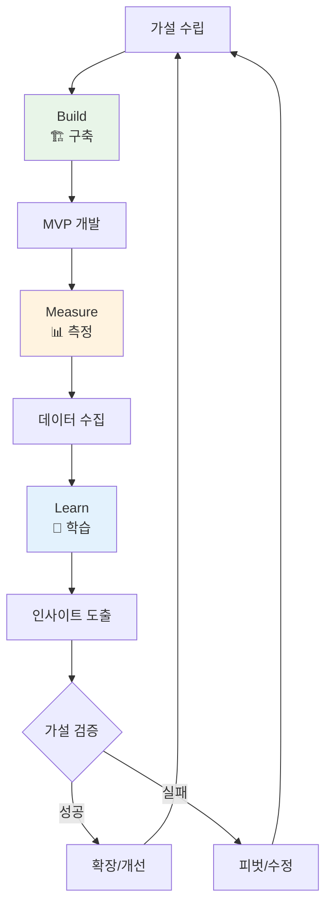
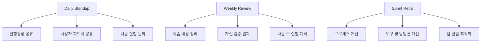
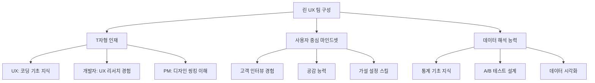

# 린 UX (Lean UX)

> **핵심 철학**: "빌드-측정-학습을 통해 사용자와 함께 제품을 만들어 간다." - Jeff Gothelf

## 🚀 린 UX란?

린 UX는 **애자일 개발 환경**에서 사용자 경험을 빠르게 검증하고 개선하는 방법론입니다. 완벽한 문서보다는 빠른 실험과 학습을 통해 사용자 가치를 창출하는데 집중합니다.

### ⚡ 핵심 가치

**🔄 Build-Measure-Learn (구축-측정-학습)**
- 빠른 실험으로 가설 검증
- 데이터 기반 의사결정
- 지속적 제품 개선

**👥 Cross-functional Teams (다기능 팀)**
- 디자이너, 개발자, PM이 한 팀으로 작업
- 실시간 협업과 소통
- 공동 책임과 목표 공유

**🎯 Outcome-focused (결과 중심)**
- 기능(Output)보다 비즈니스 결과(Outcome)에 집중
- 사용자 행동 변화 추적
- 가치 창출 측정

---

## 🔄 3단계 핵심 사이클

### 📊 Build-Measure-Learn 시각화



---

## 📖 상세 시나리오 예시: "AI 밀키트 추천 기능"

**상황**: 요리 레시피 앱을 운영하는 팀이 사용자의 저녁 메뉴 고민을 해결해주기 위해 'AI 밀키트 추천 기능'을 구상했습니다.

### 1️⃣ **Think/Build (가설 수립 및 MVP 구축)**

**가설 (Hypothesis):**
> "우리는 **바쁜 직장인 사용자**가 **'오늘 저녁 뭐 먹지?' 버튼**을 누르면, **AI가 추천하는 밀키트 3가지**를 보여줄 경우, **추천된 밀키트의 상세 페이지 클릭률이 20% 이상**이 될 것이라고 믿는다."

**MVP 설계 (Build):**
- **목표**: 실제 AI 추천 로직을 개발하는 데는 시간이 많이 걸리므로, '사용자들이 정말 이런 추천을 원하는지' 최소한의 자원으로 검증한다.
- **선택한 MVP**: **'Wizard of Oz' MVP**. 사용자가 버튼을 누르면, 실제로는 AI가 아닌 팀원(마케터, 기획자)이 5분 안에 직접 인기 밀키트 3개를 골라 수동으로 앱 내 메시지를 통해 보내준다.
- **개발 범위**: 프론트엔드에 버튼 하나만 추가하고, 백엔드에서는 버튼 클릭 시 팀 슬랙 채널에 알림만 오도록 개발. (1-2일 소요)

### 2️⃣ **Measure (측정)**

- **기간**: 1주일
- **대상**: 앱 사용자 중 10%에게만 버튼 노출 (A/B 테스트)
- **핵심 지표(KPI)**:
    1.  **추천 요청률**: 버튼 노출 대비 클릭률
    2.  **상세 페이지 전환율**: 추천 메시지를 받은 사용자 중 밀키트 상세 페이지로 이동한 비율 (가설 검증의 핵심)
    3.  **정성 피드백**: 추천 후 간단한 만족도 설문 (1-5점)

**수집된 데이터:**
- 총 1,000명에게 버튼 노출, 150명(15%)이 추천 요청.
- 추천받은 150명 중 15명(10%)만이 상세 페이지 클릭. (목표 20% 미달)
- 정성 피드백: "추천은 좋은데, 왜 이 메뉴인지 이유를 모르겠어요.", "내 취향이 아닌데...", "가격 정보가 바로 보이면 좋겠어요."

### 3️⃣ **Learn (학습 및 다음 행동 결정)**

**데이터 분석 및 인사이트:**
- **가설 검증**: 실패. 상세 페이지 클릭률이 목표치(20%)에 미치지 못하는 10%에 그쳤다.
- **인사이트**: 사용자들은 단순한 메뉴 나열이 아닌, **'왜' 이 메뉴가 추천되었는지(개인화 근거)**와 **핵심 정보(가격, 조리 시간 등)**를 함께 원한다.

**다음 행동 결정 (Pivot or Iterate):**
- **결정**: **피벗(Pivot)이 아닌 개선(Iterate)**. 기능 자체에 대한 니즈(추천 요청률 15%)는 확인되었으므로, 추천 방식을 개선하기로 결정.
- **새로운 가설**: 
> "우리는 바쁜 직장인 사용자에게 **취향(한식/양식 등)을 먼저 물어본 후**, AI 추천 밀키트를 **추천 이유와 가격 정보와 함께** 보여줄 경우, 상세 페이지 클릭률이 25% 이상이 될 것이라고 믿는다."
- **다음 MVP**: 간단한 취향 선택 버튼을 추가하고, 추천 메시지 포맷을 개선하여 2차 실험 진행.

---

## 1️⃣ Build (구축) 단계 상세 가이드

### 🎯 목적
최소한의 기능으로 가설을 테스트할 수 있는 MVP(Minimum Viable Product)를 빠르게 구축합니다.

### 🛠️ MVP의 다양한 유형

MVP는 '최소 기능 제품'이지만, 항상 실제 '제품'일 필요는 없습니다. 핵심은 **'최소한의 노력으로 가설을 검증하는 모든 것'** 입니다.

| MVP 유형 | 설명 | 예시 |
| :--- | :--- | :--- |
| **랜딩 페이지 MVP** | 실제 제품 없이, 제품을 설명하는 웹페이지만 만들어 사전예약이나 이메일 수집으로 시장 수요를 측정합니다. | Dropbox의 초기 설명 동영상, Buffer의 기능 소개 페이지 |
| **Wizard of Oz MVP** | 겉보기에는 자동화된 서비스처럼 보이지만, 실제로는 내부에서 사람이 수동으로 작업을 처리합니다. | Zappos 창업자가 주문이 들어오면 직접 신발 가게에 가서 사서 보냈던 일화 |
| **Concierge MVP** | 자동화 없이, 창업자나 팀원이 소수의 초기 사용자에게 직접 수동으로 서비스를 제공하며 니즈를 깊이 파악합니다. | 식단 추천 서비스 초기, 영양사가 직접 고객과 상담하며 식단을 짜주는 경우 |
| **단일 기능 MVP** | 제품의 여러 기능 중 가장 핵심적인 단 하나의 기능에만 집중하여 개발하고 출시합니다. | 인스타그램의 초기 '사진 필터 및 공유' 기능 |
| **프로토타입 MVP** | 실제 작동하는 코드는 없지만, 사용자가 클릭하며 경험할 수 있는 고수준의 프로토타입(Figma 등)으로 사용성을 검증합니다. | 새로운 앱의 핵심 플로우를 Figma 프로토타입으로 만들어 사용자 테스트 |

---

## 2️⃣ Measure (측정) 단계 상세 가이드

### 🎯 목적
실제 사용자 행동을 관찰하고 정량적/정성적 데이터를 수집하여 가설을 검증합니다.

### 📊 측정 전략

**🔢 정량적 측정 (Quantitative)**
- **A/B 테스트**: 기존 버전(A)과 신규 MVP(B)의 성과를 비교하여 변화를 명확히 측정합니다.
- **퍼널 분석**: 사용자가 목표 행동까지 도달하는 각 단계의 전환율을 측정하여 병목 구간을 찾습니다. (예: 앱 실행 → 버튼 클릭 → 상세페이지 조회 → 구매)
- **핵심 지표**: 가설에서 정의한 '측정 가능한 결과'를 추적합니다. (예: 전환율, 작업 완료 시간, 에러율)

**👥 정성적 측정 (Qualitative)**
- **사용자 인터뷰**: 3-5명의 사용자를 대상으로 MVP를 사용하게 하고, '왜' 그렇게 행동하는지 심층적으로 질문합니다. (Think-aloud 프로토콜)
- **인앱 설문조사**: 기능 사용 직후, 간단한 1-2개 질문으로 만족도나 피드백을 수집합니다. (예: "이 기능이 도움이 되셨나요?")
- **세션 녹화**: Hotjar, LogRocket 같은 툴을 사용해 사용자의 실제 화면 조작을 녹화하여 예상치 못한 행동 패턴을 발견합니다.

---

## 3️⃣ Learn (학습) 단계 상세 가이드

### 🎯 목적
수집된 데이터를 분석하여 가설이 맞았는지 틀렸는지 판단하고, **'무엇을 배웠는지'** 명확히 하여 다음 행동을 결정합니다.

### 🧠 학습 및 의사결정 프레임워크

**1. 데이터 분석 및 인사이트 도출**
- **목표 vs. 실제**: 가설에서 설정한 목표치와 실제 측정된 데이터를 비교합니다. (예: 목표 전환율 50% vs 실제 35%)
- **Why 찾기**: 정량 데이터(What)와 정성 데이터(Why)를 결합하여 현상의 원인을 분석합니다. (예: "전환율이 낮은 이유는 사용자들이 UI를 복잡하게 느꼈기 때문이다.")

**2. 학습 내용 정리 (Learning Template)**
```
- 가설: [우리가 믿었던 것]
- 결과: [실제로 일어난 일, 데이터 기반]
- 학습: [결과를 통해 새롭게 알게 된 것]
- 다음 행동: [학습을 바탕으로 결정한 다음 단계]
```

**3. 다음 행동 결정: 개선(Iterate) vs. 방향 전환(Pivot)**

| 결정 | 언제? | 다음 행동 예시 |
| :--- | :--- | :--- |
| **개선 (Iterate)** | 가설의 핵심은 맞았으나, 구현 방식이나 디테일이 문제일 때. (예: 추천 기능 자체는 원하지만, 추천 방식이 문제) | - UI/UX 개선<br>- 기능의 일부 수정<br>- 타겟 메시지 변경 |
| **방향 전환 (Pivot)** | 가설의 근본적인 전제 자체가 틀렸을 때. (예: 사용자들이 추천 기능 자체를 전혀 원하지 않음) | - 핵심 가치 제안 변경<br>- 타겟 고객 그룹 변경<br>- 문제 자체를 재정의 |
| **확장 (Scale Up)** | 가설이 성공적으로 검증되고 긍정적 성과가 명확할 때. | - MVP를 정식 기능으로 개발<br>- 더 많은 사용자에게 기능 노출<br>- 관련 추가 기능 개발 |

**의사결정 질문 리스트:**
- 우리의 핵심 가설은 검증되었는가?
- 사용자들이 문제 자체에는 공감하는가, 아니면 해결책에만 반응하는가?
- 우리가 예상치 못했던 새로운 사용자 행동이나 니즈가 발견되었는가?
- 이 실험에서 가장 놀라웠던 점은 무엇인가?
- 만약 방향을 전환한다면, 어떤 새로운 가설을 세울 수 있는가?

---

## 🛠️ 애자일 환경에서의 적용

### 🔄 스프린트와 린 UX 사이클의 통합

**전통적 스프린트 vs 린 UX 통합 스프린트**

| 항목 | 전통적 스프린트 | 린 UX 통합 스프린트 |
| --- | --- | --- |
| **스프린트 길이** | 2주 고정 | 1-2주 (실험 복잡도에 따라 가변) |
| **스프린트 목표** | 기능 개발 완료 | 가설 검증 완료 |
| **완료 기준** | 코드 작성 완료 | 학습 목표 달성 |
| **회고 내용** | 개발 프로세스 개선 | 사용자 학습 공유 + 프로세스 개선 |

### 📅 2주 스프린트 구조 예시

**🗓️ Week 1: Think & Build**
- **월요일**:
  - 지난 스프린트 학습 내용 공유 (스프린트 회고)
  - 새로운 가설 설정 및 MVP 범위 정의
  - 역할 분담 (디자이너는 프로토타입, 개발자는 기술 검토)
- **화-수요일**:
  - MVP 개발 (프론트엔드 우선, 백엔드 최소화)
  - 측정 도구 설정 (애널리틱스, A/B 테스트 도구)
- **목-금요일**:
  - MVP 완성 및 내부 테스트
  - 다음 주 사용자 테스트 준비

**🗓️ Week 2: Measure & Learn**
- **월-수요일**:
  - 실제 사용자에게 MVP 배포 (소규모)
  - 실시간 데이터 모니터링 및 사용자 인터뷰
- **목요일**:
  - 데이터 분석 및 인사이트 도출
  - Pivot/Iterate 결정
- **금요일**:
  - 팀 전체 학습 공유 및 다음 스프린트 계획

### 👥 다기능 팀 운영 전략

**🎯 역할별 린 UX 참여 방식**

**Product Manager**
- 비즈니스 가설 및 성과 지표 정의
- 사용자 피드백을 비즈니스 우선순위로 변환
- 스프린트 목표를 '학습 목표'로 재정의

**UX Designer**
- 빠른 프로토타이핑 및 사용자 테스트 주도
- 정성적 피드백 수집 및 분석
- 디자인 시스템보다는 실험 중심 접근

**Developer**
- 최소 기능으로 빠른 구현 (기술 부채 허용)
- 측정 도구 및 A/B 테스트 시스템 구축
- 확장 가능한 아키텍처보다는 빠른 검증 우선

**📊 팀 커뮤니케이션 구조**


---

## 📊 성과 측정 및 도구

### 🎯 핵심 지표 (Key Metrics) 설정

**AARRR 프레임워크와 린 UX의 결합**

| 단계 | 지표 유형 | 린 UX 적용 | 측정 도구 예시 |
| --- | --- | --- | --- |
| **Acquisition** | 획득 | 랜딩 페이지 MVP 테스트로 관심도 측정 | Google Analytics, 페이지뷰, 가입률 |
| **Activation** | 활성화 | 온보딩 플로우 실험으로 첫 사용 경험 최적화 | 튜토리얼 완료율, 첫 주요 액션 완료율 |
| **Retention** | 재방문 | 핵심 기능 MVP 테스트로 지속 사용 유도 | DAU/MAU, 재방문률, 세션 길이 |
| **Referral** | 추천 | 공유 기능 실험으로 바이럴 효과 검증 | 추천 점수(NPS), 공유율, 초대 수락률 |
| **Revenue** | 수익 | 결제 플로우 개선으로 전환율 최적화 | 결제 전환율, ARPU, LTV |

### 🛠️ 필수 도구 스택 (Tool Stack)

**📈 정량 데이터 분석 도구**

| 도구 | 용도 | 가격 | 린 UX 활용법 |
| --- | --- | --- | --- |
| **Google Analytics 4** | 웹/앱 행동 분석 | 무료 | 퍼널 분석, A/B 테스트 결과 추적 |
| **Mixpanel** | 이벤트 기반 분석 | $20/월~ | 사용자 여정 추적, 코호트 분석 |
| **Amplitude** | 제품 분석 | $0~995/월 | 사용자 행동 패턴 분석, 리텐션 측정 |
| **Hotjar** | 히트맵/세션 녹화 | $32/월~ | 사용자 실제 행동 관찰, UI 문제점 발견 |

**🎨 A/B 테스트 및 실험 도구**

| 도구 | 용도 | 가격 | 린 UX 활용법 |
| --- | --- | --- | --- |
| **Google Optimize** | 웹 A/B 테스트 | 무료 (단종 예정) | 랜딩 페이지, UI 요소 테스트 |
| **Optimizely** | 전문 A/B 테스트 | $50/월~ | 복잡한 다변수 테스트, 개인화 |
| **VWO** | 전환율 최적화 | $200/월~ | 히트맵 + A/B 테스트 통합 |
| **LaunchDarkly** | 기능 플래그 | $8.5/월~ | 점진적 기능 배포, 빠른 롤백 |

**👥 정성 피드백 수집 도구**

| 도구 | 용도 | 가격 | 린 UX 활용법 |
| --- | --- | --- | --- |
| **Typeform** | 사용자 설문 | $25/월~ | 사용성 만족도, 니즈 조사 |
| **UserVoice** | 피드백 수집 | $499/월~ | 기능 요청 수집, 우선순위 투표 |
| **Intercom** | 인앱 메시징 | $39/월~ | 실시간 사용자 피드백, 실험 안내 |
| **Calendly** | 사용자 인터뷰 | $8/월~ | 1:1 인터뷰 일정 관리, 자동화 |

### 📊 실험 설계 및 통계적 유의성

**🔬 A/B 테스트 설계 가이드**

**1. 샘플 사이즈 계산**
```
최소 필요 사용자 수 = (기준 전환율, 개선 목표, 신뢰도)
예시: 기준 5% → 목표 7% (40% 개선), 95% 신뢰도 = 각 그룹 최소 1,000명
```

**권장 도구**: [Evan Miller's A/B Test Calculator](https://www.evanmiller.org/ab-testing/)

**2. 실험 기간 결정**
- **최소 1주일**: 요일별 사용 패턴 차이 고려
- **최대 4주**: 너무 긴 실험은 외부 변수 증가
- **조기 종료 금지**: 통계적 유의성 달성해도 계획된 기간 완주

**3. 가설 설정 템플릿**
```
우리는 [대상 사용자]가 [변경사항]을 경험할 때,
[현재 지표] 대비 [목표 개선율] 이상의 성과를 보일 것이라고 믿는다.
이를 [측정 지표]로 [기간] 동안 측정할 것이다.
```

### 📈 데이터 분석 및 해석

**🧮 통계적 분석 체크리스트**

**✅ 실험 전 체크사항**
- [ ] 대조군(Control)과 실험군(Variant) 동일 조건 보장
- [ ] 랜덤 배정 알고리즘 확인 (50:50 또는 계획된 비율)
- [ ] 외부 변수 통제 (마케팅 캠페인, 계절성 등)

**✅ 실험 중 모니터링**
- [ ] 일일 데이터 트렌드 확인 (급격한 변화 감지)
- [ ] 사용자 피드백 실시간 수집
- [ ] 기술적 오류나 버그 모니터링

**✅ 실험 후 분석**
- [ ] P-value < 0.05 (95% 신뢰도) 확인
- [ ] 실질적 의미(Practical Significance) 평가
- [ ] 세그먼트별 결과 분석 (나이, 성별, 디바이스 등)

**📊 결과 해석 가이드**

| 결과 | 통계적 유의성 | 실무 결정 | 다음 행동 |
| --- | --- | --- | --- |
| **승리 (Win)** | p < 0.05, 목표 달성 | 전체 배포 | 성공 요인 분석, 추가 개선점 탐색 |
| **무승부 (Flat)** | p ≥ 0.05, 차이 없음 | 기존 유지 또는 새 실험 | 실험 설계 재검토, 더 큰 변화 시도 |
| **패배 (Loss)** | p < 0.05, 성과 악화 | 롤백, 원인 분석 | 가설 재수정, 대안 접근법 모색 |
| **불확실 (Inconclusive)** | 표본 부족, 기간 부족 | 실험 연장 또는 재설계 | 더 큰 샘플, 명확한 차이 만들기 |

---

## 🚨 주의사항 및 베스트 프랙티스

### ⚠️ 흔한 실수와 함정들

**🎯 MVP를 너무 "미니멈"하게 만드는 실수**

| ❌ 잘못된 접근 | ✅ 올바른 접근 | 예시 |
| --- | --- | --- |
| 기능을 단순히 제거하기 | 핵심 가치는 유지하며 구현 방식 단순화 | 추천 기능 → AI 대신 사람이 수동 큐레이션 |
| 사용할 수 없을 정도로 조잡하게 | 기본 품질은 보장하며 범위만 축소 | 결제 시스템 → 신용카드만 지원 (간편결제 제외) |
| 무료로만 제공 | 실제 지불 의향 테스트 | 프리미엄 기능 → 단순한 유료 모델로 테스트 |

**📊 데이터에 매몰되어 사용자 공감 잃는 실수**

**Warning Signs:**
- "데이터가 이렇게 말하니까..." 하며 사용자 피드백 무시
- 수치만 보고 맥락(Context) 놓치기
- 통계적 유의성만 추구하고 실질적 의미 간과

**해결 방법:**
```
📈 데이터 (What) + 👥 사용자 피드백 (Why) = 💡 인사이트 (So What)

예시:
- What: 클릭률이 30% 증가했다
- Why: 사용자들이 "버튼이 더 눈에 잘 띄어서" 클릭했다고 응답
- So What: 기능 자체의 가치가 아닌 UI 개선 효과. 다른 기능에도 동일한 UI 원칙 적용 고려
```

### 🎯 성공을 위한 베스트 프랙티스

**🚀 조직 차원의 성공 요인**

**1. 경영진 지원과 문화 변화**
- **CEO/CPO 레벨에서의 이해와 지원**: "실패를 통한 학습"에 대한 관용
- **성공 지표 재정의**: 기능 출시 개수 → 검증된 가설 개수
- **보상 시스템 변경**: 완벽한 실행 → 빠른 학습과 피벗 능력

**2. 팀 구성과 역량 개발**


**🎯 실행 차원의 베스트 프랙티스**

**1. 가설 설정의 SMART 원칙**
```
Specific (구체적): "사용자가 버튼을 더 많이 클릭한다" ❌
→ "25-35세 직장인 여성이 '오늘 저녁 메뉴 추천' 버튼을 클릭한다" ✅

Measurable (측정 가능): "사용성이 개선된다" ❌
→ "작업 완료 시간이 30초에서 20초로 단축된다" ✅

Achievable (달성 가능): "전환율을 10%에서 90%로" ❌
→ "전환율을 10%에서 13%로 (30% 향상)" ✅

Relevant (관련성): "클릭률 증가" ❌
→ "실제 구매 전환율 증가" ✅

Time-bound (기한): "언젠가 개선될 것" ❌
→ "2주 실험 기간 동안" ✅
```

**2. 실험 우선순위 매트릭스**

| 영향도\노력도 | 낮음 (1일) | 중간 (1주) | 높음 (1개월+) |
| --- | --- | --- | --- |
| **높음** | 🚀 지금 당장 | 📅 다음 스프린트 | 🎯 분기별 계획 |
| **중간** | 🏃‍♂️ Quick Win | 🤔 ROI 계산 필요 | ⏸️ 보류 검토 |
| **낮음** | ⚡ 여유 시간에 | ❌ 하지 마라 | ❌ 절대 하지 마라 |

**3. 학습 속도 최대화 전략**

**병렬 실험 (Parallel Testing)**
- 동시에 여러 가설을 독립적으로 테스트
- 예: A(현재) vs B(새 UI) vs C(새 카피) vs D(새 플로우)
- 주의: 상호 영향 최소화를 위한 격리 필요

**순차 실험 (Sequential Testing)**
- 이전 실험 결과를 다음 실험에 반영
- 예: 1주차(색상 테스트) → 2주차(위치 테스트) → 3주차(통합 테스트)
- 장점: 누적 학습 효과, 더 정교한 최적화

### 🛡️ 리스크 관리

**🚨 실험 실패 시 대응 방안**

**기술적 리스크**
- **롤백 계획**: 1클릭으로 이전 버전 복구 가능한 시스템
- **카나리 배포**: 전체 사용자의 5%에게만 먼저 배포 후 점진 확대
- **모니터링 대시보드**: 실시간 오류 감지 및 알림 시스템

**비즈니스 리스크**
- **MVP 범위 제한**: 핵심 비즈니스에 영향 최소화
- **역실험 계획**: 의도치 않은 부작용 발생 시 측정 방법 사전 정의
- **커뮤니케이션 계획**: 사용자 혼란 최소화를 위한 설명 및 공지

**조직 리스크**
- **실패에 대한 정의**: "실험 실패" ≠ "팀 실패", "학습 성공"으로 재정의
- **심리적 안전감**: 실패를 공유하고 학습하는 문화 조성
- **성과 평가 기준**: 단기 성과보다 중장기 학습과 개선에 중점

---

## 🔗 관련 자료

### 📚 필독 도서

**🎯 린 UX 입문서**
- **"Lean UX" - Jeff Gothelf & Josh Seiden**: 린 UX의 바이블, 실무 적용 가이드
- **"Lean Startup" - Eric Ries**: 린 방법론의 근본 이론, Build-Measure-Learn 사이클
- **"Sprint" - Jake Knapp (Google Ventures)**: 5일 디자인 스프린트 방법론

**🔬 실험 설계 및 데이터 분석**
- **"Trustworthy Online Controlled Experiments" - Ron Kohavi**: A/B 테스트 설계의 과학적 접근
- **"Lean Analytics" - Alistair Croll & Benjamin Yoskovitz**: 스타트업을 위한 데이터 분석 가이드

### 🎓 온라인 강의 및 코스

| 플랫폼 | 코스명 | 강사 | 특징 |
| --- | --- | --- | --- |
| **Coursera** | Design Thinking for Innovation | University of Virginia | 디자인 씽킹 + 린 UX 통합 |
| **Udacity** | A/B Testing | Google | 통계적 실험 설계 심화 |
| **Interaction Design Foundation** | User Experience: The Beginner's Guide | IDF | UX 기초 + 린 방법론 |
| **LinkedIn Learning** | Lean UX Fundamentals | Laura Klein | 실무 중심 단기 코스 |

### 🛠️ 실무 템플릿 및 도구

**📋 가설 설정 템플릿**
```
[실험명]: _______________

1. 문제 상황:
   현재 [대상 사용자]는 [상황]에서 [문제]를 겪고 있다.

2. 가설:
   우리는 [대상 사용자]가 [솔루션/변경사항]을 경험할 때,
   [현재 지표] 대비 [목표 개선율]의 성과를 보일 것이라고 믿는다.

3. 성공 지표:
   - 주요 지표: _______________
   - 보조 지표: _______________
   - 정성 지표: _______________

4. 실험 설계:
   - 기간: _______________
   - 대상: _______________
   - MVP 범위: _______________

5. 학습 목표:
   이 실험을 통해 우리는 _______________를 배우고 싶다.
```

**📊 실험 결과 정리 템플릿**
```
[실험 결과 리포트]

1. 가설 검증 결과:
   ✅/❌ 가설: [원래 가설]
   📊 결과: [실제 수치와 통계적 유의성]

2. 핵심 학습:
   💡 What We Learned: _______________
   🤔 What Surprised Us: _______________
   🚩 What Concerns Us: _______________

3. 다음 행동:
   🎯 Decision: [Continue/Pivot/Scale]
   📅 Next Steps: _______________
   🔄 Next Hypothesis: _______________
```

### 🌐 유용한 웹사이트 및 커뮤니티

**📖 블로그 및 매거진**
- **Medium - UX Planet**: 린 UX 실무 케이스 스터디
- **A List Apart**: 웹 디자인 + UX 방법론 심화 콘텐츠
- **Nielsen Norman Group**: UX 리서치 방법론 및 베스트 프랙티스

**👥 커뮤니티 및 포럼**
- **Designer News**: 디자인 트렌드 및 방법론 토론
- **Reddit r/userexperience**: 실무 질문 및 경험 공유
- **LinkedIn UX Groups**: 네트워킹 및 채용 정보

**🎪 컨퍼런스 및 이벤트**
- **UX Week (Nielsen Norman Group)**: 글로벌 UX 방법론 트렌드
- **Design at Scale**: 대기업 UX팀의 린 프로세스 사례
- **Lean Startup Conference**: 린 방법론의 최신 발전사항

### 🔧 즉시 사용 가능한 도구 모음

**🆓 무료 도구 스타터 킷**
1. **Google Analytics** - 웹사이트 행동 분석
2. **Google Forms** - 간단한 사용자 설문
3. **Figma** - 프로토타이핑 및 디자인
4. **Hotjar (Free Plan)** - 기본 히트맵 및 녹화
5. **Typeform (Free Plan)** - 사용자 피드백 수집

**💰 유료 도구 추천 (ROI 높은 순서)**
1. **Mixpanel** ($20/월) - 이벤트 분석 및 퍼널
2. **Calendly** ($8/월) - 사용자 인터뷰 일정 관리
3. **Notion** ($4/월) - 실험 관리 및 문서화
4. **Optimizely** ($50/월) - 전문 A/B 테스트
5. **Amplitude** ($995/월) - 고급 제품 분석 (성장 단계)

---

**💡 마무리 메시지**: 린 UX는 완벽한 계획보다는 빠른 학습을 우선시합니다. 사용자와 함께 제품을 만들어가는 과정에서 진정한 가치를 발견할 수 있습니다. 작게 시작하고, 빠르게 실패하고, 지속적으로 학습하는 마음가짐이 성공의 열쇠입니다.