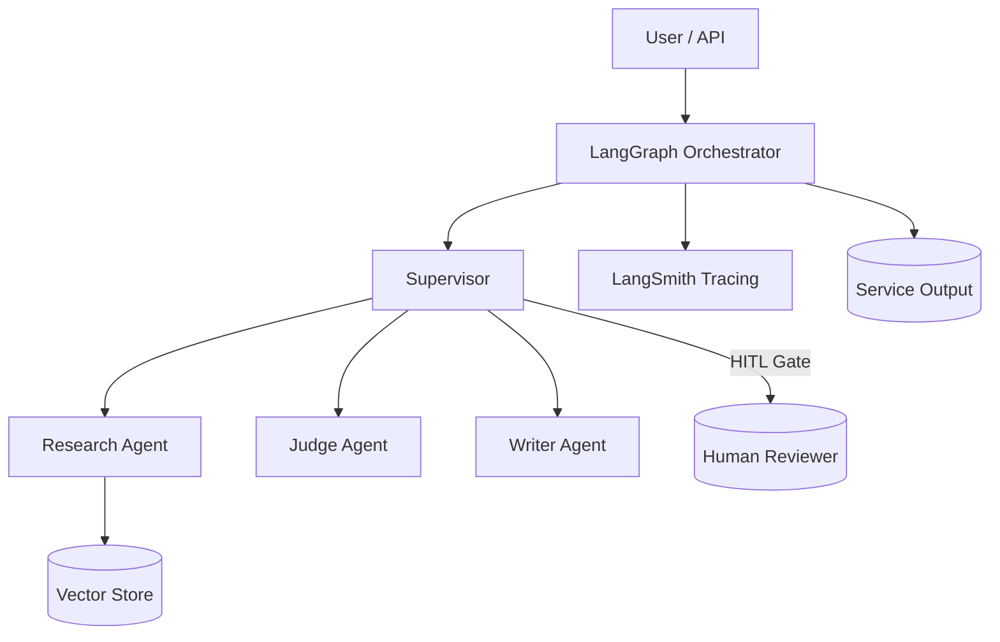
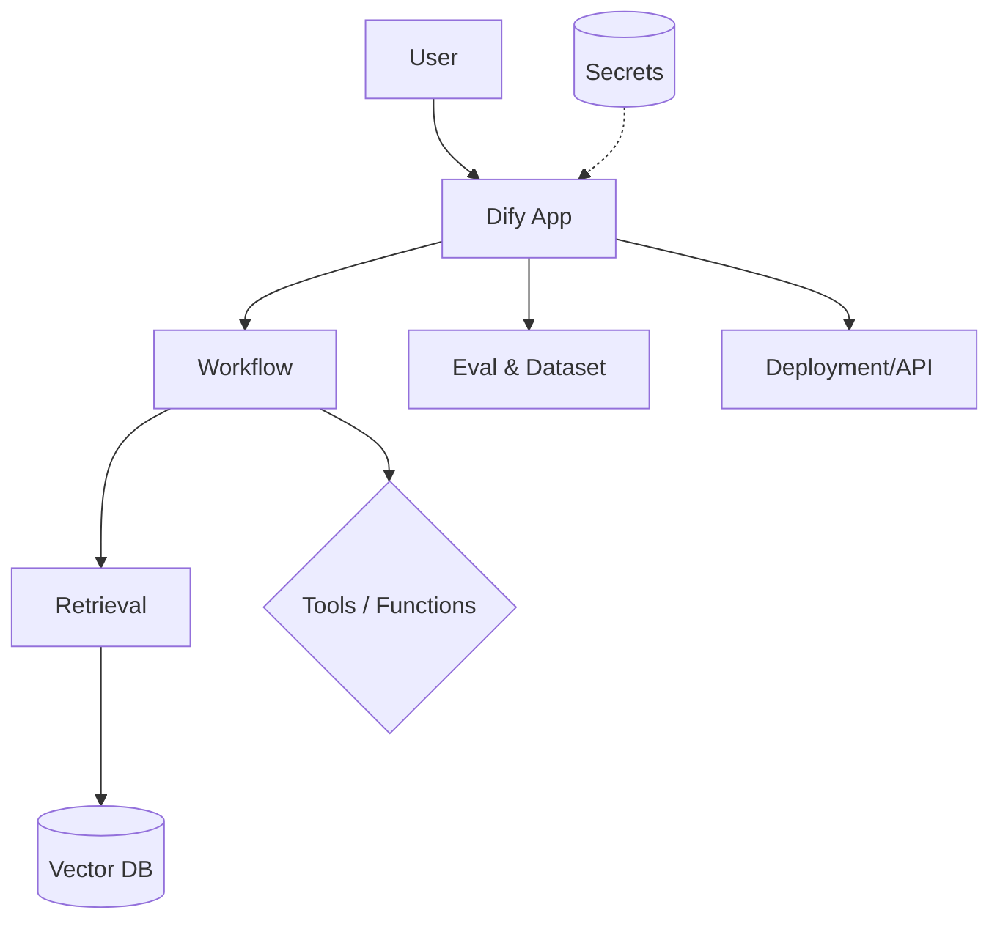
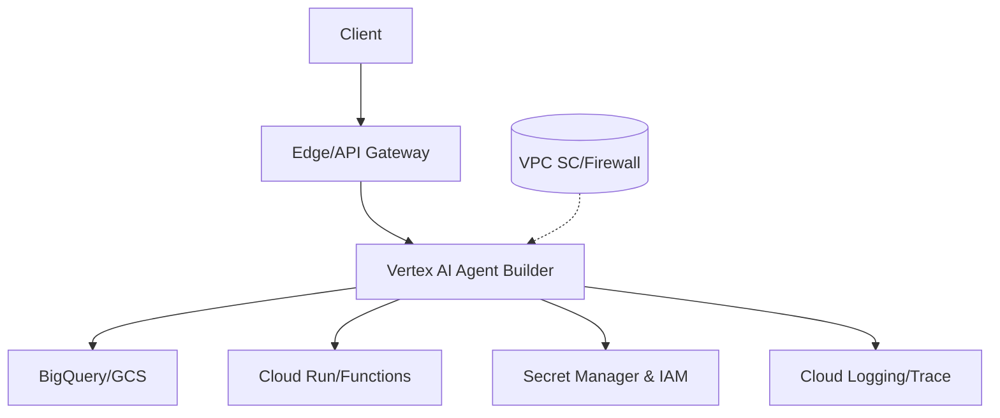
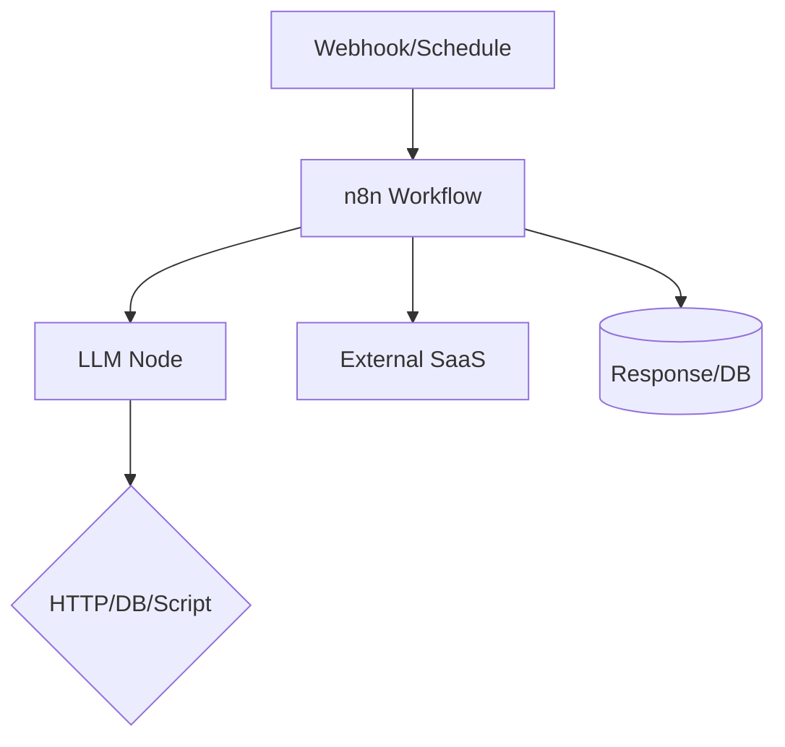

## 📋 솔루션 비교표 (확대)

| 도구명 | 타입 | 가격 | AI 특화 | 오픈소스 | 링크 |
|--------|------|------|---------|----------|------|
| **Dify** | LLM 앱/에이전트 빌더 | 무료/유료 | ⭐⭐⭐⭐⭐ | ✅ | https://dify.ai/ |
| **LangFlow** | LangChain/LangGraph 빌더 | 무료/유료 | ⭐⭐⭐⭐ | ✅ | https://www.langflow.org/ |
| **Flowise** | LLM 노드 기반 빌더 | 무료/유료 | ⭐⭐⭐⭐ | ✅ | https://flowiseai.com/ |
| **LangGraph Studio** | 에이전트 오케스트레이션 | 유료/플랫폼 | ⭐⭐⭐⭐⭐ | ❌(플랫폼) | https://langchain.ai |
| **AutoGen Studio** | 멀티에이전트 노코드 | 무료/유료 | ⭐⭐⭐⭐ | ❌(앱은 폐쇄) | https://github.com/microsoft/autogen |
| **CrewAI Control Plane** | 엔터프라이즈 오케스트레이션 | 유료(트라이얼) | ⭐⭐⭐⭐ | ❌(클라우드) | https://app.crewai.com |
| **Vertex AI Agent Builder** | GCP 에이전트 빌더 | 유료 | ⭐⭐⭐⭐ | ❌ | https://cloud.google.com/vertex-ai |
| **AWS Agents for Bedrock** | AWS 에이전트 빌더 | 유료 | ⭐⭐⭐⭐ | ❌ | https://aws.amazon.com/bedrock/ |
| **Azure AI Studio (Prompt flow)** | 시각적 플로우/평가 | 유료 | ⭐⭐⭐⭐ | ❌ | https://ai.azure.com |
| **n8n** | 범용 자동화(LLM 노드) | 무료/유료 | ⭐⭐⭐ | ✅ | https://n8n.io/ |
| **Activepieces** | 범용 자동화 | 무료/유료 | ⭐⭐ | ✅ | https://www.activepieces.com/ |
| **Zapier (AI Actions)** | 앱 연동 자동화 | 무료/유료 | ⭐⭐ | ❌ | https://zapier.com/ |
| **Make.com** | 앱 연동/시각 플로우 | 유료 | ⭐⭐ | ❌ | https://www.make.com/ |
| **Pipedream** | 서버리스 워크플로우 | 유료(무료티어) | ⭐⭐ | ❌ | https://pipedream.com/ |
| **Dust** | 팀용 어시스턴트/플로우 | 유료 | ⭐⭐⭐ | ❌ | https://dust.tt/ |
| **Vapi / Retell** | 보이스 에이전트 빌더 | 유료 | ⭐⭐⭐ | ❌ | https://vapi.ai / https://retellai.com |

## 🔧 카테고리별 분류

### AI 특화 플랫폼
- **Dify**: RAG/에이전트/툴 연동, 워크플로우+데이터셋+평가 통합, 셀프호스팅 강점
- **LangFlow/Flowise**: 시각적 노드 기반 LLM 플로우, 빠른 PoC에 적합, OSS 확장성
- **LangGraph Studio**: 상태 그래프/HITL/조건부 분기 등 프로덕션급 오케스트레이션
- **AutoGen Studio**: 대화형 멀티에이전트 설계/실행, AgentTool 기반 협업 시나리오
- **CrewAI Control Plane**: 엔터프라이즈 관찰가능성/트레이싱/배포/액세스 제어

### 범용 자동화 도구
- **n8n/Activepieces**: 600+ 통합, 함수/코드 노드, 간단한 AI 자동화에 적합
- **Zapier/Make/Pipedream**: SaaS 연동 최강, AI Actions/LLM 모듈로 에이전트 워크플로우 가능

### 클라우드 빌더(하이퍼스케일러)
- **Vertex AI Agent Builder / AWS Bedrock Agents / Azure AI Studio**: 관리형 보안/비용/로그/비밀 관리, 엔터프라이즈 통합 용이

### 보이스 에이전트
- **Vapi/Retell**: 전화/실시간 음성, 콜센터/예약/세일즈 시나리오에 적합

## 💰 가격 정보 (요약)

| 도구 | 무료 플랜 | 유료 시작가격 | 특징 |
|------|-----------|---------------|------|
| **Dify** | ✅ 무제한 | $20/월 | 셀프호스팅 무료 |
| **LangFlow** | ✅ 제한적 | $25/월 | 오픈소스 |
| **n8n** | ✅ 5개 워크플로우 | $20/월 | 셀프호스팅 무료 |
| **Flowise** | ✅ 제한적 | $15~/월 | 오픈소스 |
| **Zapier** | ✅ 100 작업/월 | $20/월 | 클라우드만 |

## 🎯 용도별 추천

### AI 프로젝트 개발
1. **LangGraph Studio** - 프로덕션 에이전트 오케스트레이션/HITL
2. **Dify** - RAG/에이전트 제품화 + 운영 번들
3. **LangFlow/Flowise** - 시각적 설계/빠른 실험

### 비즈니스 자동화
1. **n8n** - 개발자 친화적, 코드 노드/셀프호스팅
2. **Zapier/Make** - 비개발자 친화적, 광범위한 SaaS 연동
3. **Activepieces** - 가벼운 환경/온프렘 선호

### 학습/실험
1. **Flowise/LangFlow** - 시각적 학습/OSS 확장
2. **Dify** - 에이전트/툴/평가 예제 풍부
3. **AutoGen Studio** - 멀티에이전트 실험

## 🔍 솔루션 개별 요약 (특장점/제약)

- **Dify**
  - 강점: 워크플로우+데이터셋+관찰가능성 번들, 셀프호스팅, 에이전트/툴/함수 호출 지원
  - 제약: 복잡한 상태 그래프/HITL 오케스트레이션은 제한적
    
- **LangGraph Studio**
  - 강점: 상태 그래프, 조건부 엣지, 루프, Human-in-the-Loop, LangSmith 연동
  - 제약: 플랫폼 종속(비OSS), 사용료 발생
    
- **LangFlow / Flowise**
  - 강점: 빠른 시각 설계/데모, 커뮤니티 커넥터 풍부, OSS 확장 쉬움
  - 제약: 대규모 운영/장기 실행/트레이싱엔 보강 필요
    
- **AutoGen Studio**
  - 강점: 대화 중심 멀티에이전트 설계, AgentTool로 에이전트 상호 호출
  - 제약: 스튜디오 자체는 배포/운영보단 실험 중심
    
- **CrewAI Control Plane**
  - 강점: 엔터프라이즈 관찰가능성/보안/배포, Crews/Flows 코드와 연계
  - 제약: 클라우드 종속, 비용
    
- **Vertex AI Agent Builder / AWS Bedrock Agents / Azure AI Studio**
  - 강점: IAM/네트워킹/비밀/로깅 등 엔터프라이즈 운영 기본기
  - 제약: 벤더 종속, 타 클라우드/온프렘과 혼합 시 복잡도 상승
    
- **n8n / Activepieces / Zapier / Make / Pipedream**
  - 강점: SaaS 통합, 간단한 AI 액션·함수·웹훅으로 신속 자동화
  - 제약: 복잡한 에이전트 상태/메모리/루프는 한계
    
- **Vapi / Retell (보이스)**
  - 강점: 전화/실시간 음성 처리, IVR 대체 시나리오 빠른 구축
  - 제약: 도메인 지식/툴 연동은 별도 설계 필요

## 🔗 관련 링크

### 비교 리뷰
- "Best AI Workflow Tools 2024" - 미정
- "No-Code AI Platforms Comparison" - 미정

### 커뮤니티
- r/nocode (Reddit)
- AI Automation Discord
- No-Code Makers Slack

## 🧭 선택 가이드 (요약)
- 빠른 시각 설계/학습: Flowise/LangFlow
- 프로덕션 오케스트레이션/HITL: LangGraph Studio (+ LangSmith)
- 올인원 LLM 제품화 번들: Dify
- 엔터프라이즈 클라우드 통합: Vertex AI / Bedrock Agents / Azure AI Studio
- 업무 자동화 중심: n8n / Zapier / Make / Activepieces
- 보이스 콜 에이전트: Vapi / Retell

---

## ✅ 도입 체크리스트 (도구별 핵심)

### LangGraph Studio (+ LangSmith)
- 호스팅: 관리형 플랫폼(비OSS). 계정/워크스페이스 설정
- IAM/비밀: 모델 키·서드파티 키는 플랫폼 시크릿에 저장
- 네트워크: 사내 리소스 접근 시 프록시/VPC 허용 목록 확인
- 관찰성: LangSmith 프로젝트/데이터 보존 기간 설정, PII 마스킹
- HITL: 승인 게이트(휴먼 리뷰) 노드 설계 및 감사 로그 확인
- 비용: 동시 실행/스토리지/트레이싱 비용 추정(월간)

### Dify (Self-host or Cloud)
- 호스팅: Docker-compose/K8s 권장, 영속 볼륨 확보
- 데이터: 데이터셋/벡터 스토어(Redis/PGVecto/Elastic 등) 선택
- 비밀: `.env`/시크릿 매니저, 키 로테이션 계획
- 관찰성: 실행 로그/평가(offline/online) 활성화, 보존 정책
- 보안: 프롬프트 인젝션 가드/출력 필터 설정
- 비용: 모델 호출/스토리지/이그레스 예산화

### LangFlow / Flowise (OSS)
- 배포: Docker or Node 서비스로 고정 포트 노출, 리버스 프록시
- 버전관리: 플로우 JSON 내보내기/백업 자동화
- 비밀: 환경변수/볼트 연동, 노드별 키 노출 주의
- 관찰성: 실행 로그/에러 핸들러 노드 추가
- 확장: 커스텀 노드(커넥터) 개발 계획 수립

### AutoGen Studio
- 목적: 멀티에이전트 실험/프로토타입. 운영보단 실험 중심
- 구성: AgentTool/모델 클라이언트 설정, 로깅/스트리밍 활성화
- 제약: 장기 실행/스케줄러/배포는 별도 구성 필요

### CrewAI Control Plane
- 계정: 조직·프로젝트 경계, 역할·권한(Role) 설정
- 관찰성: 트레이싱/모니터링 대시보드 구성, 알림 정책
- 보안: 워크스페이스 비밀, 데이터 경계/지역 설정

### 하이퍼스케일러 (Vertex AI / Bedrock / Azure AI Studio)
- IAM: 최소권한 역할 설계, 서비스 계정/권한 부여
- 네트워크: VPC/프라이빗 엔드포인트, egress 제어, 프록시
- 데이터: 로깅/추적/Key 관리(KMS/Secret Manager)
- 규제: 데이터 지역/보존, 감사 추적(Cloud Audit/Defender)

### 업무 자동화 (n8n / Activepieces / Zapier / Make / Pipedream)
- 트리거: 웹훅/크론/이벤트, 재시도 정책 확인
- 비밀: 커넥터 키 보관, 각 워크플로우 분리
- 한계: 긴 체인/상태 관리/루프는 별도 오케스트레이터 병행 고려

### 보이스 에이전트 (Vapi / Retell)
- 통신: 번호/IVR/녹취 정책, STT/TTS 모델 품질 검증
- 도구: 캘린더/CRM/지식베이스 툴 호출 지연 최적화
- 인간 연결: 에스컬레이션(상담사 연결) 경로/기준 정의

---

## 🗺️ 샘플 아키텍처 다이어그램

### A. LangGraph Studio + LangSmith (HITL 포함)


### B. Dify (RAG + 평가 + 배포)


### C. Vertex AI Agent Builder (GCP)


### D. n8n 기반 업무 자동화 + LLM


---

## 💵 도입 비용 산정 템플릿 (월간)

아래 항목을 산정하여 합산합니다. 실제 단가는 벤더/모델별 과금표를 확인하세요.

- 모델 호출 비용: `요청/일 × 일수 × (입력토큰/1K × 단가 + 출력토큰/1K × 단가)`
- 임베딩/검색: `문서수 × 평균토큰 × 임베딩단가 + 검색쿼리/일 × 일수 × 검색단가`
- 스토리지: 벡터DB/오브젝트/Git 저장소(GB-월)
- 관찰성/트레이싱: LangSmith/모니터링/로그 GB-월
- 인프라: 컨테이너/함수/서버리스 실행시간, 네트워크 이그레스(GB)
- 플랫폼 구독: Studio/Control Plane 라이선스

예시(샘플 YAML)
```yaml
workload:
  daily_requests: 5_000
  days: 30
  avg_input_tokens: 800
  avg_output_tokens: 300
pricing:
  model_in_per_1k: 0.002   # $/1K tokens
  model_out_per_1k: 0.006  # $/1K tokens
  embedding_per_1k: 0.0001
  tracing_per_gb: 0.20
  storage_per_gb: 0.10
  egress_per_gb: 0.09
metrics:
  embedding_docs: 50_000
  embedding_avg_tokens: 500
  tracing_gb: 20
  storage_gb: 30
  egress_gb: 10
calc:
  model_usd: "=daily_requests*days*((avg_input_tokens/1000)*model_in_per_1k+(avg_output_tokens/1000)*model_out_per_1k)"
  embedding_usd: "=embedding_docs*embedding_avg_tokens/1000*embedding_per_1k"
  tracing_usd: "=tracing_gb*tracing_per_gb"
  storage_usd: "=storage_gb*storage_per_gb"
  egress_usd: "=egress_gb*egress_per_gb"
  total_usd: "=model_usd+embedding_usd+tracing_usd+storage_usd+egress_usd"
```

도구별 메모
- LangGraph Studio: 동시 실행/스토리지/트레이싱(Logs+Traces) 단가 포함
- Dify: 모델/임베딩+벡터스토리지/배포/API 호출/평가 저장소 비용
- LangFlow/Flowise: 자체 호스팅 인프라+모델·임베딩 비용, 로그 스토리지
- 하이퍼스케일러: VPC/네트워킹(egr ess), KMS/Secret, Cloud Logging/Trace 비용

---

## 🔐 보안 점검 체크리스트

프롬프트/체인 보안
- 입력 검증: 시스템/사용자 입력 분리, 길이/포맷 검증, JSON 스키마 검증
- 프롬프트 인젝션 방어: 지시 재해석 금지 규칙, 외부 콘텐츠 신뢰 경계 표시, 도구 실행 화이트리스트
- 출력 필터링: PII/유해 콘텐츠 차단, 포맷 강제(JSON/Markdown 스키마)

데이터 경계/권한
- 비밀 관리: 키/토큰은 Secret Manager(또는 플랫폼 시크릿)에 저장, 주기적 로테이션
- 최소권한(IAM): 서비스 계정/역할 분리(읽기/쓰기/운영), 작업별 스코프 축소
- 네트워크: VPC/프라이빗 엔드포인트, 아웃바운드 이그레스 제한, 허용 목록 관리

로깅/관찰성/감사
- 트레이싱: 프롬프트/반환/도구호출 로깅, 샘플링 비율 설정
- PII 보호: 마스킹/토큰화, Log 저장기간·접근통제
- 감사: HITL 승인 단계/의사결정 로그 보존, 알림 정책

서드파티/공급망
- 커넥터/플러그인: 소스 검증, 버전 고정, 서명/무결성 확인
- OSS 구성요소: 라이선스/취약점 스캔(SLSA/OSV), 주기적 업데이트

샘플 가드레일 정책(YAML)
```yaml
guards:
  input:
    max_chars: 8000
    schema: order_query_v1   # 예: JSON schema id
    forbidden_phrases: ["ignore previous", "disregard system"]
  tools:
    allowlist: ["search", "db.read", "calendar.create"]
    block_on_unknown: true
  output:
    format: json
    pii_mask: true
    must_include_keys: ["answer", "confidence", "sources"]
  hitl:
    enable: true
    conditions: ["confidence < 0.7", "contains_pii == true"]
logging:
  trace_redaction: ["pii.email", "pii.ssn"]
  retention_days: 30
```

---

## 🛡️ 솔루션별 보안/구성 체크리스트 (커스터마이즈)

### Dify 전용
- 네임스페이스 분리: App/Workflow/데이터셋을 프로젝트 기준으로 격리
- 검색 경계: 외부 URL 크롤링 시 도메인 허용 목록 지정
- 평가 데이터: 개인정보 포함 시 비식별 처리 후 저장
- 백업: `dify export`로 앱/플로우 주기 내보내기 + 인덱스 스냅샷

### LangGraph Studio 전용
- Role 설계: Viewer/Editor/Deployer 분리, PROD 배포는 보호 분기
- HITL 정책: 승인자 그룹/근무시간/타임아웃/자동 폴백 정의
- Trace 정책: `trace_redaction` 키 규칙(PII/Secrets) 사전 등록
- 릴리즈: 그래프 버전 태깅, 이전 버전 롤백 테스트

### LangFlow / Flowise 전용
- 인증: 프록시(OAuth/OIDC)로 대시보드 보호, 인터넷 직접 노출 금지
- 시크릿: 노드 구성에 키 하드코딩 금지, 환경변수/볼트 이용
- CI: 플로우 JSON lint/검증(스키마), 변경 검토(PR) 필수화

### Vertex AI Agent Builder 전용
- 서비스 경계: 프로젝트 분리(Prod/Non-prod), 조직 정책으로 지역 제한
- 데이터 접근: BigQuery/GCS 권한 최소화, 정책 태그/데이터 마스킹
- 네트워크: VPC-SC로 에이전트–데이터 경계 보호, Egress 제한

### AWS Agents for Bedrock 전용
- 엔드포인트: PrivateLink 사용, 퍼블릭 접근 차단
- 데이터: S3 버킷 정책/암호화(SSE-KMS), Athena/Glue 권한 최소화
- 가드레일: Bedrock Guardrails/Comprehend 필터 결합

### Azure AI Studio 전용
- ID: Managed Identity 기본, 키 직접 주입 지양
- 네트워크: Private Endpoint + Defender for Cloud 권장 설정
- 로깅: Log Analytics 워크스페이스 별도 운영(보존 30/90/180일)

### CrewAI Control Plane 전용
- RBAC: API 키 범위 제한, 조직 외부 공유 금지
- 데이터: 실행/트레이스 로그의 민감정보 마스킹 규칙 적용
- 배포: 환경 분리(Dev/Stg/Prod)와 릴리즈 승인 체계

### n8n / Activepieces / Zapier / Make 전용
- 웹훅: 서명 검증/재시도 idempotency 키, 공개 플로우 금지
- 커넥터: 민감 시스템 접근은 별도 서비스 계정/권한 세분화
- 감사: 실행 히스토리 장기 보존 및 실패시 자동 격리 플로우

### Vapi / Retell 전용
- 규정 준수: 녹취 동의/보존기간/국가별 규제 확인
- 프롬프트: 전화 상의 개인 정보 수집 최소화 규칙
- 에스컬레이션: 상담사 연결 기준/SLAs/콜 백업 라우팅

---

## 📎 기본 샘플 정책 파일 (템플릿)

### Dify (guards + storage)
```yaml
guards:
  input:
    schema: order_v1
    max_chars: 6000
  output:
    format: json
    must_include_keys: ["answer", "sources", "confidence"]
  tools:
    allowlist: ["search", "db.read"]

storage:
  vector:
    provider: pgvector
    conn: ${PG_DSN}
    collection_prefix: dify_app_prod
```

### LangGraph Studio (HITL + trace)
```yaml
hitl:
  enable: true
  conditions:
    - "confidence < 0.7"
    - "contains_pii == true"
trace:
  redaction:
    fields: ["user.email", "payment.card"]
  sampling_rate: 0.3
secrets:
  refs: ["OPENAI_API_KEY", "SEARCH_API_KEY"]
```

### LangFlow / Flowise (env + flow export)
```yaml
env:
  OPENAI_API_KEY: ${OPENAI_API_KEY}
  VECTOR_DB_URL: ${VECTOR_DB_URL}
flow:
  name: rag_qa
  version: 1
  nodes:
    - type: retriever
      provider: vector
      collection: docs_prod
    - type: llm
      model: gpt-4o-mini
```

### Vertex AI Agent Builder (IAM sample)
```yaml
iam:
  service_accounts:
    runtime: agent-runtime@proj.iam.gserviceaccount.com
    ops: agent-ops@proj.iam.gserviceaccount.com
  roles:
    - member: serviceAccount:agent-runtime@proj.iam.gserviceaccount.com
      role: roles/aiplatform.user
    - member: serviceAccount:agent-runtime@proj.iam.gserviceaccount.com
      role: roles/storage.objectViewer
    - member: serviceAccount:agent-ops@proj.iam.gserviceaccount.com
      role: roles/logging.admin
```

### AWS Agents for Bedrock (IAM policy)
```json
{
  "Version": "2012-10-17",
  "Statement": [
    {
      "Effect": "Allow",
      "Action": ["bedrock:InvokeModel", "bedrock:InvokeModelWithResponseStream"],
      "Resource": "*"
    },
    {
      "Effect": "Allow",
      "Action": ["s3:GetObject", "s3:PutObject"],
      "Resource": "arn:aws:s3:::my-agent-bucket/*"
    }
  ]
}
```

### Azure AI Studio (Key Vault + logging)
```yaml
identity:
  managed: true
keyvault:
  vault_name: kv-ai-prod
  secrets: ["OPENAI_API_KEY", "SEARCH_API_KEY"]
logging:
  log_analytics_workspace: laws-ai-prod
  retention_days: 90
network:
  private_endpoint: true
```

### CrewAI Control Plane (RBAC + retention)
```yaml
rbac:
  roles:
    - name: viewer
      perms: ["runs.read"]
    - name: editor
      perms: ["runs.read", "flows.write"]
    - name: deployer
      perms: ["deployment.create", "deployment.rollback"]
tracing:
  sampling_rate: 0.2
  retention_days: 30
```

### n8n (webhook + retry)
```yaml
webhook:
  signature_verification: true
  allowed_ips: ["10.0.0.0/8"]
retry:
  max_attempts: 5
  backoff: exponential
  base_ms: 1000
```

### Vapi / Retell (call policy)
```yaml
pii:
  mask_entities: ["email", "phone", "credit_card"]
escalation:
  rules:
    - condition: "intent == 'billing_issue' or sentiment == 'frustrated'"
      action: transfer_to_human
limits:
  max_call_minutes: 10
recording:
  enabled: true
  retention_days: 30
```
## 🏷️ 관련 키워드
`ai-workflow` `no-code` `automation` `llm` `agent` `rag` `langchain`
