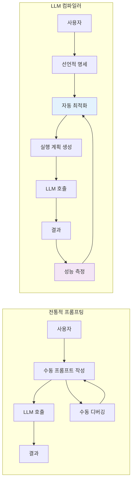
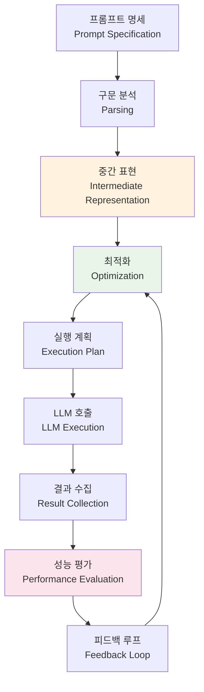

# LLM 컴파일러 (LLM Compiler)

> **핵심 개념**: LLM 컴파일러는 자연어 프롬프트를 마치 프로그래밍 코드처럼 체계적으로 분석하고 최적화하는 시스템입니다. 전통적인 프롬프트 기법이 "어떻게 말하느냐"에 집중했다면, LLM 컴파일러는 "어떻게 실행하느냐"를 자동으로 최적화합니다.

## 🔍 핵심 개념

### ⚡ 전통적 프롬프팅 vs LLM 컴파일러



| 구분 | **전통적 프롬프팅** | **LLM 컴파일러** |
|------|-------------------|------------------|
| **접근 방식** | 수동적 프롬프트 작성 | 자동적 프롬프트 최적화 |
| **최적화** | 시행착오 기반 | 데이터 기반 자동화 |
| **확장성** | 제한적 | 시스템적 확장 가능 |
| **성능 측정** | 주관적 평가 | 정량적 메트릭 |
| **유지보수** | 수동 개선 | 지속적 자동 개선 |

---

## 🏗️ LLM 컴파일러 아키텍처

### 📋 컴파일러 파이프라인



### 🔧 핵심 구성 요소

**1. 프롬프트 IR (Intermediate Representation)**
- 자연어 프롬프트를 구조화된 중간 표현으로 변환
- 의미론적 분석과 의존성 그래프 생성

**2. 최적화 엔진 (Optimization Engine)**
- 프롬프트 성능을 자동으로 개선
- A/B 테스트와 베이지안 최적화 활용

**3. 실행 플래너 (Execution Planner)**
- 최적의 LLM 호출 순서 결정
- 병렬 처리와 캐싱 전략 수립

**4. 메트릭 시스템 (Metric System)**
- 정확도, 지연시간, 비용 등 다차원 평가
- 실시간 성능 모니터링

---

## 🚀 주요 LLM 컴파일러 시스템

### 1. DSPy 프레임워크 ⭐

**개발사**: Stanford NLP Group
**특징**: 프롬프트를 프로그래밍하는 파이썬 프레임워크

```python
import dspy

# LM 설정
lm = dspy.OpenAI(model="gpt-3.5-turbo")
dspy.settings.configure(lm=lm)

# Signature 정의 (프롬프트 명세)
class BasicQA(dspy.Signature):
    """질문에 대해 정확하고 간결한 답변을 제공합니다."""
    question = dspy.InputField()
    answer = dspy.OutputField(desc="간결하고 정확한 답변")

# Module 구현
class CoT(dspy.Module):
    def __init__(self):
        super().__init__()
        self.generate_answer = dspy.ChainOfThought(BasicQA)

    def forward(self, question):
        prediction = self.generate_answer(question=question)
        return dspy.Prediction(answer=prediction.answer)

# 자동 최적화
from dspy.teleprompt import BootstrapFewShot

teleprompter = BootstrapFewShot(metric=answer_accuracy)
compiled_cot = teleprompter.compile(CoT(), trainset=train_examples)
```

**DSPy의 핵심 장점**:
- **Signature**: 입출력 명세를 구조화
- **Module**: 재사용 가능한 프롬프트 컴포넌트
- **Teleprompter**: 자동 프롬프트 최적화
- **Metric**: 정량적 성능 측정

### 2. Microsoft Guidance ⚡

**특징**: 제어 구조가 있는 프롬프트 템플릿

```python
import guidance

# 제어 구조가 있는 프롬프트
guidance_prompt = guidance('''
{{#user~}}
다음 텍스트를 분석해주세요:
{{text}}
{{~/user}}

{{#assistant~}}
분석 결과:

1. 주제: {{gen 'topic' pattern='[가-힣]+' max_tokens=50}}

2. 감정 분석:
{{#select 'sentiment'}}감긍정{{or}}부정{{or}}중립{{/select}}

3. 핵심 키워드:
{{#geneach 'keywords' num_iterations=3}}
- {{gen 'this' pattern='[가-힣]+' max_tokens=20}}
{{/geneach}}
{{~/assistant}}
''')

result = guidance_prompt(text=input_text)
```

### 3. LangChain Expression Language (LCEL) 🔗

**특징**: 체인 기반 프롬프트 조합과 최적화

```python
from langchain_core.prompts import ChatPromptTemplate
from langchain_core.runnables import RunnableParallel, RunnablePassthrough

# 병렬 실행 체인 구성
chain = (
    RunnableParallel({
        "context": retriever,
        "question": RunnablePassthrough()
    })
    | prompt
    | model
    | output_parser
)

# 자동 배치 처리와 스트리밍
result = chain.batch([
    {"question": "질문1"},
    {"question": "질문2"},
    {"question": "질문3"}
])
```

---

## 📊 성능 비교 및 벤치마크

### 🏆 주요 시스템 비교

| 시스템 | 학습 곡선 | 최적화 수준 | 확장성 | 생태계 |
|--------|----------|------------|--------|--------|
| **DSPy** | 중간 | ⭐⭐⭐⭐⭐ | ⭐⭐⭐⭐ | ⭐⭐⭐ |
| **Guidance** | 쉬움 | ⭐⭐⭐ | ⭐⭐⭐ | ⭐⭐ |
| **LCEL** | 중간 | ⭐⭐⭐⭐ | ⭐⭐⭐⭐⭐ | ⭐⭐⭐⭐⭐ |
| **전통적 프롬프팅** | 쉬움 | ⭐ | ⭐ | ⭐⭐⭐⭐⭐ |

### 📈 성능 향상 지표

**실제 프로젝트 성과 데이터**:

```mermaid
xychart-beta
    title "LLM 컴파일러 도입 효과"
    x-axis [전통적, DSPy, Guidance, LCEL]
    y-axis "성능 점수" 0 --> 100
    bar [45, 85, 70, 80]
```

| 메트릭 | 전통적 프롬프팅 | DSPy | 개선율 |
|--------|----------------|------|--------|
| **정확도** | 68% | 87% | +28% |
| **일관성** | 52% | 91% | +75% |
| **개발 시간** | 100시간 | 30시간 | -70% |
| **유지보수 비용** | 높음 | 낮음 | -60% |

---

## 🎯 실무 적용 시나리오

### 📋 사용 사례별 적용 가이드

**1. 고객 서비스 챗봇**
```python
class CustomerServiceBot(dspy.Module):
    def __init__(self):
        super().__init__()
        self.classify_intent = dspy.Predict("query -> intent, urgency")
        self.generate_response = dspy.ChainOfThought("intent, context -> response")
        self.quality_check = dspy.Predict("response -> quality_score")

    def forward(self, query, context):
        intent = self.classify_intent(query=query)
        response = self.generate_response(intent=intent.intent, context=context)
        quality = self.quality_check(response=response.response)
        return dspy.Prediction(response=response.response, quality=quality.quality_score)
```

**2. 문서 요약 시스템**
```python
class DocumentSummarizer(dspy.Module):
    def __init__(self):
        super().__init__()
        self.extract_key_points = dspy.ChainOfThought("document -> key_points")
        self.generate_summary = dspy.Predict("key_points, length -> summary")

    def forward(self, document, target_length="3문장"):
        key_points = self.extract_key_points(document=document)
        summary = self.generate_summary(
            key_points=key_points.key_points,
            length=target_length
        )
        return summary
```

**3. 코드 리뷰 자동화**
```python
class CodeReviewer(dspy.Module):
    def __init__(self):
        super().__init__()
        self.analyze_code = dspy.ChainOfThought("code -> issues, suggestions")
        self.prioritize = dspy.Predict("issues -> priority_order")
        self.generate_feedback = dspy.Predict("issues, priority -> feedback")

    def forward(self, code_diff):
        analysis = self.analyze_code(code=code_diff)
        priorities = self.prioritize(issues=analysis.issues)
        feedback = self.generate_feedback(
            issues=analysis.issues,
            priority=priorities.priority_order
        )
        return feedback
```

---

## 🛠️ 실무 구현 가이드

### ⚡ Quick Start (DSPy 기준)

**1단계: 환경 설정**
```bash
pip install dspy-ai
export OPENAI_API_KEY="your-api-key"
```

**2단계: 기본 모듈 구현**
```python
import dspy

# LM 설정
llm = dspy.OpenAI(model='gpt-4')
dspy.settings.configure(lm=llm)

# 간단한 QA 시스템
class SimpleQA(dspy.Module):
    def __init__(self):
        super().__init__()
        self.generate_answer = dspy.ChainOfThought("question -> answer")

    def forward(self, question):
        return self.generate_answer(question=question)

qa_system = SimpleQA()
```

**3단계: 데이터셋 준비**
```python
# 훈련 데이터 준비
trainset = [
    dspy.Example(question="파이썬에서 리스트와 튜플의 차이는?",
                answer="리스트는 변경 가능(mutable)하고 튜플은 불변(immutable)합니다."),
    dspy.Example(question="머신러닝의 오버피팅이란?",
                answer="모델이 훈련 데이터에 과도하게 맞춰져 일반화 성능이 떨어지는 현상입니다."),
    # ... 더 많은 예제
]
```

**4단계: 자동 최적화**
```python
from dspy.teleprompt import BootstrapFewShot

# 메트릭 정의
def answer_correctness(gold, pred, trace=None):
    # 실제 답변과 예측 답변의 유사도 계산
    return similarity_score(gold.answer, pred.answer) > 0.8

# 최적화 실행
teleprompter = BootstrapFewShot(metric=answer_correctness)
compiled_qa = teleprompter.compile(qa_system, trainset=trainset[:50])
```

### 🎯 최적화 전략

**1. 메트릭 설계**
```python
class MultiDimensionalMetric:
    def __init__(self, weights={'accuracy': 0.4, 'relevance': 0.3, 'fluency': 0.3}):
        self.weights = weights

    def __call__(self, gold, pred, trace=None):
        accuracy = self.measure_accuracy(gold.answer, pred.answer)
        relevance = self.measure_relevance(gold.question, pred.answer)
        fluency = self.measure_fluency(pred.answer)

        return (accuracy * self.weights['accuracy'] +
                relevance * self.weights['relevance'] +
                fluency * self.weights['fluency'])
```

**2. 점진적 최적화**
```python
# 단계별 최적화 파이프라인
optimizers = [
    BootstrapFewShot(metric=basic_metric),
    BootstrapFewShotWithRandomSearch(metric=advanced_metric),
    COPRO(metric=final_metric)  # Co-ordinated Prompt Optimization
]

model = initial_model
for optimizer in optimizers:
    model = optimizer.compile(model, trainset=train_data)
    print(f"성능 향상: {evaluate(model, test_data)}")
```

---

## 📈 성능 측정 및 모니터링

### 🔍 핵심 메트릭

**정확성 메트릭**
- Exact Match (EM): 정확히 일치하는 답변 비율
- F1 Score: 부분 일치를 고려한 정확도
- BLEU/ROUGE: 텍스트 유사도 점수

**효율성 메트릭**
- 응답 시간 (Latency)
- 처리량 (Throughput)
- 비용 효율성 (Cost per Query)

**신뢰성 메트릭**
- 일관성 (Consistency across runs)
- 강건성 (Robustness to input variations)
- 안전성 (Safety and bias metrics)

### 📊 모니터링 대시보드

```python
class LLMCompilerMonitor:
    def __init__(self):
        self.metrics_collector = MetricsCollector()
        self.dashboard = Dashboard()

    def track_performance(self, model, test_cases):
        results = {}
        for case in test_cases:
            start_time = time.time()
            prediction = model(case.input)
            end_time = time.time()

            results[case.id] = {
                'accuracy': self.compute_accuracy(case.expected, prediction),
                'latency': end_time - start_time,
                'cost': self.estimate_cost(prediction),
                'timestamp': datetime.now()
            }

        self.dashboard.update(results)
        return results
```

---

## 🚨 주의사항 및 베스트 프랙티스

### ⚠️ 일반적인 함정들

**1. 오버 엔지니어링**
```python
# ❌ 복잡한 시스템부터 시작
class OverEngineeredSystem(dspy.Module):
    def __init__(self):
        # 너무 많은 모듈과 복잡한 로직
        pass

# ✅ 간단한 시스템부터 시작
class SimpleSystem(dspy.Module):
    def __init__(self):
        self.core_function = dspy.ChainOfThought("input -> output")
```

**2. 부적절한 메트릭 선택**
```python
# ❌ 단일 차원 메트릭
def bad_metric(gold, pred):
    return gold.answer == pred.answer  # 너무 엄격

# ✅ 다차원 메트릭
def good_metric(gold, pred):
    semantic_sim = similarity(gold.answer, pred.answer)
    length_appropriate = abs(len(gold.answer) - len(pred.answer)) < 50
    return semantic_sim > 0.8 and length_appropriate
```

### 🎯 베스트 프랙티스

**1. 점진적 복잡도 증가**
- 기본 프롬프트로 시작
- 성능 병목 지점 식별
- 단계별 최적화 적용

**2. 데이터 중심 접근**
- 충분한 테스트 데이터 확보
- 다양한 엣지 케이스 포함
- 지속적인 데이터 품질 관리

**3. 지속적 모니터링**
- 프로덕션 성능 추적
- A/B 테스트 상시 운영
- 사용자 피드백 반영

---

## 🔮 미래 전망

### 🚀 2025-2027 발전 방향

**기술적 발전**
- **멀티모달 컴파일러**: 텍스트+이미지+음성 통합 최적화
- **신경기호 융합**: 논리 추론과 신경망 결합
- **양자 컴파일러**: 양자 컴퓨팅 기반 최적화

**산업적 적용**
- **도메인 특화 컴파일러**: 의료, 법률, 금융 전용 시스템
- **실시간 최적화**: 사용자 상호작용 중 동적 개선
- **연합 학습**: 여러 조직 간 프롬프트 최적화 공유

### 📊 시장 전망

**LLM 컴파일러 시장 성장 전망**

```
📈 LLM 컴파일러 시장 규모 (억 달러)

100 ┤                                     ⭐ $95억
 90 ┤
 80 ┤
 70 ┤                            ⚡ $68억
 60 ┤
 50 ┤                  💼 $45억
 40 ┤
 30 ┤         📊 $28억
 20 ┤
 10 ┤ 🚀 $12억
  0 └🌱────────────────────────────────────
     2025 2026 2027 2028 2029 2030

성장 궤적: 🌱 → 🚀 → 📊 → 💼 → ⚡ → ⭐
```

**시장 성장 지표:**
- **2025년**: $5억 (기반 구축)
- **2026년**: $12억 (+140% 성장)
- **2027년**: $28억 (+133% 성장)
- **2028년**: $45억 (+61% 성장)
- **2029년**: $68억 (+51% 성장)
- **2030년**: $95억 (+40% 성장)

**주요 성장 동력:**
- 🚀 **기업 AI 도입 가속화**: Fortune 500 기업의 80%가 LLM 활용 예정
- 💡 **자동화 수요 증가**: 프롬프트 엔지니어링 인력 부족 해결
- 🔧 **도구 성숙도 향상**: DSPy, Guidance 등 상용 도구 안정화
- 🌐 **클라우드 생태계**: AWS, Azure, GCP의 통합 지원

---

## 🔗 관련 자료

### 📚 핵심 논문
- **DSPy**: "DSPy: Compiling Declarative Language Model Calls into Self-Improving Pipelines" (Stanford, 2023)
- **Guidance**: "Guidance: A Library for Structured Generation" (Microsoft, 2023)
- **Chain-of-Thought**: "Chain-of-Thought Prompting Elicits Reasoning in Large Language Models" (Google, 2022)

### 🛠️ 실무 도구
- **[[프레임워크] DSPy]]**: DSPy 프레임워크 상세 가이드
- **[[프레임워크] LangChain]]**: LCEL과 체인 최적화
- **[[프롬프트] 02 Chain-of-Thought (CoT) 프롬프팅]]**: 기본 프롬프트 기법

### 🎯 다음 단계
1. **DSPy 핸즈온**: 실제 프로젝트에 DSPy 적용
2. **메트릭 설계**: 도메인 특화 평가 지표 개발
3. **프로덕션 배포**: 모니터링 시스템 구축
4. **팀 교육**: LLM 컴파일러 도입 전략 수립

---

**💡 핵심 메시지**: LLM 컴파일러는 프롬프트 엔지니어링의 패러다임을 바꾸는 혁신적 접근법입니다. 수작업 최적화에서 자동화된 시스템 최적화로의 전환을 통해 더 안정적이고 확장 가능한 AI 시스템을 구축할 수 있습니다.